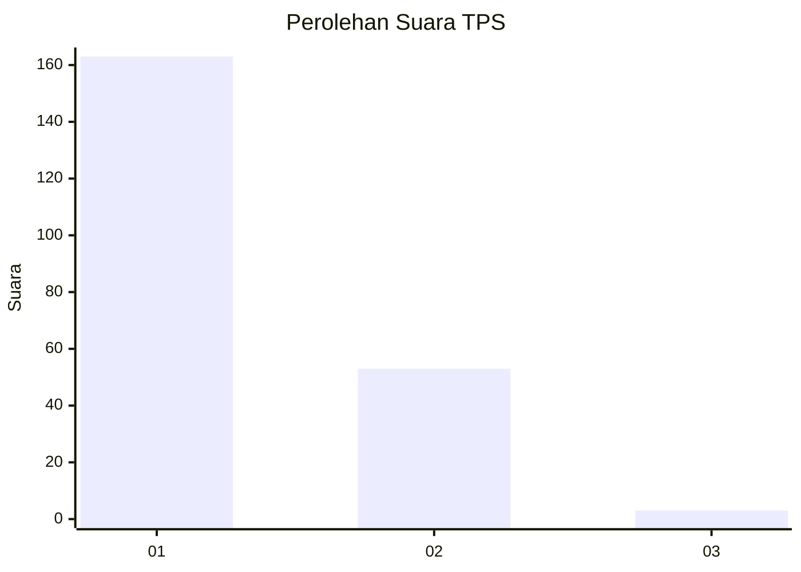
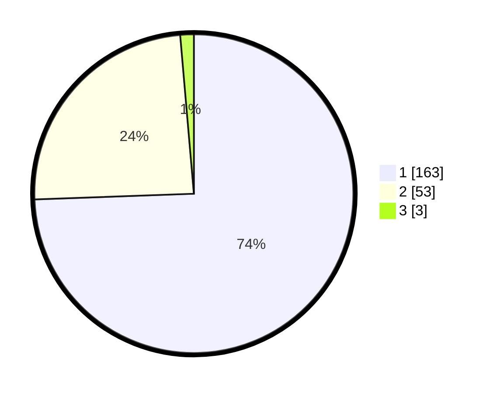

# Hasil

## Grafik

## Tabel

| No. | Nama Paslon    | Suara | Suara (raw) | Persentase |
|:--- |:-------------- | -----:| -----------:| ----------:|
| 1   | ANIES MUHAIMIN | 163   | [163][p-1]  | 74,43      |
| 2   | PRABOWO GIBRAN | 53    | [53][p-2]   | 24,20      |
| 3   | GANJAR MAHFUD  | 3     | [3][p-3]    | 1,37       |

[p-1]: https://github.com/gigit-pemilu/pemilu-2024-13-sumatera-barat/blob/main/pilpres/hitung-suara/sub/13-sumatera-barat/sub/07-lima-puluh-kota/sub/03-payakumbuh/sub/2003-simalanggang/sub/002-tps/sub/paslon-1.txt
[p-2]: https://github.com/gigit-pemilu/pemilu-2024-13-sumatera-barat/blob/main/pilpres/hitung-suara/sub/13-sumatera-barat/sub/07-lima-puluh-kota/sub/03-payakumbuh/sub/2003-simalanggang/sub/002-tps/sub/paslon-2.txt
[p-3]: https://github.com/gigit-pemilu/pemilu-2024-13-sumatera-barat/blob/main/pilpres/hitung-suara/sub/13-sumatera-barat/sub/07-lima-puluh-kota/sub/03-payakumbuh/sub/2003-simalanggang/sub/002-tps/sub/paslon-3.txt

## Foto C Plano

https://sirekap-obj-formc.kpu.go.id/9a3e/pemilu/ppwp/13/07/03/20/03/1307032003002-20240227-140543--12826091-d2dc-4981-8347-bd1ea73bdaa2.jpg

https://sirekap-obj-formc.kpu.go.id/9a3e/pemilu/ppwp/13/07/03/20/03/1307032003002-20240227-141006--d4368ccb-8ff6-48ed-b8fe-ccd00384cd8f.jpg

https://sirekap-obj-formc.kpu.go.id/9a3e/pemilu/ppwp/13/07/03/20/03/1307032003002-20240227-141126--7c61f1b7-3809-41d9-8851-ff88b8dddef7.jpg

## Metadata

| Key        | Value               |
| ---------- | ------------------- |
| Time Stamp | 2024-02-29 22:00:00 |

