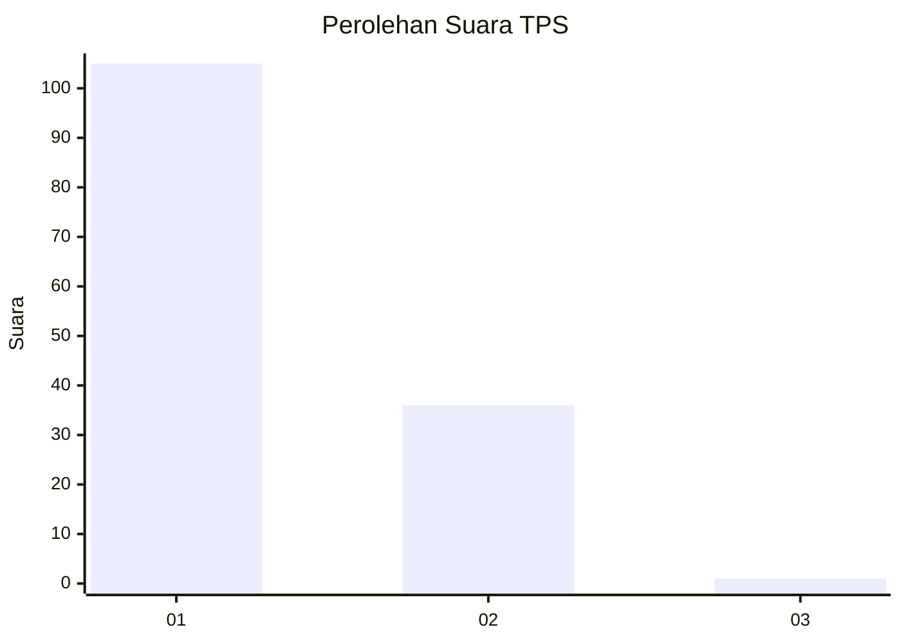
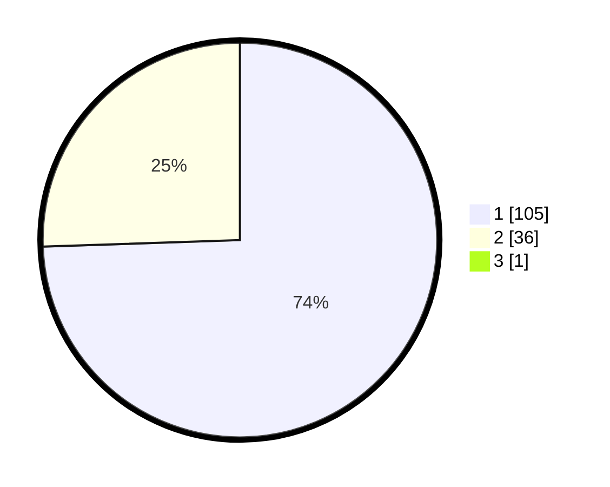

# Hasil

## Grafik

## Tabel

| No. | Nama Paslon    | Suara | Suara (raw) | Persentase |
|:--- |:-------------- | -----:| -----------:| ----------:|
| 1   | ANIES MUHAIMIN | 105   | [105][p-1]  | 73,94      |
| 2   | PRABOWO GIBRAN | 36    | [36][p-2]   | 25,35      |
| 3   | GANJAR MAHFUD  | 1     | [1][p-3]    | 0,70       |

[p-1]: https://github.com/gigit-pemilu/pemilu-2024-13-sumatera-barat/blob/main/pilpres/hitung-suara/sub/13-sumatera-barat/sub/07-lima-puluh-kota/sub/03-payakumbuh/sub/2006-taeh-baruah/sub/003-tps/sub/paslon-1.txt
[p-2]: https://github.com/gigit-pemilu/pemilu-2024-13-sumatera-barat/blob/main/pilpres/hitung-suara/sub/13-sumatera-barat/sub/07-lima-puluh-kota/sub/03-payakumbuh/sub/2006-taeh-baruah/sub/003-tps/sub/paslon-2.txt
[p-3]: https://github.com/gigit-pemilu/pemilu-2024-13-sumatera-barat/blob/main/pilpres/hitung-suara/sub/13-sumatera-barat/sub/07-lima-puluh-kota/sub/03-payakumbuh/sub/2006-taeh-baruah/sub/003-tps/sub/paslon-3.txt

## Foto C Plano

https://sirekap-obj-formc.kpu.go.id/d81b/pemilu/ppwp/13/07/03/20/06/1307032006003-20240227-135807--dc802382-e2f4-42bd-84f1-5838894925fa.jpg

https://sirekap-obj-formc.kpu.go.id/d81b/pemilu/ppwp/13/07/03/20/06/1307032006003-20240227-135853--cdf0b031-a28c-48fd-bc37-cc7012e5c111.jpg

https://sirekap-obj-formc.kpu.go.id/d81b/pemilu/ppwp/13/07/03/20/06/1307032006003-20240227-135928--738497ad-86f0-4ab3-b1c6-a92834e87bc9.jpg

## Metadata

| Key        | Value               |
| ---------- | ------------------- |
| Time Stamp | 2024-02-28 19:00:00 |

