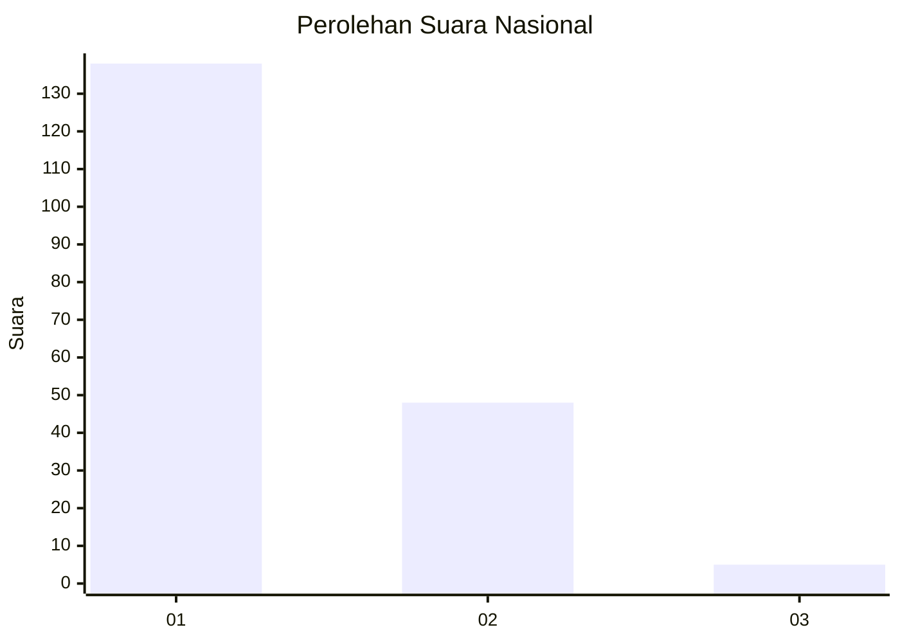
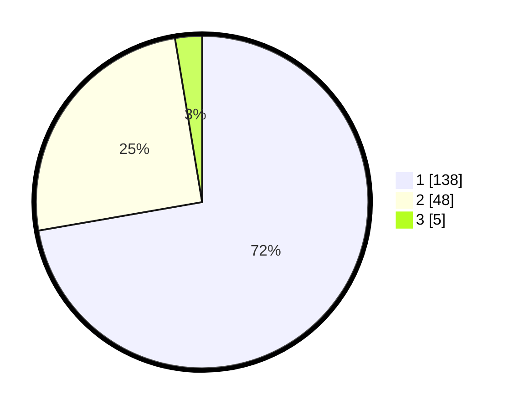

# Hasil

## Grafik

## Tabel

| No. | Nama Paslon    | Suara | Suara (raw) | Persentase |
|:--- |:-------------- | -----:| -----------:| ----------:|
| 1   | ANIES MUHAIMIN | 138   | [138][p-1]  | 72,25      |
| 2   | PRABOWO GIBRAN | 48    | [48][p-2]   | 25,13      |
| 3   | GANJAR MAHFUD  | 5     | [5][p-3]    | 2,62       |

[p-1]: https://github.com/gigit-pemilu/pemilu-2024/blob/main/pilpres/hitung-suara/sub/13-sumatera-barat/sub/07-lima-puluh-kota/sub/03-payakumbuh/sub/2007-koto-tangah-simalanggang/sub/006-tps/sub/paslon-1.txt
[p-2]: https://github.com/gigit-pemilu/pemilu-2024/blob/main/pilpres/hitung-suara/sub/13-sumatera-barat/sub/07-lima-puluh-kota/sub/03-payakumbuh/sub/2007-koto-tangah-simalanggang/sub/006-tps/sub/paslon-2.txt
[p-3]: https://github.com/gigit-pemilu/pemilu-2024/blob/main/pilpres/hitung-suara/sub/13-sumatera-barat/sub/07-lima-puluh-kota/sub/03-payakumbuh/sub/2007-koto-tangah-simalanggang/sub/006-tps/sub/paslon-3.txt

## Foto C Plano

https://sirekap-obj-formc.kpu.go.id/e13f/pemilu/ppwp/13/07/03/20/07/1307032007006-20240225-164001--7b1375d3-f022-425b-8df6-b1f8a41f28e6.jpg

https://sirekap-obj-formc.kpu.go.id/e13f/pemilu/ppwp/13/07/03/20/07/1307032007006-20240225-164045--99777870-0f0d-45c1-b056-a6ddfe788753.jpg

https://sirekap-obj-formc.kpu.go.id/e13f/pemilu/ppwp/13/07/03/20/07/1307032007006-20240225-164132--85a7e861-7765-429c-a23c-e005f54cc72a.jpg

## Metadata

| Key        | Value               |
| ---------- | ------------------- |
| Time Stamp | 2024-02-26 15:00:00 |

