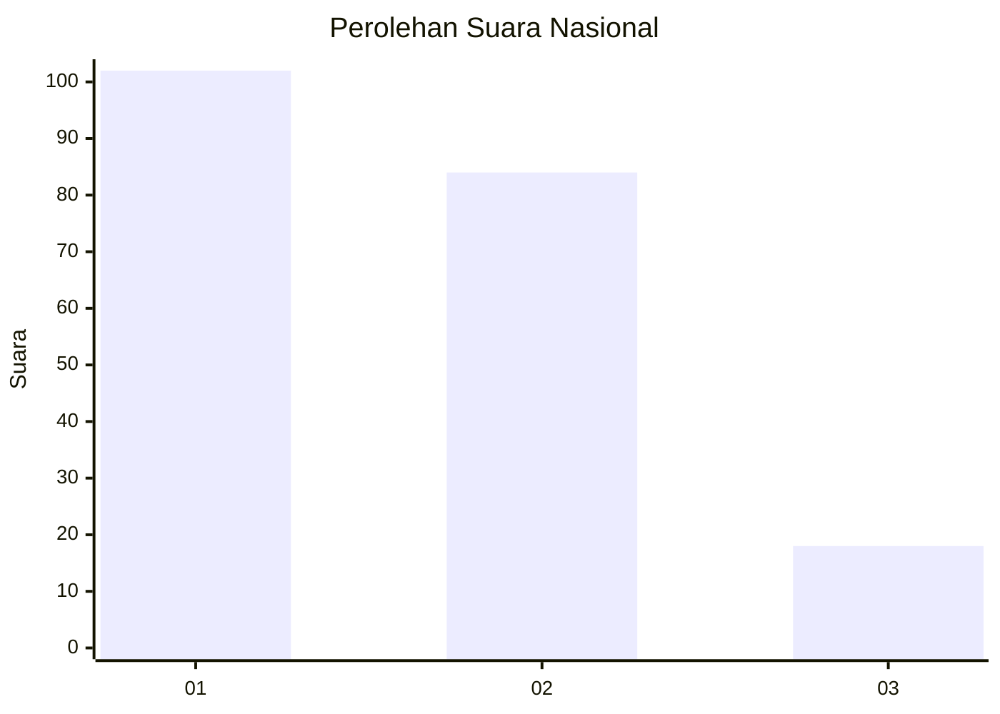
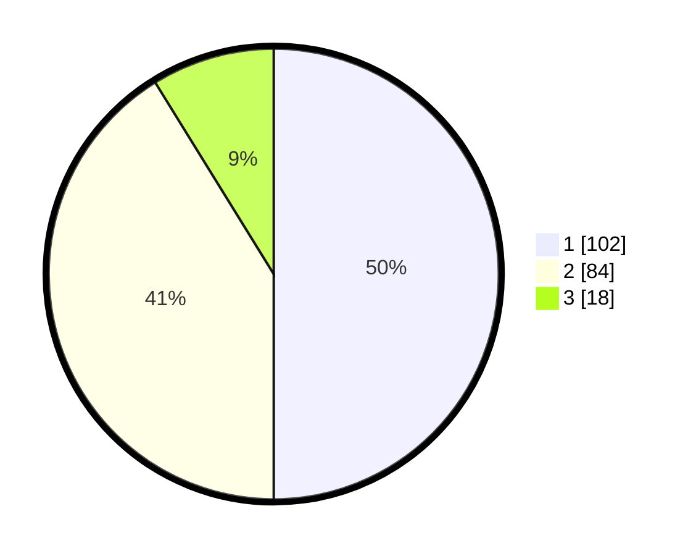

# Hasil

## Grafik

## Tabel

| No. | Nama Paslon    | Suara | Suara (raw) | Persentase |
|:--- |:-------------- | -----:| -----------:| ----------:|
| 1   | ANIES MUHAIMIN | 102   | [102][p-1]  | 50,00      |
| 2   | PRABOWO GIBRAN | 84    | [84][p-2]   | 41,18      |
| 3   | GANJAR MAHFUD  | 18    | [18][p-3]   | 8,82       |

[p-1]: https://github.com/gigit-pemilu/pemilu-2024/blob/main/pilpres/hitung-suara/sub/13-sumatera-barat/sub/07-lima-puluh-kota/sub/09-lareh-sago-halaban/sub/2001-labuah-gunuang/sub/001-tps/sub/paslon-1.txt
[p-2]: https://github.com/gigit-pemilu/pemilu-2024/blob/main/pilpres/hitung-suara/sub/13-sumatera-barat/sub/07-lima-puluh-kota/sub/09-lareh-sago-halaban/sub/2001-labuah-gunuang/sub/001-tps/sub/paslon-2.txt
[p-3]: https://github.com/gigit-pemilu/pemilu-2024/blob/main/pilpres/hitung-suara/sub/13-sumatera-barat/sub/07-lima-puluh-kota/sub/09-lareh-sago-halaban/sub/2001-labuah-gunuang/sub/001-tps/sub/paslon-3.txt

## Foto C Plano

https://sirekap-obj-formc.kpu.go.id/c2db/pemilu/ppwp/13/07/09/20/01/1307092001001-20240226-191849--e41129d1-dc9a-4b13-8435-ebe130b0ff09.jpg

https://sirekap-obj-formc.kpu.go.id/c2db/pemilu/ppwp/13/07/09/20/01/1307092001001-20240226-192021--3ec04873-b799-4879-a92d-bf7f3aa4a510.jpg

https://sirekap-obj-formc.kpu.go.id/c2db/pemilu/ppwp/13/07/09/20/01/1307092001001-20240226-192118--8e9eae23-0ba0-458e-bbb0-e05127be4a81.jpg

## Metadata

| Key        | Value               |
| ---------- | ------------------- |
| Time Stamp | 2024-02-29 15:00:00 |

