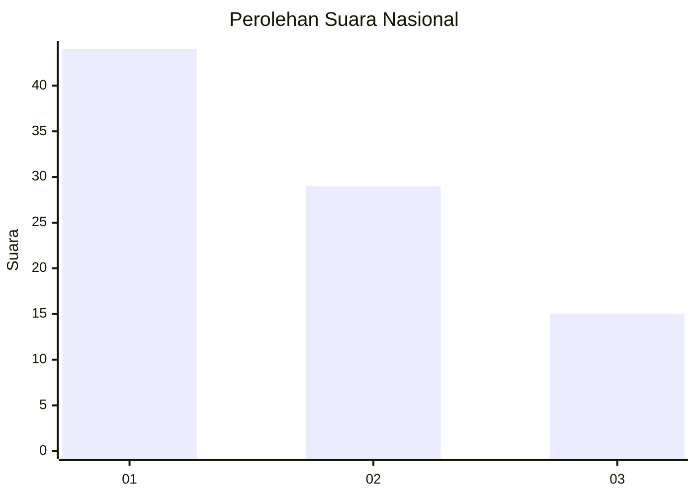
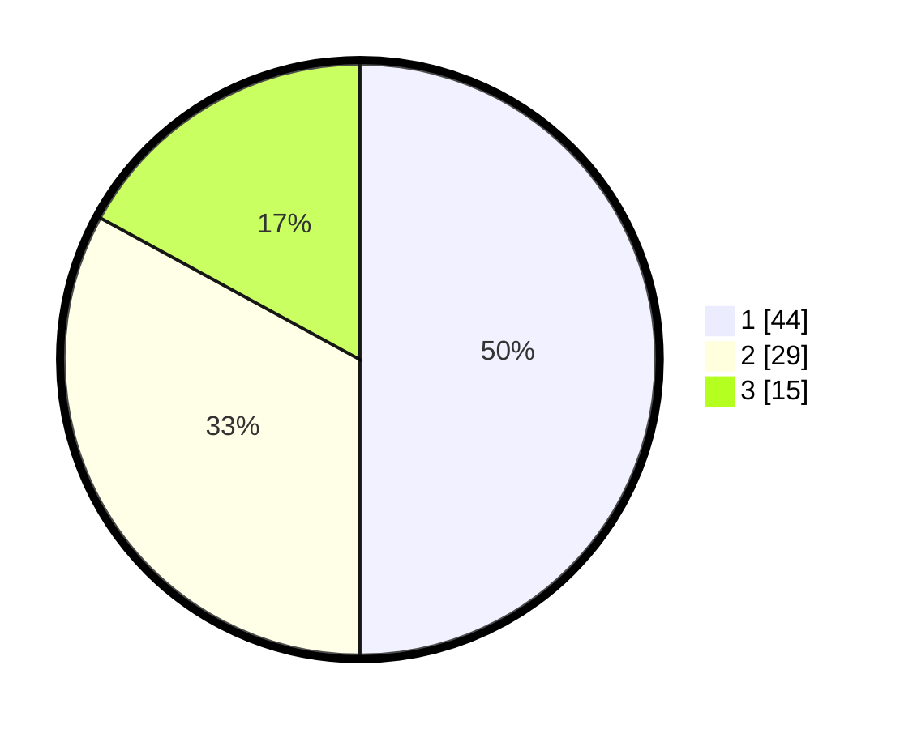

# Hasil

## Grafik

## Tabel

| No. | Nama Paslon    | Suara | Suara (raw) | Persentase |
|:--- |:-------------- | -----:| -----------:| ----------:|
| 1   | ANIES MUHAIMIN | 44    | [44][p-1]   | 50,00      |
| 2   | PRABOWO GIBRAN | 29    | [29][p-2]   | 32,95      |
| 3   | GANJAR MAHFUD  | 15    | [15][p-3]   | 17,05      |

[p-1]: https://github.com/gigit-pemilu/pemilu-2024/blob/main/pilpres/hitung-suara/sub/13-sumatera-barat/sub/07-lima-puluh-kota/sub/09-lareh-sago-halaban/sub/2006-halaban/sub/001-tps/sub/paslon-1.txt
[p-2]: https://github.com/gigit-pemilu/pemilu-2024/blob/main/pilpres/hitung-suara/sub/13-sumatera-barat/sub/07-lima-puluh-kota/sub/09-lareh-sago-halaban/sub/2006-halaban/sub/001-tps/sub/paslon-2.txt
[p-3]: https://github.com/gigit-pemilu/pemilu-2024/blob/main/pilpres/hitung-suara/sub/13-sumatera-barat/sub/07-lima-puluh-kota/sub/09-lareh-sago-halaban/sub/2006-halaban/sub/001-tps/sub/paslon-3.txt

## Foto C Plano

https://sirekap-obj-formc.kpu.go.id/7d40/pemilu/ppwp/13/07/09/20/06/1307092006001-20240226-150338--f0e59289-13e6-45ef-a0ab-a8cba66f9e83.jpg

https://sirekap-obj-formc.kpu.go.id/7d40/pemilu/ppwp/13/07/09/20/06/1307092006001-20240214-141810--2cdbc830-f703-4996-bb44-9580dd96a229.jpg

https://sirekap-obj-formc.kpu.go.id/7d40/pemilu/ppwp/13/07/09/20/06/1307092006001-20240214-141928--58145f6e-bad1-4677-8966-c24c198b2b06.jpg

## Metadata

| Key        | Value               |
| ---------- | ------------------- |
| Time Stamp | 2024-02-26 16:00:00 |

