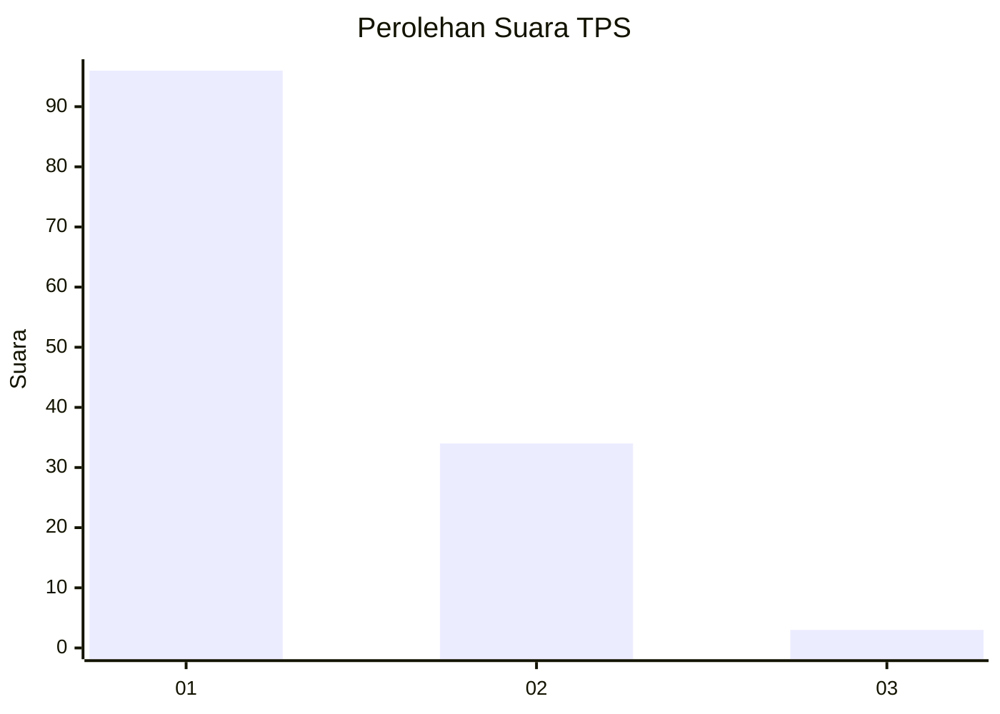
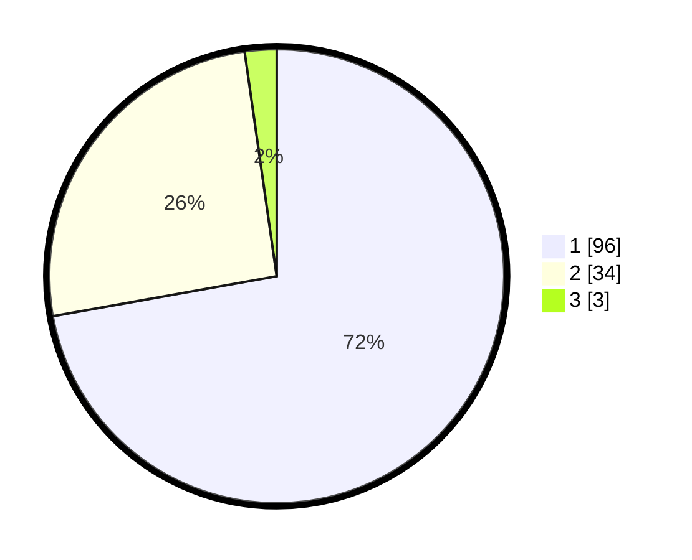

# Hasil

## Grafik

## Tabel

| No. | Nama Paslon    | Suara | Suara (raw) | Persentase |
|:--- |:-------------- | -----:| -----------:| ----------:|
| 1   | ANIES MUHAIMIN | 96    | [96][p-1]   | 72,18      |
| 2   | PRABOWO GIBRAN | 34    | [34][p-2]   | 25,56      |
| 3   | GANJAR MAHFUD  | 3     | [3][p-3]    | 2,26       |

[p-1]: https://github.com/gigit-pemilu/pemilu-2024-13-sumatera-barat/blob/main/pilpres/hitung-suara/sub/13-sumatera-barat/sub/07-lima-puluh-kota/sub/09-lareh-sago-halaban/sub/2006-halaban/sub/011-tps/sub/paslon-1.txt
[p-2]: https://github.com/gigit-pemilu/pemilu-2024-13-sumatera-barat/blob/main/pilpres/hitung-suara/sub/13-sumatera-barat/sub/07-lima-puluh-kota/sub/09-lareh-sago-halaban/sub/2006-halaban/sub/011-tps/sub/paslon-2.txt
[p-3]: https://github.com/gigit-pemilu/pemilu-2024-13-sumatera-barat/blob/main/pilpres/hitung-suara/sub/13-sumatera-barat/sub/07-lima-puluh-kota/sub/09-lareh-sago-halaban/sub/2006-halaban/sub/011-tps/sub/paslon-3.txt

## Foto C Plano

https://sirekap-obj-formc.kpu.go.id/f1a5/pemilu/ppwp/13/07/09/20/06/1307092006011-20240227-135849--6dc85946-fbe1-47f7-9b28-997a7be5a9bc.jpg

https://sirekap-obj-formc.kpu.go.id/f1a5/pemilu/ppwp/13/07/09/20/06/1307092006011-20240227-140049--43090821-f4d3-4efc-b1db-b9cd1f1030e8.jpg

https://sirekap-obj-formc.kpu.go.id/f1a5/pemilu/ppwp/13/07/09/20/06/1307092006011-20240227-114347--4ae6478f-6a5f-4d05-8c97-eaa45d49837a.jpg

## Metadata

| Key        | Value               |
| ---------- | ------------------- |
| Time Stamp | 2024-02-28 21:00:00 |

