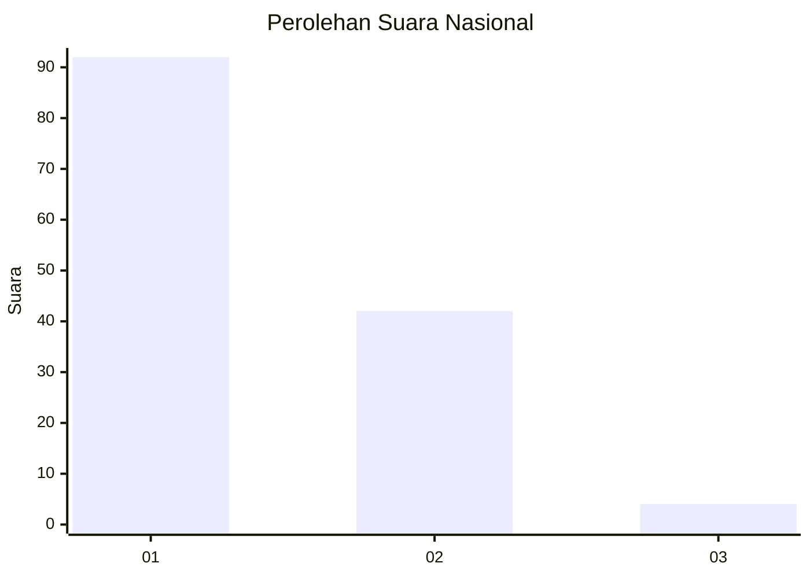
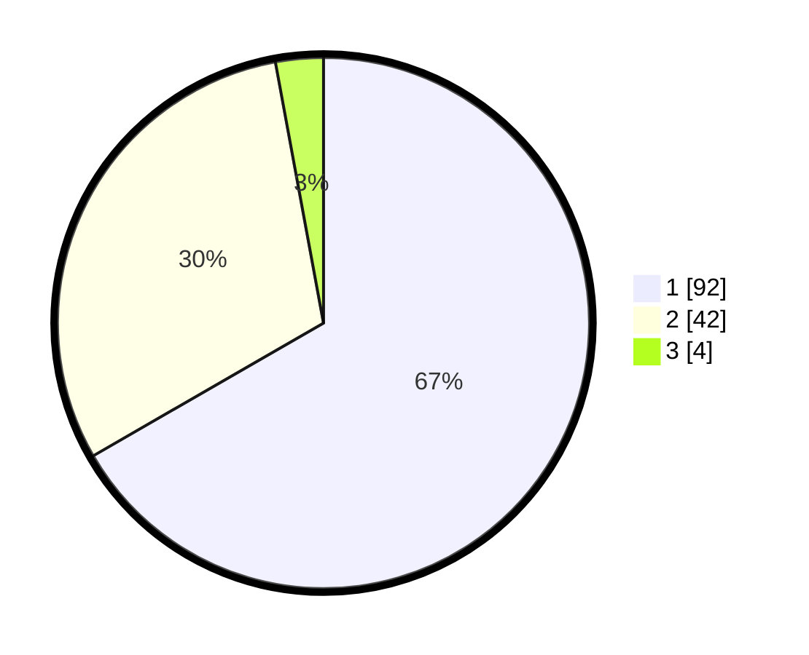

# Hasil

## Grafik

## Tabel

| No. | Nama Paslon    | Suara | Suara (raw) | Persentase |
|:--- |:-------------- | -----:| -----------:| ----------:|
| 1   | ANIES MUHAIMIN | 92    | [92][p-1]   | 66,67      |
| 2   | PRABOWO GIBRAN | 42    | [42][p-2]   | 30,43      |
| 3   | GANJAR MAHFUD  | 4     | [4][p-3]    | 2,90       |

[p-1]: https://github.com/gigit-pemilu/pemilu-2024/blob/main/pilpres/hitung-suara/sub/13-sumatera-barat/sub/07-lima-puluh-kota/sub/10-situjuah-limo-nagari/sub/2004-situjuah-banda-dalam/sub/004-tps/sub/paslon-1.txt
[p-2]: https://github.com/gigit-pemilu/pemilu-2024/blob/main/pilpres/hitung-suara/sub/13-sumatera-barat/sub/07-lima-puluh-kota/sub/10-situjuah-limo-nagari/sub/2004-situjuah-banda-dalam/sub/004-tps/sub/paslon-2.txt
[p-3]: https://github.com/gigit-pemilu/pemilu-2024/blob/main/pilpres/hitung-suara/sub/13-sumatera-barat/sub/07-lima-puluh-kota/sub/10-situjuah-limo-nagari/sub/2004-situjuah-banda-dalam/sub/004-tps/sub/paslon-3.txt

## Foto C Plano

https://sirekap-obj-formc.kpu.go.id/7448/pemilu/ppwp/13/07/10/20/04/1307102004004-20240222-164213--481a53b0-ecf8-4894-bd69-92907d952e6b.jpg

https://sirekap-obj-formc.kpu.go.id/7448/pemilu/ppwp/13/07/10/20/04/1307102004004-20240222-164230--bea7f4c2-7e50-4c98-8d37-e0d3c4b4c4e0.jpg

https://sirekap-obj-formc.kpu.go.id/7448/pemilu/ppwp/13/07/10/20/04/1307102004004-20240222-164244--dffd9fa9-95e4-464e-b035-38e0adbd5fc7.jpg

## Metadata

| Key        | Value               |
| ---------- | ------------------- |
| Time Stamp | 2024-02-22 18:00:00 |

