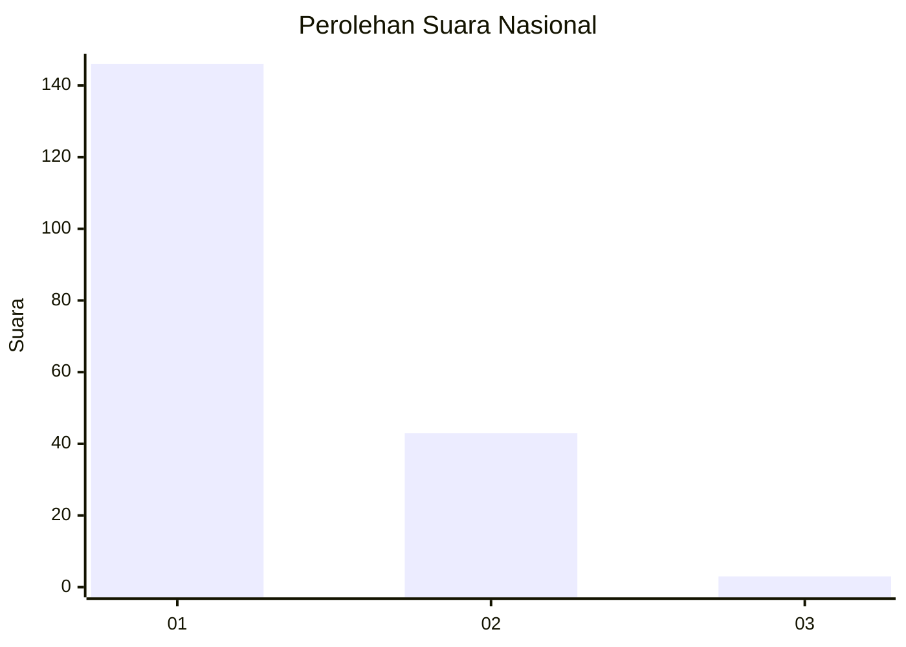
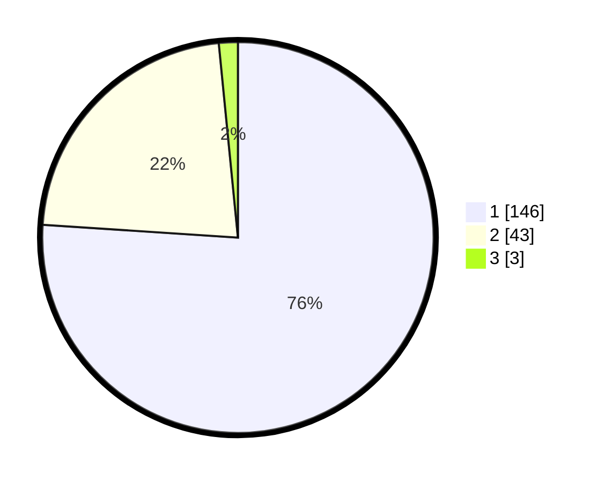

# Hasil

## Grafik

## Tabel

| No. | Nama Paslon    | Suara | Suara (raw) | Persentase |
|:--- |:-------------- | -----:| -----------:| ----------:|
| 1   | ANIES MUHAIMIN | 146   | [146][p-1]  | 76,04      |
| 2   | PRABOWO GIBRAN | 43    | [43][p-2]   | 22,40      |
| 3   | GANJAR MAHFUD  | 3     | [3][p-3]    | 1,56       |

[p-1]: https://github.com/gigit-pemilu/pemilu-2024/blob/main/pilpres/hitung-suara/sub/13-sumatera-barat/sub/07-lima-puluh-kota/sub/10-situjuah-limo-nagari/sub/2004-situjuah-banda-dalam/sub/005-tps/sub/paslon-1.txt
[p-2]: https://github.com/gigit-pemilu/pemilu-2024/blob/main/pilpres/hitung-suara/sub/13-sumatera-barat/sub/07-lima-puluh-kota/sub/10-situjuah-limo-nagari/sub/2004-situjuah-banda-dalam/sub/005-tps/sub/paslon-2.txt
[p-3]: https://github.com/gigit-pemilu/pemilu-2024/blob/main/pilpres/hitung-suara/sub/13-sumatera-barat/sub/07-lima-puluh-kota/sub/10-situjuah-limo-nagari/sub/2004-situjuah-banda-dalam/sub/005-tps/sub/paslon-3.txt

## Foto C Plano

https://sirekap-obj-formc.kpu.go.id/e83a/pemilu/ppwp/13/07/10/20/04/1307102004005-20240222-175404--5bdf55e8-5402-48f1-b7cf-8f6c9e8f558e.jpg

https://sirekap-obj-formc.kpu.go.id/e83a/pemilu/ppwp/13/07/10/20/04/1307102004005-20240222-175433--1c66c8c2-1c5e-4525-aa31-d7324bc05c31.jpg

https://sirekap-obj-formc.kpu.go.id/e83a/pemilu/ppwp/13/07/10/20/04/1307102004005-20240222-175446--6001c4d0-8d1e-4f6d-ba2e-e64ab567d1db.jpg

## Metadata

| Key        | Value               |
| ---------- | ------------------- |
| Time Stamp | 2024-02-22 23:00:00 |

