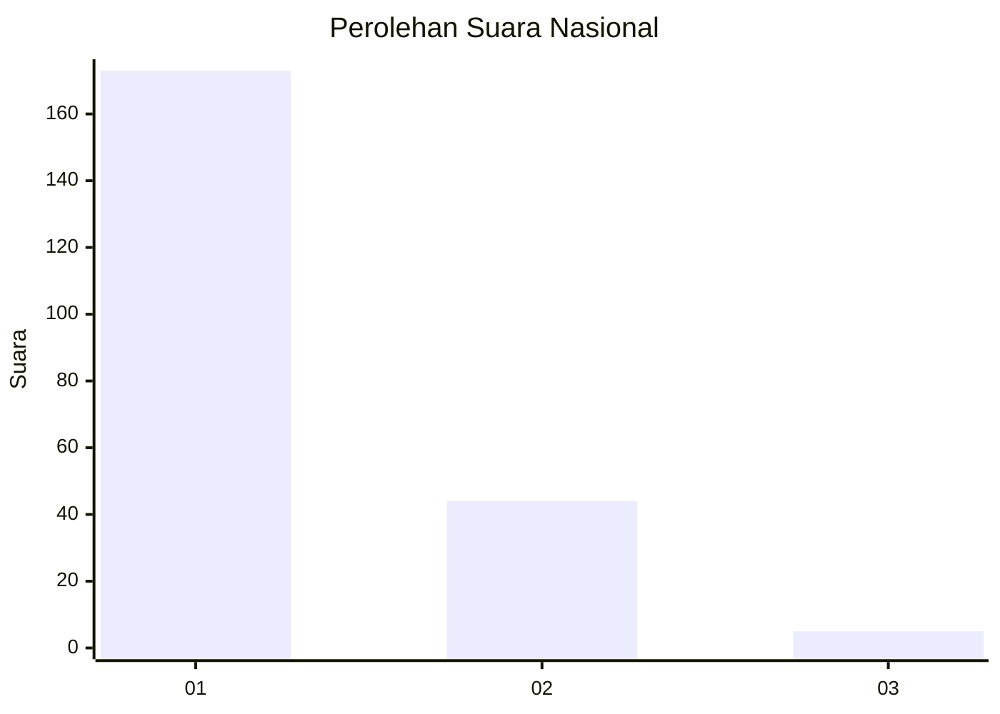
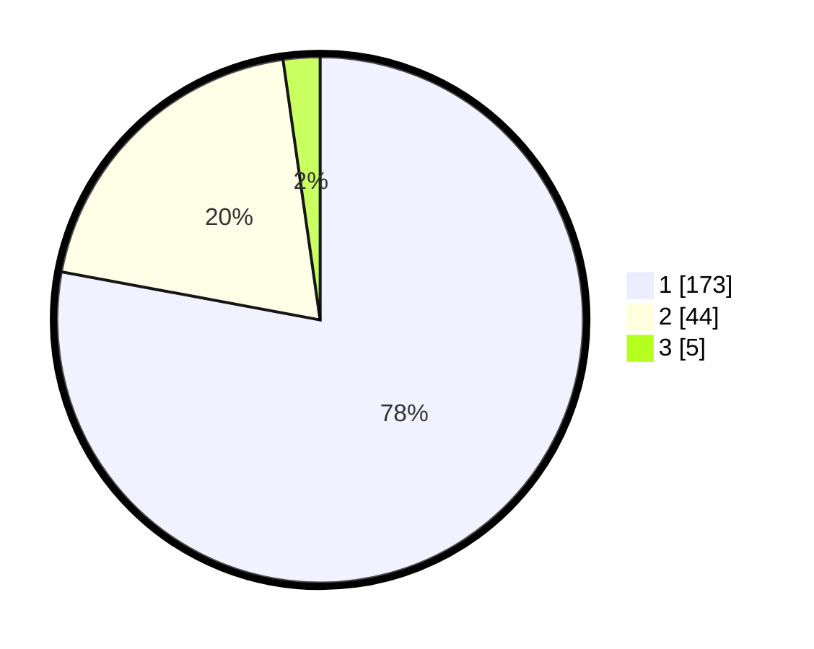

# Hasil

## Grafik

## Tabel

| No. | Nama Paslon    | Suara | Suara (raw) | Persentase |
|:--- |:-------------- | -----:| -----------:| ----------:|
| 1   | ANIES MUHAIMIN | 173   | [173][p-1]  | 77,93      |
| 2   | PRABOWO GIBRAN | 44    | [44][p-2]   | 19,82      |
| 3   | GANJAR MAHFUD  | 5     | [5][p-3]    | 2,25       |

[p-1]: https://github.com/gigit-pemilu/pemilu-2024/blob/main/pilpres/hitung-suara/sub/13-sumatera-barat/sub/07-lima-puluh-kota/sub/10-situjuah-limo-nagari/sub/2004-situjuah-banda-dalam/sub/017-tps/sub/paslon-1.txt
[p-2]: https://github.com/gigit-pemilu/pemilu-2024/blob/main/pilpres/hitung-suara/sub/13-sumatera-barat/sub/07-lima-puluh-kota/sub/10-situjuah-limo-nagari/sub/2004-situjuah-banda-dalam/sub/017-tps/sub/paslon-2.txt
[p-3]: https://github.com/gigit-pemilu/pemilu-2024/blob/main/pilpres/hitung-suara/sub/13-sumatera-barat/sub/07-lima-puluh-kota/sub/10-situjuah-limo-nagari/sub/2004-situjuah-banda-dalam/sub/017-tps/sub/paslon-3.txt

## Foto C Plano

https://sirekap-obj-formc.kpu.go.id/f762/pemilu/ppwp/13/07/10/20/04/1307102004017-20240224-102934--c99eedf9-994d-45f8-bfee-ed87ae199680.jpg

https://sirekap-obj-formc.kpu.go.id/f762/pemilu/ppwp/13/07/10/20/04/1307102004017-20240224-103801--24c616e1-1784-4d85-8663-c5b55b502d5c.jpg

https://sirekap-obj-formc.kpu.go.id/f762/pemilu/ppwp/13/07/10/20/04/1307102004017-20240224-103830--67834cc0-8e4e-43fb-aae8-6d6bed3ba426.jpg

## Metadata

| Key        | Value               |
| ---------- | ------------------- |
| Time Stamp | 2024-02-24 22:31:28 |

