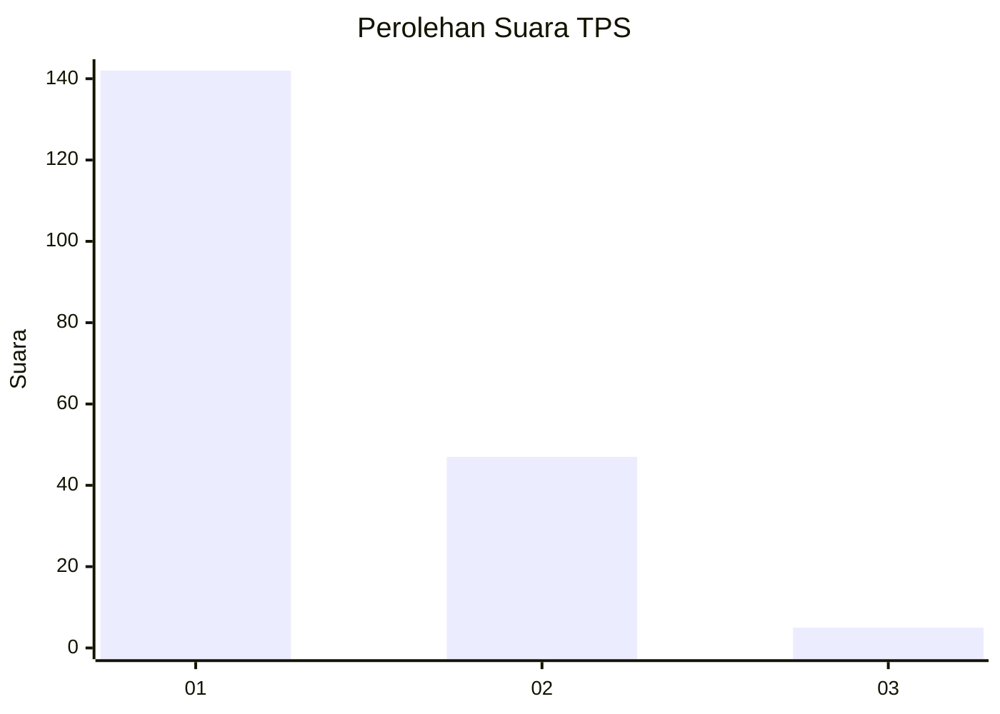
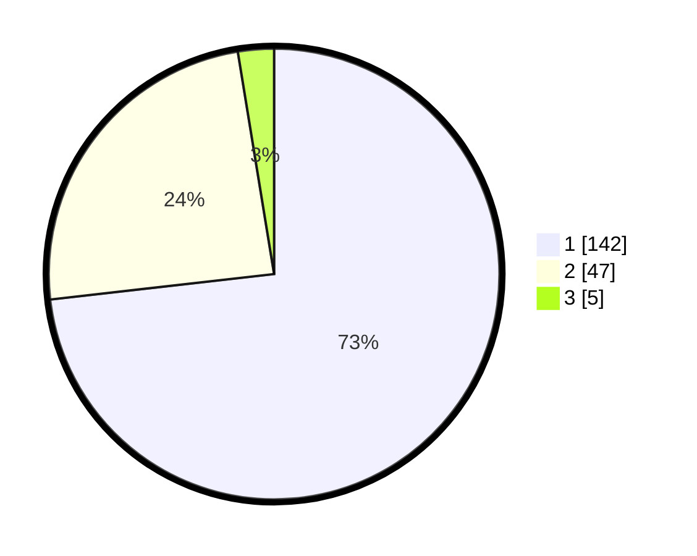

# Hasil

## Grafik

## Tabel

| No. | Nama Paslon    | Suara | Suara (raw) | Persentase |
|:--- |:-------------- | -----:| -----------:| ----------:|
| 1   | ANIES MUHAIMIN | 142   | [142][p-1]  | 73,20      |
| 2   | PRABOWO GIBRAN | 47    | [47][p-2]   | 24,23      |
| 3   | GANJAR MAHFUD  | 5     | [5][p-3]    | 2,58       |

[p-1]: https://github.com/gigit-pemilu/pemilu-2024-13-sumatera-barat/blob/main/pilpres/hitung-suara/sub/13-sumatera-barat/sub/07-lima-puluh-kota/sub/11-mungka/sub/2001-jopang-manganti/sub/001-tps/sub/paslon-1.txt
[p-2]: https://github.com/gigit-pemilu/pemilu-2024-13-sumatera-barat/blob/main/pilpres/hitung-suara/sub/13-sumatera-barat/sub/07-lima-puluh-kota/sub/11-mungka/sub/2001-jopang-manganti/sub/001-tps/sub/paslon-2.txt
[p-3]: https://github.com/gigit-pemilu/pemilu-2024-13-sumatera-barat/blob/main/pilpres/hitung-suara/sub/13-sumatera-barat/sub/07-lima-puluh-kota/sub/11-mungka/sub/2001-jopang-manganti/sub/001-tps/sub/paslon-3.txt

## Foto C Plano

https://sirekap-obj-formc.kpu.go.id/4284/pemilu/ppwp/13/07/11/20/01/1307112001001-20240214-205551--380d92c7-3d78-4507-95e5-59c173098427.jpg

https://sirekap-obj-formc.kpu.go.id/4284/pemilu/ppwp/13/07/11/20/01/1307112001001-20240214-160101--9aa96845-5cca-4bab-b324-a7e92d7fe644.jpg

https://sirekap-obj-formc.kpu.go.id/4284/pemilu/ppwp/13/07/11/20/01/1307112001001-20240215-015056--ddcd14a6-d5bb-428e-8974-3d90aa3f2124.jpg

## Metadata

| Key        | Value               |
| ---------- | ------------------- |
| Time Stamp | 2024-02-15 07:00:44 |

