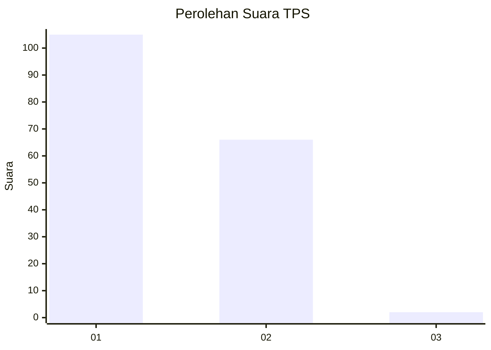
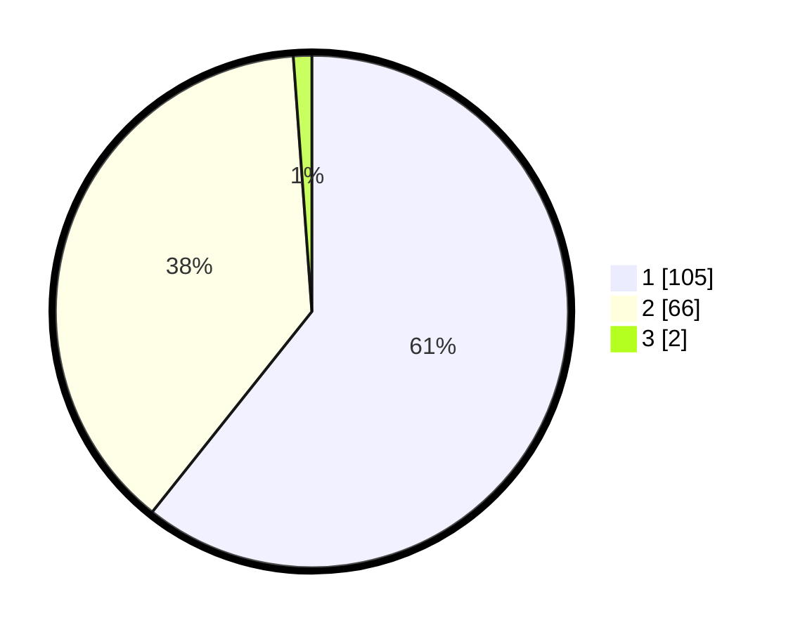

# Hasil

## Grafik

## Tabel

| No. | Nama Paslon    | Suara | Suara (raw) | Persentase |
|:--- |:-------------- | -----:| -----------:| ----------:|
| 1   | ANIES MUHAIMIN | 105   | [105][p-1]  | 60,69      |
| 2   | PRABOWO GIBRAN | 66    | [66][p-2]   | 38,15      |
| 3   | GANJAR MAHFUD  | 2     | [2][p-3]    | 1,16       |

[p-1]: https://github.com/gigit-pemilu/pemilu-2024-13-sumatera-barat/blob/main/pilpres/hitung-suara/sub/13-sumatera-barat/sub/07-lima-puluh-kota/sub/13-akabiluru/sub/2001-sariak-laweh/sub/002-tps/sub/paslon-1.txt
[p-2]: https://github.com/gigit-pemilu/pemilu-2024-13-sumatera-barat/blob/main/pilpres/hitung-suara/sub/13-sumatera-barat/sub/07-lima-puluh-kota/sub/13-akabiluru/sub/2001-sariak-laweh/sub/002-tps/sub/paslon-2.txt
[p-3]: https://github.com/gigit-pemilu/pemilu-2024-13-sumatera-barat/blob/main/pilpres/hitung-suara/sub/13-sumatera-barat/sub/07-lima-puluh-kota/sub/13-akabiluru/sub/2001-sariak-laweh/sub/002-tps/sub/paslon-3.txt

## Foto C Plano

https://sirekap-obj-formc.kpu.go.id/9999/pemilu/ppwp/13/07/13/20/01/1307132001002-20240214-160055--5d662e51-a4f6-4d0f-a542-32b5cc4b97c7.jpg

https://sirekap-obj-formc.kpu.go.id/9999/pemilu/ppwp/13/07/13/20/01/1307132001002-20240214-230051--47b177ca-75b0-48be-9c5e-c76f813b0fae.jpg

https://sirekap-obj-formc.kpu.go.id/9999/pemilu/ppwp/13/07/13/20/01/1307132001002-20240214-230132--5dbd1af3-f1dd-49f5-92bf-1815756776eb.jpg

## Metadata

| Key        | Value               |
| ---------- | ------------------- |
| Time Stamp | 2024-02-16 11:00:29 |

