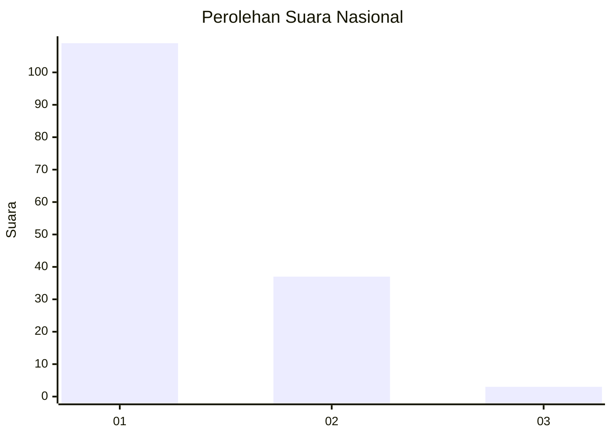
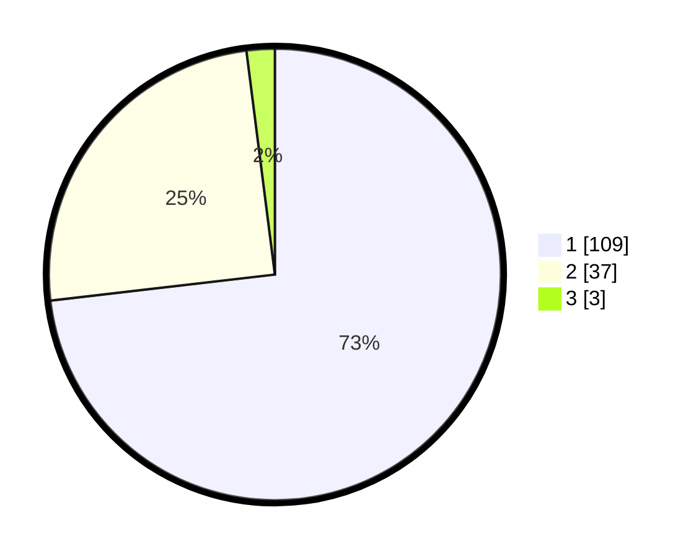

# Hasil

## Grafik

## Tabel

| No. | Nama Paslon    | Suara | Suara (raw) | Persentase |
|:--- |:-------------- | -----:| -----------:| ----------:|
| 1   | ANIES MUHAIMIN | 109   | [109][p-1]  | 73,15      |
| 2   | PRABOWO GIBRAN | 37    | [37][p-2]   | 24,83      |
| 3   | GANJAR MAHFUD  | 3     | [3][p-3]    | 2,01       |

[p-1]: https://github.com/gigit-pemilu/pemilu-2024/blob/main/pilpres/hitung-suara/sub/13-sumatera-barat/sub/07-lima-puluh-kota/sub/13-akabiluru/sub/2001-sariak-laweh/sub/003-tps/sub/paslon-1.txt
[p-2]: https://github.com/gigit-pemilu/pemilu-2024/blob/main/pilpres/hitung-suara/sub/13-sumatera-barat/sub/07-lima-puluh-kota/sub/13-akabiluru/sub/2001-sariak-laweh/sub/003-tps/sub/paslon-2.txt
[p-3]: https://github.com/gigit-pemilu/pemilu-2024/blob/main/pilpres/hitung-suara/sub/13-sumatera-barat/sub/07-lima-puluh-kota/sub/13-akabiluru/sub/2001-sariak-laweh/sub/003-tps/sub/paslon-3.txt

## Foto C Plano

https://sirekap-obj-formc.kpu.go.id/138b/pemilu/ppwp/13/07/13/20/01/1307132001003-20240221-135338--1886561e-cd79-4a1a-a34b-a3d9565a6f30.jpg

https://sirekap-obj-formc.kpu.go.id/138b/pemilu/ppwp/13/07/13/20/01/1307132001003-20240221-135425--1999b5c2-df62-4643-94aa-e877f9dfa07d.jpg

https://sirekap-obj-formc.kpu.go.id/138b/pemilu/ppwp/13/07/13/20/01/1307132001003-20240221-135520--60b8cb45-f5e8-43e2-9f00-c157550baaea.jpg

## Metadata

| Key        | Value               |
| ---------- | ------------------- |
| Time Stamp | 2024-02-22 01:00:00 |

