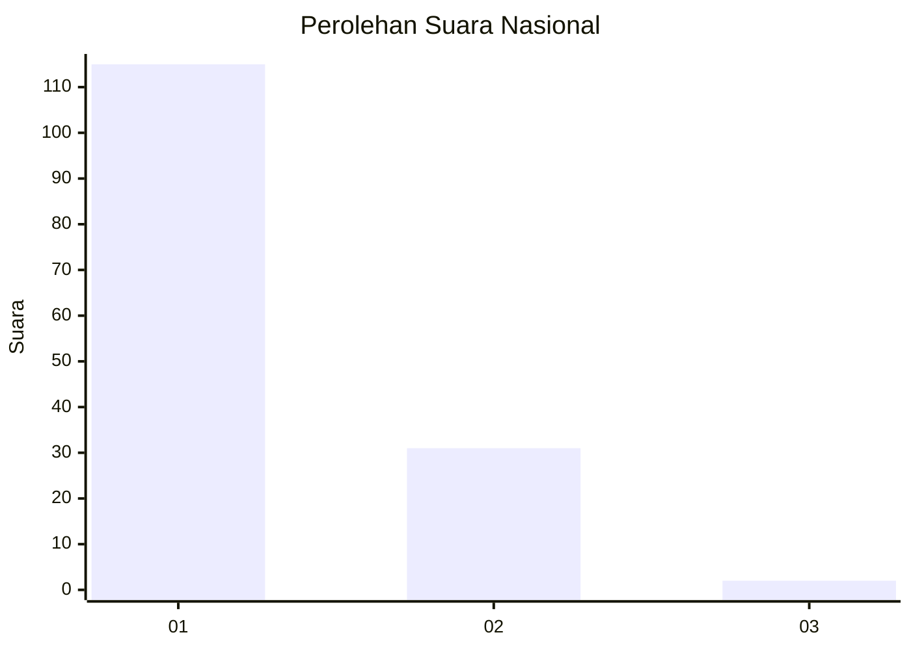
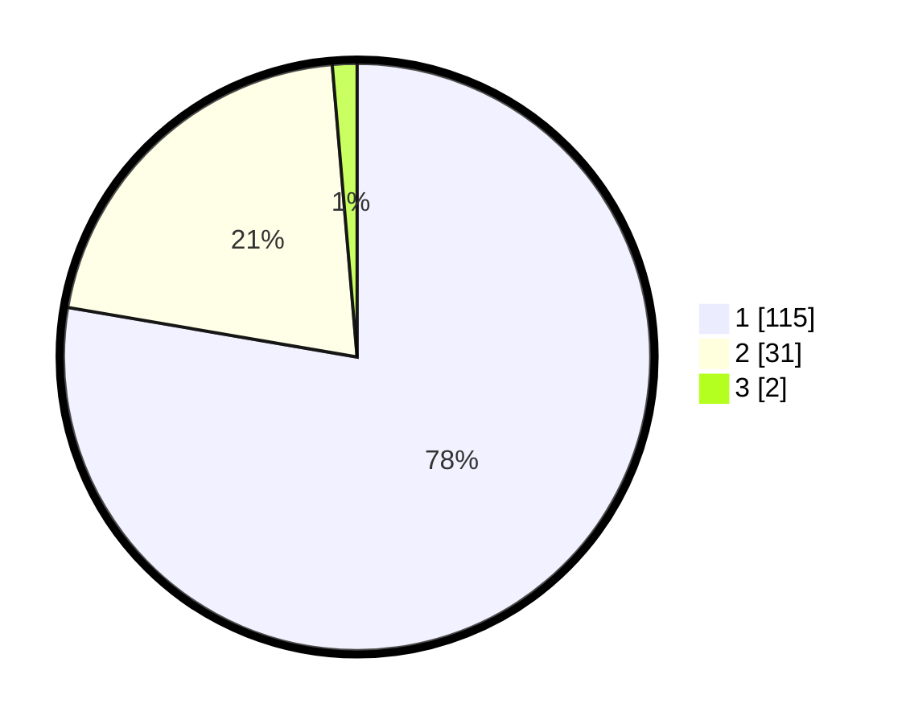

# Hasil

## Grafik

## Tabel

| No. | Nama Paslon    | Suara | Suara (raw) | Persentase |
|:--- |:-------------- | -----:| -----------:| ----------:|
| 1   | ANIES MUHAIMIN | 115   | [115][p-1]  | 77,70      |
| 2   | PRABOWO GIBRAN | 31    | [31][p-2]   | 20,95      |
| 3   | GANJAR MAHFUD  | 2     | [2][p-3]    | 1,35       |

[p-1]: https://github.com/gigit-pemilu/pemilu-2024/blob/main/pilpres/hitung-suara/sub/13-sumatera-barat/sub/07-lima-puluh-kota/sub/13-akabiluru/sub/2001-sariak-laweh/sub/004-tps/sub/paslon-1.txt
[p-2]: https://github.com/gigit-pemilu/pemilu-2024/blob/main/pilpres/hitung-suara/sub/13-sumatera-barat/sub/07-lima-puluh-kota/sub/13-akabiluru/sub/2001-sariak-laweh/sub/004-tps/sub/paslon-2.txt
[p-3]: https://github.com/gigit-pemilu/pemilu-2024/blob/main/pilpres/hitung-suara/sub/13-sumatera-barat/sub/07-lima-puluh-kota/sub/13-akabiluru/sub/2001-sariak-laweh/sub/004-tps/sub/paslon-3.txt

## Foto C Plano

https://sirekap-obj-formc.kpu.go.id/b8f5/pemilu/ppwp/13/07/13/20/01/1307132001004-20240214-214259--623d4202-c493-4a3e-b8c8-ff34a9f508d3.jpg

https://sirekap-obj-formc.kpu.go.id/b8f5/pemilu/ppwp/13/07/13/20/01/1307132001004-20240214-214526--539558a4-8b7a-44c5-8099-32aa0386fbdd.jpg

https://sirekap-obj-formc.kpu.go.id/b8f5/pemilu/ppwp/13/07/13/20/01/1307132001004-20240214-214629--b973f287-252c-4638-95b7-fe8aed82ef73.jpg

## Metadata

| Key        | Value               |
| ---------- | ------------------- |
| Time Stamp | 2024-02-15 12:00:28 |

