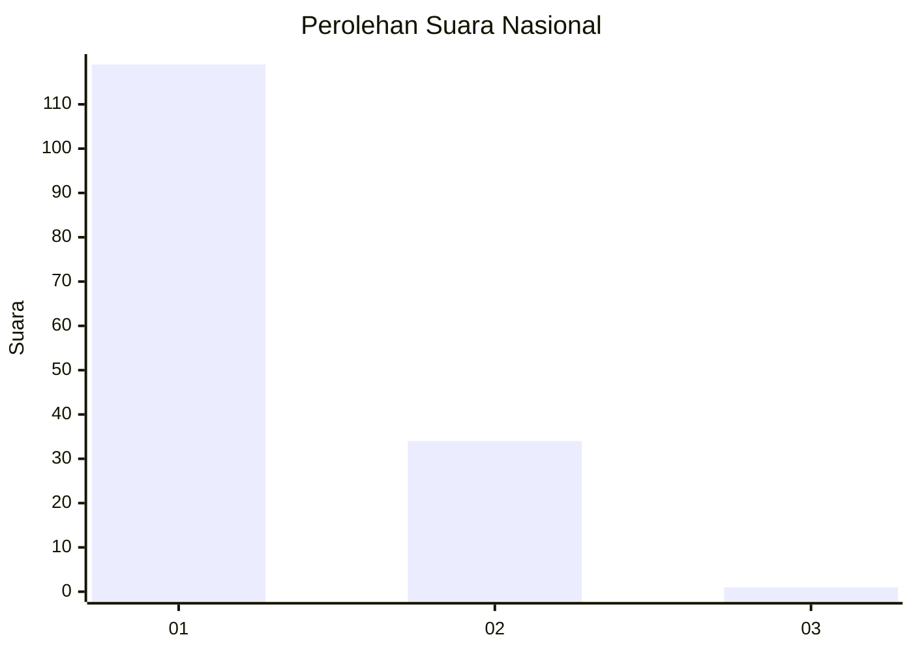
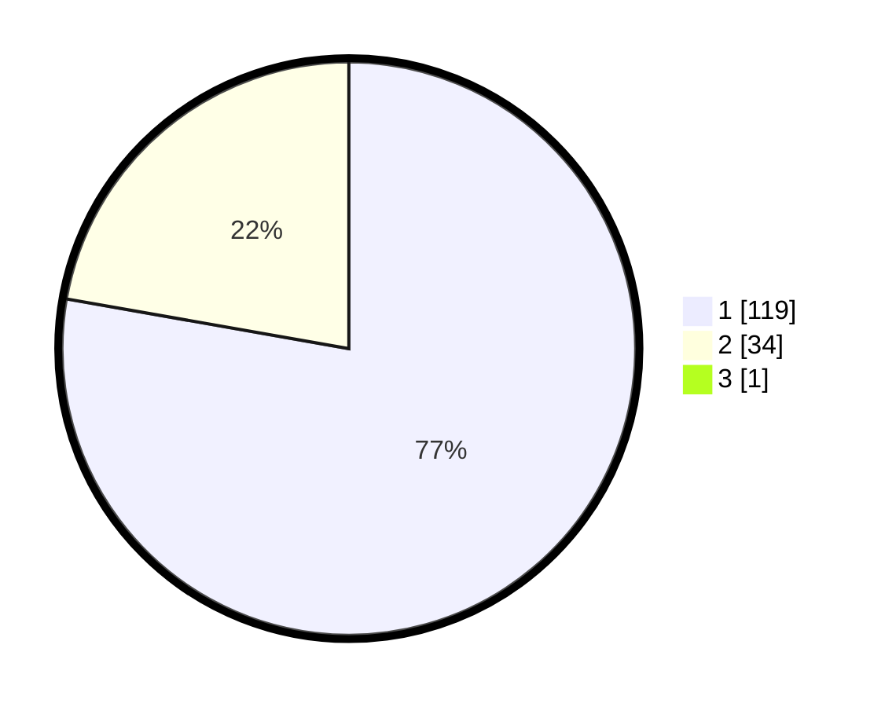

# Hasil

## Grafik

## Tabel

| No. | Nama Paslon    | Suara | Suara (raw) | Persentase |
|:--- |:-------------- | -----:| -----------:| ----------:|
| 1   | ANIES MUHAIMIN | 119   | [119][p-1]  | 77,27      |
| 2   | PRABOWO GIBRAN | 34    | [34][p-2]   | 22,08      |
| 3   | GANJAR MAHFUD  | 1     | [1][p-3]    | 0,65       |

[p-1]: https://github.com/gigit-pemilu/pemilu-2024/blob/main/pilpres/hitung-suara/sub/13-sumatera-barat/sub/07-lima-puluh-kota/sub/13-akabiluru/sub/2003-batuhampar/sub/004-tps/sub/paslon-1.txt
[p-2]: https://github.com/gigit-pemilu/pemilu-2024/blob/main/pilpres/hitung-suara/sub/13-sumatera-barat/sub/07-lima-puluh-kota/sub/13-akabiluru/sub/2003-batuhampar/sub/004-tps/sub/paslon-2.txt
[p-3]: https://github.com/gigit-pemilu/pemilu-2024/blob/main/pilpres/hitung-suara/sub/13-sumatera-barat/sub/07-lima-puluh-kota/sub/13-akabiluru/sub/2003-batuhampar/sub/004-tps/sub/paslon-3.txt

## Foto C Plano

https://sirekap-obj-formc.kpu.go.id/3f14/pemilu/ppwp/13/07/13/20/03/1307132003004-20240214-233819--97f91c73-9d51-4f27-a751-38e7ff7be9f3.jpg

https://sirekap-obj-formc.kpu.go.id/3f14/pemilu/ppwp/13/07/13/20/03/1307132003004-20240214-193318--f7f30fbf-fd76-4b19-bc44-a719ec73baa1.jpg

https://sirekap-obj-formc.kpu.go.id/3f14/pemilu/ppwp/13/07/13/20/03/1307132003004-20240214-200412--36a8a93c-f2ff-4519-bba1-18c3a35750ae.jpg

## Metadata

| Key        | Value               |
| ---------- | ------------------- |
| Time Stamp | 2024-02-15 00:41:44 |

