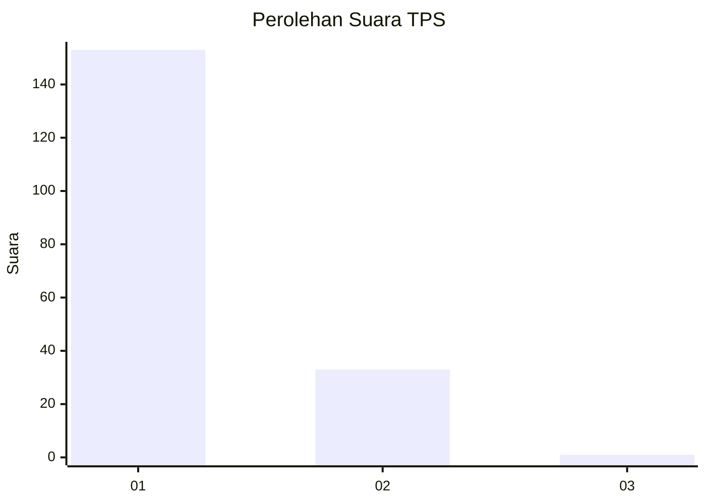
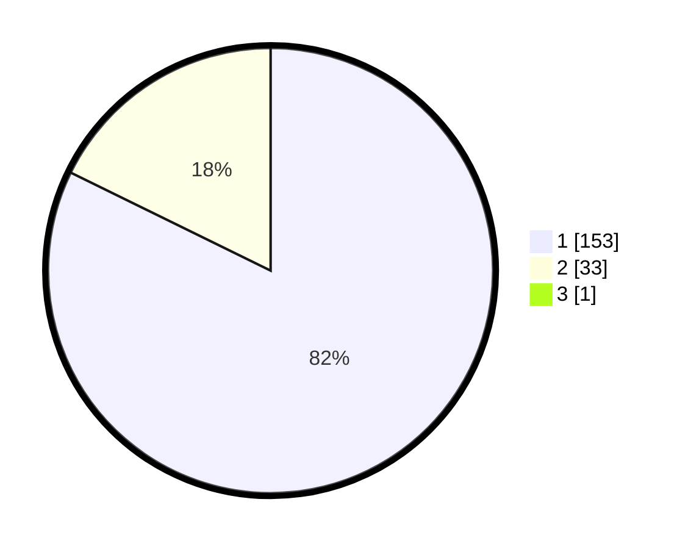

# Hasil

## Grafik

## Tabel

| No. | Nama Paslon    | Suara | Suara (raw) | Persentase |
|:--- |:-------------- | -----:| -----------:| ----------:|
| 1   | ANIES MUHAIMIN | 153   | [153][p-1]  | 81,82      |
| 2   | PRABOWO GIBRAN | 33    | [33][p-2]   | 17,65      |
| 3   | GANJAR MAHFUD  | 1     | [1][p-3]    | 0,53       |

[p-1]: https://github.com/gigit-pemilu/pemilu-2024-13-sumatera-barat/blob/main/pilpres/hitung-suara/sub/13-sumatera-barat/sub/07-lima-puluh-kota/sub/13-akabiluru/sub/2003-batuhampar/sub/011-tps/sub/paslon-1.txt
[p-2]: https://github.com/gigit-pemilu/pemilu-2024-13-sumatera-barat/blob/main/pilpres/hitung-suara/sub/13-sumatera-barat/sub/07-lima-puluh-kota/sub/13-akabiluru/sub/2003-batuhampar/sub/011-tps/sub/paslon-2.txt
[p-3]: https://github.com/gigit-pemilu/pemilu-2024-13-sumatera-barat/blob/main/pilpres/hitung-suara/sub/13-sumatera-barat/sub/07-lima-puluh-kota/sub/13-akabiluru/sub/2003-batuhampar/sub/011-tps/sub/paslon-3.txt

## Foto C Plano

https://sirekap-obj-formc.kpu.go.id/472a/pemilu/ppwp/13/07/13/20/03/1307132003011-20240219-103845--f4afbb89-bf22-40fd-b260-8948e9929ed5.jpg

https://sirekap-obj-formc.kpu.go.id/472a/pemilu/ppwp/13/07/13/20/03/1307132003011-20240215-002222--74c5ff0b-1c88-453e-8bb0-98611e5e8f3a.jpg

https://sirekap-obj-formc.kpu.go.id/472a/pemilu/ppwp/13/07/13/20/03/1307132003011-20240215-000538--8059f253-f9f6-40c0-b5cc-1f392bf2deb0.jpg

## Metadata

| Key        | Value               |
| ---------- | ------------------- |
| Time Stamp | 2024-02-19 11:00:00 |

