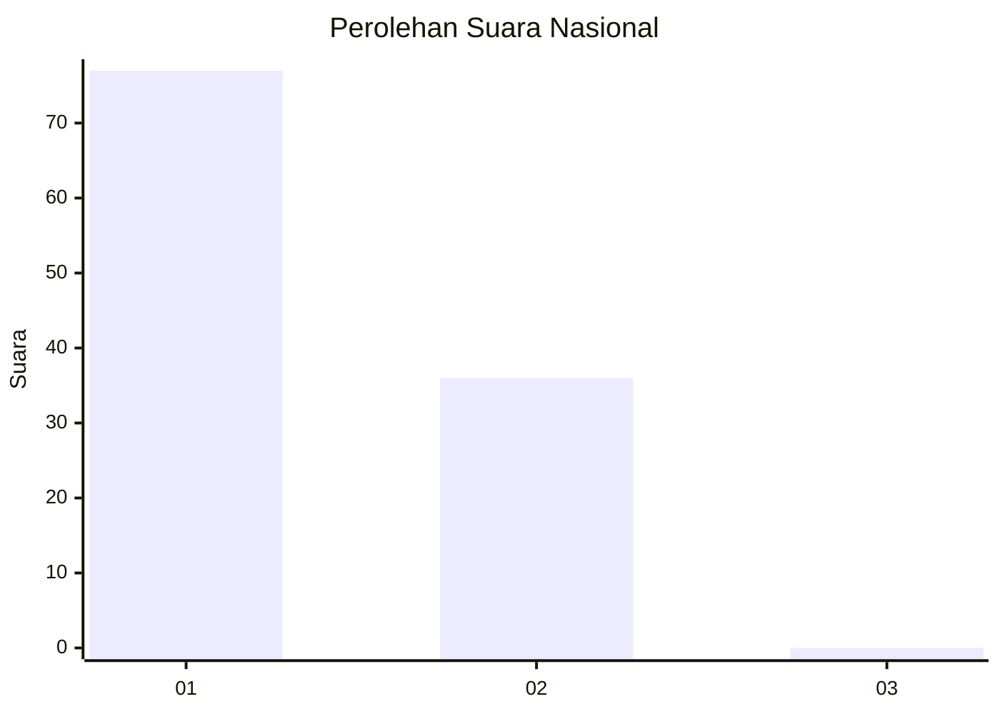
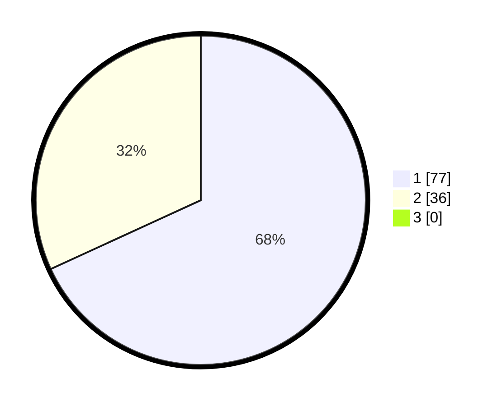

# Hasil

## Grafik

## Tabel

| No. | Nama Paslon    | Suara | Suara (raw) | Persentase |
|:--- |:-------------- | -----:| -----------:| ----------:|
| 1   | ANIES MUHAIMIN | 77    | [77][p-1]   | 68,14      |
| 2   | PRABOWO GIBRAN | 36    | [36][p-2]   | 31,86      |
| 3   | GANJAR MAHFUD  | 0     | [0][p-3]    | 0,00       |

[p-1]: https://github.com/gigit-pemilu/pemilu-2024/blob/main/pilpres/hitung-suara/sub/13-sumatera-barat/sub/07-lima-puluh-kota/sub/13-akabiluru/sub/2003-batuhampar/sub/012-tps/sub/paslon-1.txt
[p-2]: https://github.com/gigit-pemilu/pemilu-2024/blob/main/pilpres/hitung-suara/sub/13-sumatera-barat/sub/07-lima-puluh-kota/sub/13-akabiluru/sub/2003-batuhampar/sub/012-tps/sub/paslon-2.txt
[p-3]: https://github.com/gigit-pemilu/pemilu-2024/blob/main/pilpres/hitung-suara/sub/13-sumatera-barat/sub/07-lima-puluh-kota/sub/13-akabiluru/sub/2003-batuhampar/sub/012-tps/sub/paslon-3.txt

## Foto C Plano

https://sirekap-obj-formc.kpu.go.id/2156/pemilu/ppwp/13/07/13/20/03/1307132003012-20240214-212835--cade012e-b075-4c26-9b03-e0cc2fc2b361.jpg

https://sirekap-obj-formc.kpu.go.id/2156/pemilu/ppwp/13/07/13/20/03/1307132003012-20240214-212907--6c6a6682-6688-4de8-9870-64d7d6d3ba1c.jpg

https://sirekap-obj-formc.kpu.go.id/2156/pemilu/ppwp/13/07/13/20/03/1307132003012-20240216-002207--54a60a30-2aff-4d6f-a285-d22c6e2c9227.jpg

## Metadata

| Key        | Value               |
| ---------- | ------------------- |
| Time Stamp | 2024-02-16 12:51:22 |

