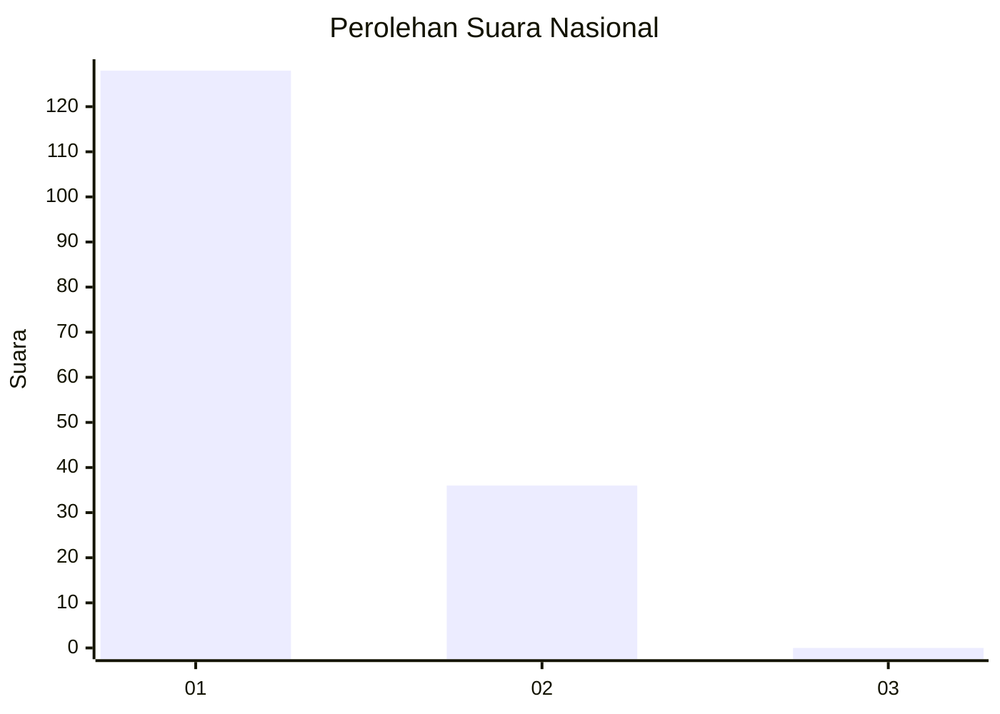
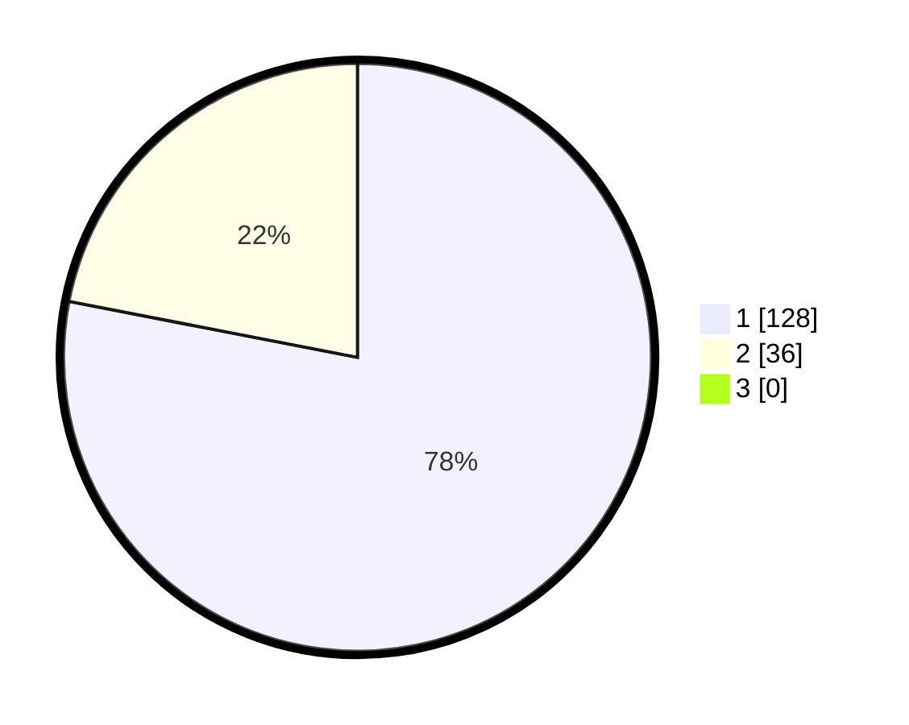

# Hasil

## Grafik

## Tabel

| No. | Nama Paslon    | Suara | Suara (raw) | Persentase |
|:--- |:-------------- | -----:| -----------:| ----------:|
| 1   | ANIES MUHAIMIN | 128   | [128][p-1]  | 78,05      |
| 2   | PRABOWO GIBRAN | 36    | [36][p-2]   | 21,95      |
| 3   | GANJAR MAHFUD  | 0     | [0][p-3]    | 0,00       |

[p-1]: https://github.com/gigit-pemilu/pemilu-2024/blob/main/pilpres/hitung-suara/sub/13-sumatera-barat/sub/07-lima-puluh-kota/sub/13-akabiluru/sub/2007-durian-gadang/sub/001-tps/sub/paslon-1.txt
[p-2]: https://github.com/gigit-pemilu/pemilu-2024/blob/main/pilpres/hitung-suara/sub/13-sumatera-barat/sub/07-lima-puluh-kota/sub/13-akabiluru/sub/2007-durian-gadang/sub/001-tps/sub/paslon-2.txt
[p-3]: https://github.com/gigit-pemilu/pemilu-2024/blob/main/pilpres/hitung-suara/sub/13-sumatera-barat/sub/07-lima-puluh-kota/sub/13-akabiluru/sub/2007-durian-gadang/sub/001-tps/sub/paslon-3.txt

## Foto C Plano

https://sirekap-obj-formc.kpu.go.id/ec37/pemilu/ppwp/13/07/13/20/07/1307132007001-20240214-233303--b38bfa64-b274-47e0-b9a3-10762734fd07.jpg

https://sirekap-obj-formc.kpu.go.id/ec37/pemilu/ppwp/13/07/13/20/07/1307132007001-20240214-233349--447d4d58-bc81-4999-b2e3-b9a9306958c6.jpg

https://sirekap-obj-formc.kpu.go.id/ec37/pemilu/ppwp/13/07/13/20/07/1307132007001-20240214-233504--5a3347c0-b429-4637-b04c-7cc322c2eb30.jpg

## Metadata

| Key        | Value               |
| ---------- | ------------------- |
| Time Stamp | 2024-02-16 12:51:22 |

