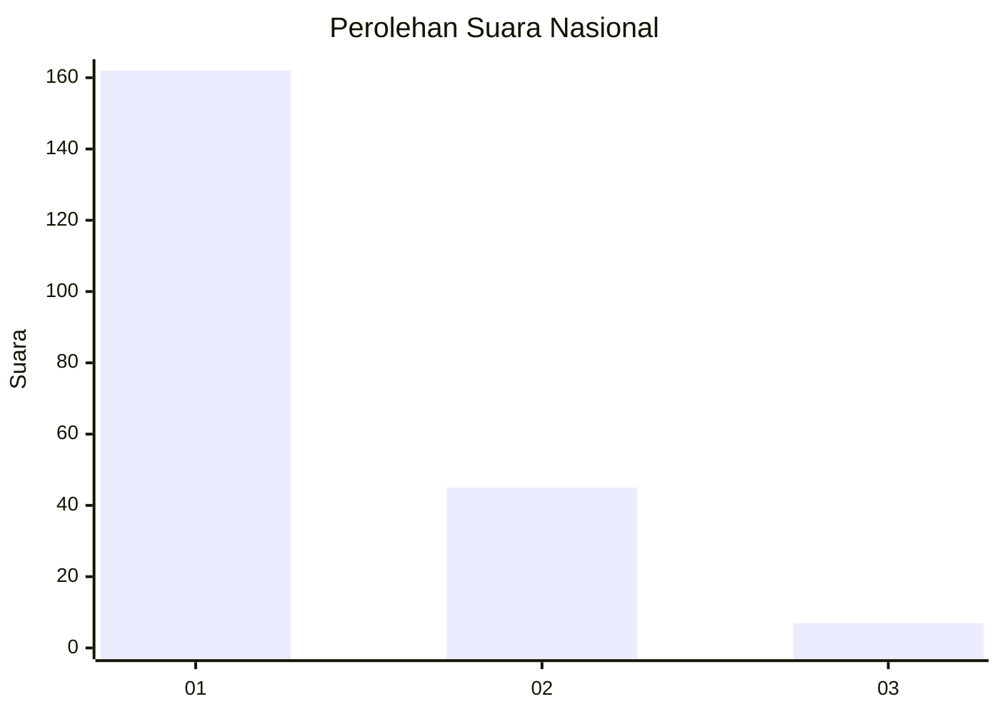
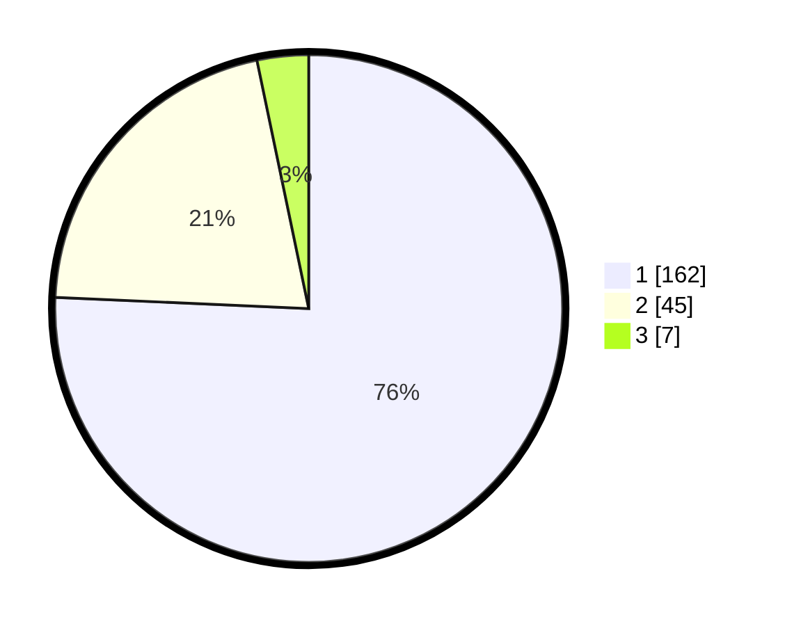

# Hasil

## Grafik

## Tabel

| No. | Nama Paslon    | Suara | Suara (raw) | Persentase |
|:--- |:-------------- | -----:| -----------:| ----------:|
| 1   | ANIES MUHAIMIN | 162   | [162][p-1]  | 75,70      |
| 2   | PRABOWO GIBRAN | 45    | [45][p-2]   | 21,03      |
| 3   | GANJAR MAHFUD  | 7     | [7][p-3]    | 3,27       |

[p-1]: https://github.com/gigit-pemilu/pemilu-2024/blob/main/pilpres/hitung-suara/sub/13-sumatera-barat/sub/08-pasaman/sub/04-bonjol/sub/2007-koto-kaciak-barat/sub/003-tps/sub/paslon-1.txt
[p-2]: https://github.com/gigit-pemilu/pemilu-2024/blob/main/pilpres/hitung-suara/sub/13-sumatera-barat/sub/08-pasaman/sub/04-bonjol/sub/2007-koto-kaciak-barat/sub/003-tps/sub/paslon-2.txt
[p-3]: https://github.com/gigit-pemilu/pemilu-2024/blob/main/pilpres/hitung-suara/sub/13-sumatera-barat/sub/08-pasaman/sub/04-bonjol/sub/2007-koto-kaciak-barat/sub/003-tps/sub/paslon-3.txt

## Foto C Plano

https://sirekap-obj-formc.kpu.go.id/a164/pemilu/ppwp/13/08/04/20/07/1308042007003-20240215-063028--923ec859-ba40-4544-837c-c3d44f931774.jpg

https://sirekap-obj-formc.kpu.go.id/a164/pemilu/ppwp/13/08/04/20/07/1308042007003-20240215-064335--219aa877-abbe-41b9-96b7-bc3633f75317.jpg

https://sirekap-obj-formc.kpu.go.id/a164/pemilu/ppwp/13/08/04/20/07/1308042007003-20240215-064658--bf47c768-5025-40a9-933c-e93cb9721132.jpg

## Metadata

| Key        | Value               |
| ---------- | ------------------- |
| Time Stamp | 2024-02-15 21:30:27 |

