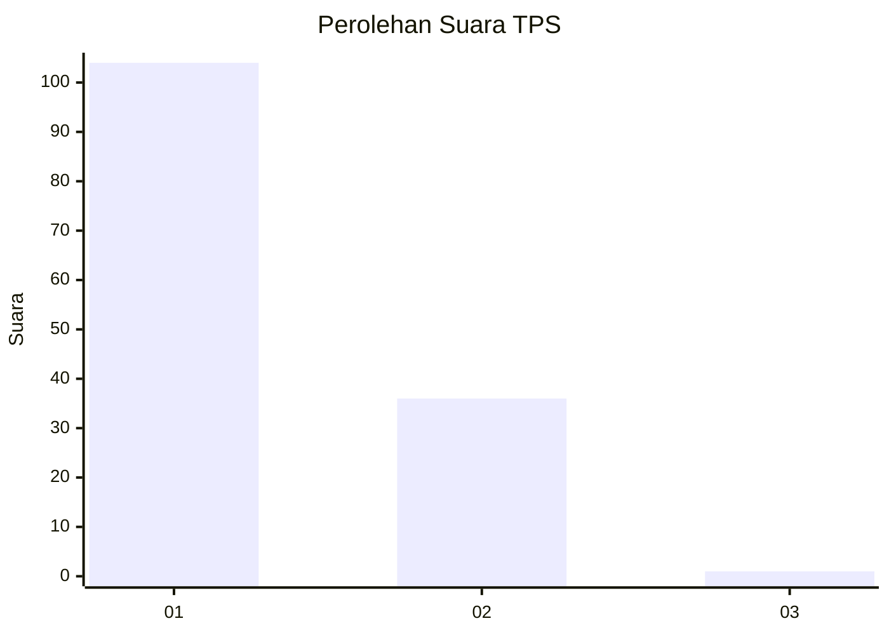
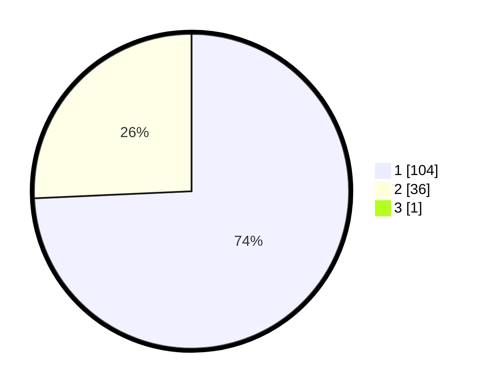

# Hasil

## Grafik

## Tabel

| No. | Nama Paslon    | Suara | Suara (raw) | Persentase |
|:--- |:-------------- | -----:| -----------:| ----------:|
| 1   | ANIES MUHAIMIN | 104   | [104][p-1]  | 73,76      |
| 2   | PRABOWO GIBRAN | 36    | [36][p-2]   | 25,53      |
| 3   | GANJAR MAHFUD  | 1     | [1][p-3]    | 0,71       |

[p-1]: https://github.com/gigit-pemilu/pemilu-2024-13-sumatera-barat/blob/main/pilpres/hitung-suara/sub/13-sumatera-barat/sub/08-pasaman/sub/04-bonjol/sub/2007-koto-kaciak-barat/sub/005-tps/sub/paslon-1.txt
[p-2]: https://github.com/gigit-pemilu/pemilu-2024-13-sumatera-barat/blob/main/pilpres/hitung-suara/sub/13-sumatera-barat/sub/08-pasaman/sub/04-bonjol/sub/2007-koto-kaciak-barat/sub/005-tps/sub/paslon-2.txt
[p-3]: https://github.com/gigit-pemilu/pemilu-2024-13-sumatera-barat/blob/main/pilpres/hitung-suara/sub/13-sumatera-barat/sub/08-pasaman/sub/04-bonjol/sub/2007-koto-kaciak-barat/sub/005-tps/sub/paslon-3.txt

## Foto C Plano

https://sirekap-obj-formc.kpu.go.id/4b1a/pemilu/ppwp/13/08/04/20/07/1308042007005-20240215-035728--9fdc2f4c-d53b-4eb9-93d8-ce51a2b559b1.jpg

https://sirekap-obj-formc.kpu.go.id/4b1a/pemilu/ppwp/13/08/04/20/07/1308042007005-20240215-005908--e85ff606-f170-4817-a11e-7b851caff694.jpg

https://sirekap-obj-formc.kpu.go.id/4b1a/pemilu/ppwp/13/08/04/20/07/1308042007005-20240215-010024--7b2c8ea5-3dbb-48aa-b89a-6384aa83497c.jpg

## Metadata

| Key        | Value               |
| ---------- | ------------------- |
| Time Stamp | 2024-02-15 21:30:27 |

