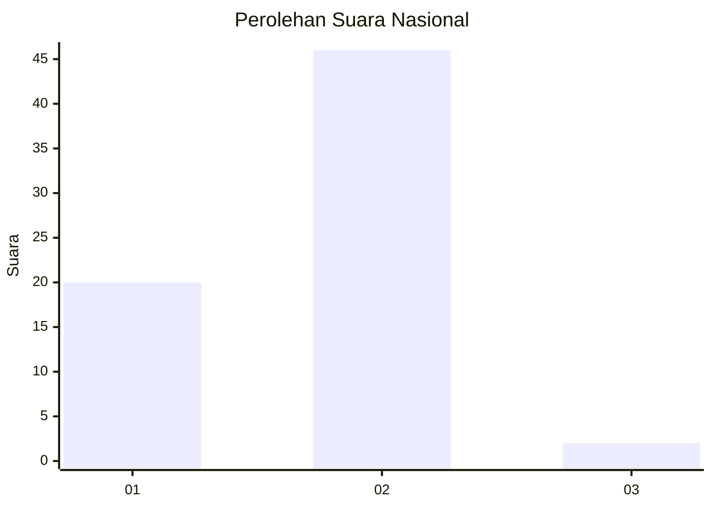
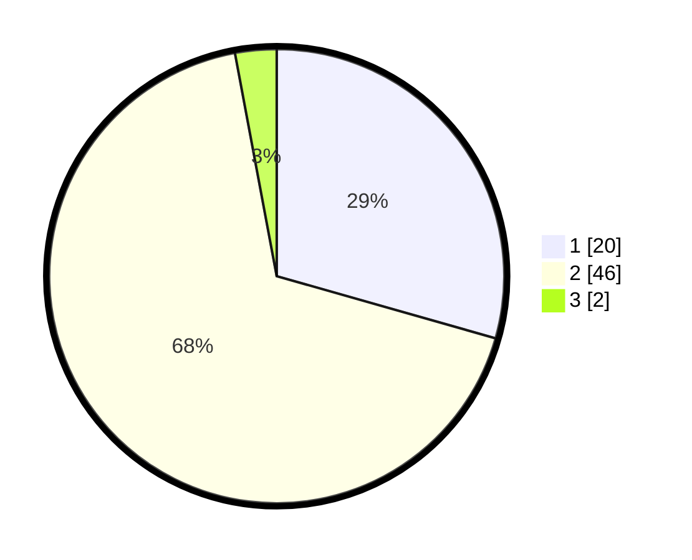

# Hasil

## Grafik

## Tabel

| No. | Nama Paslon    | Suara | Suara (raw) | Persentase |
|:--- |:-------------- | -----:| -----------:| ----------:|
| 1   | ANIES MUHAIMIN | 20    | [20][p-1]   | 29,41      |
| 2   | PRABOWO GIBRAN | 46    | [46][p-2]   | 67,65      |
| 3   | GANJAR MAHFUD  | 2     | [2][p-3]    | 2,94       |

[p-1]: https://github.com/gigit-pemilu/pemilu-2024/blob/main/pilpres/hitung-suara/sub/13-sumatera-barat/sub/08-pasaman/sub/05-lubuk-sikaping/sub/2004-pauah/sub/901-tps/sub/paslon-1.txt
[p-2]: https://github.com/gigit-pemilu/pemilu-2024/blob/main/pilpres/hitung-suara/sub/13-sumatera-barat/sub/08-pasaman/sub/05-lubuk-sikaping/sub/2004-pauah/sub/901-tps/sub/paslon-2.txt
[p-3]: https://github.com/gigit-pemilu/pemilu-2024/blob/main/pilpres/hitung-suara/sub/13-sumatera-barat/sub/08-pasaman/sub/05-lubuk-sikaping/sub/2004-pauah/sub/901-tps/sub/paslon-3.txt

## Foto C Plano

https://sirekap-obj-formc.kpu.go.id/e294/pemilu/ppwp/13/08/05/20/04/1308052004901-20240214-202706--f93aa0e8-7192-4f42-9d9c-6066e0527f66.jpg

https://sirekap-obj-formc.kpu.go.id/e294/pemilu/ppwp/13/08/05/20/04/1308052004901-20240214-160128--c6e5ce2a-1c6a-4fa6-9d34-d07a6ede026c.jpg

https://sirekap-obj-formc.kpu.go.id/e294/pemilu/ppwp/13/08/05/20/04/1308052004901-20240214-202941--7d923a9d-5e84-42a2-bebe-0cf9c790a740.jpg

## Metadata

| Key        | Value               |
| ---------- | ------------------- |
| Time Stamp | 2024-02-24 22:31:28 |

