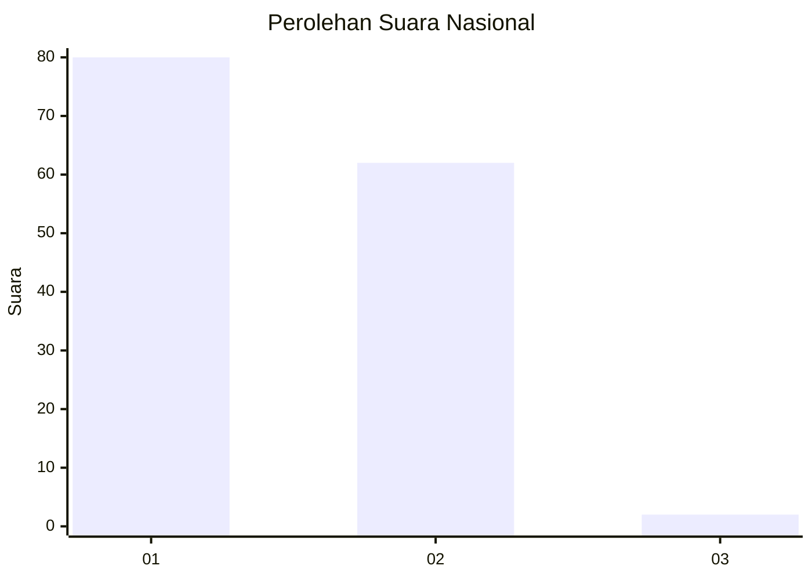
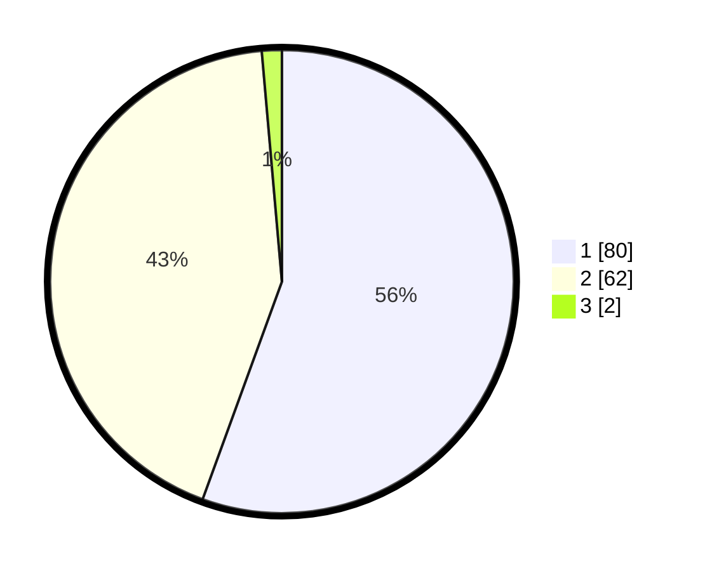

# Hasil

## Grafik

## Tabel

| No. | Nama Paslon    | Suara | Suara (raw) | Persentase |
|:--- |:-------------- | -----:| -----------:| ----------:|
| 1   | ANIES MUHAIMIN | 80    | [80][p-1]   | 55,56      |
| 2   | PRABOWO GIBRAN | 62    | [62][p-2]   | 43,06      |
| 3   | GANJAR MAHFUD  | 2     | [2][p-3]    | 1,39       |

[p-1]: https://github.com/gigit-pemilu/pemilu-2024/blob/main/pilpres/hitung-suara/sub/13-sumatera-barat/sub/08-pasaman/sub/12-duo-koto/sub/2001-simpang-tonang/sub/001-tps/sub/paslon-1.txt
[p-2]: https://github.com/gigit-pemilu/pemilu-2024/blob/main/pilpres/hitung-suara/sub/13-sumatera-barat/sub/08-pasaman/sub/12-duo-koto/sub/2001-simpang-tonang/sub/001-tps/sub/paslon-2.txt
[p-3]: https://github.com/gigit-pemilu/pemilu-2024/blob/main/pilpres/hitung-suara/sub/13-sumatera-barat/sub/08-pasaman/sub/12-duo-koto/sub/2001-simpang-tonang/sub/001-tps/sub/paslon-3.txt

## Foto C Plano

https://sirekap-obj-formc.kpu.go.id/aa5e/pemilu/ppwp/13/08/12/20/01/1308122001001-20240215-013621--09953b26-872e-4996-bb35-b622ab0ccdaf.jpg

https://sirekap-obj-formc.kpu.go.id/aa5e/pemilu/ppwp/13/08/12/20/01/1308122001001-20240215-013942--4a6a3cc3-f226-471a-a83f-0510c64a5261.jpg

https://sirekap-obj-formc.kpu.go.id/aa5e/pemilu/ppwp/13/08/12/20/01/1308122001001-20240215-014107--7a1b97c6-0071-4dea-86ef-3027900c869d.jpg

## Metadata

| Key        | Value               |
| ---------- | ------------------- |
| Time Stamp | 2024-02-24 22:31:28 |

