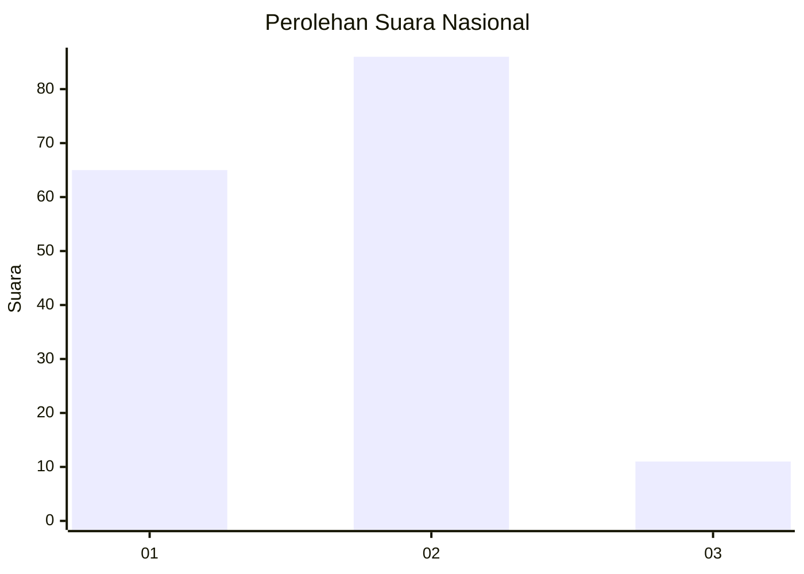
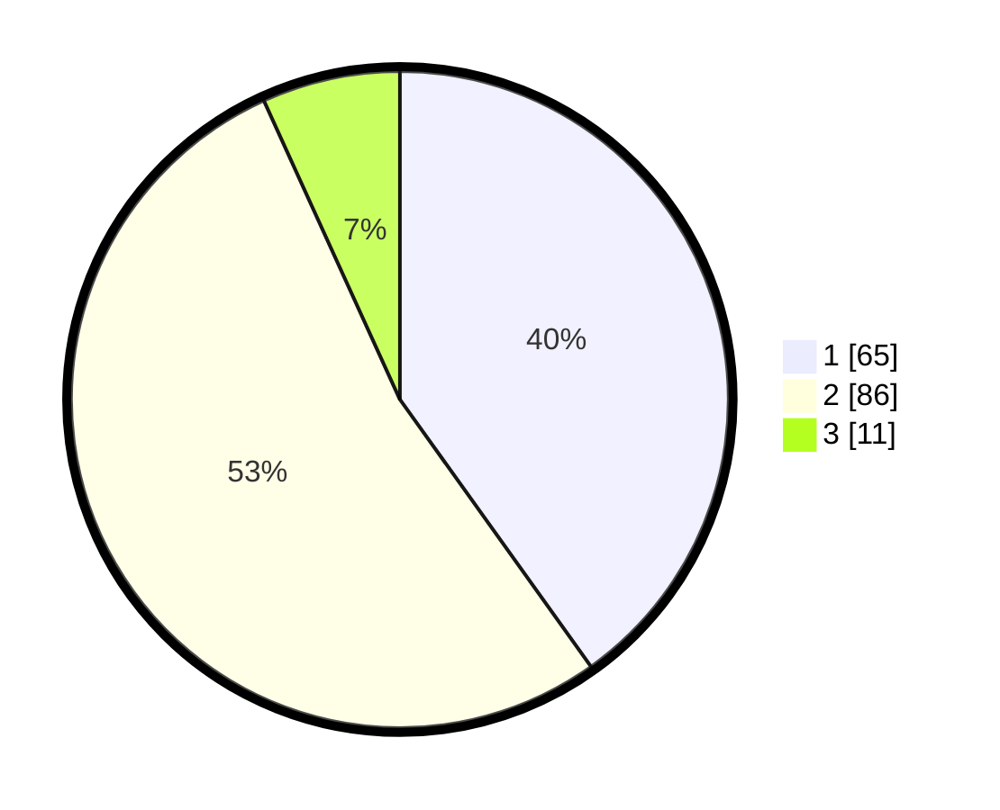

# Hasil

## Grafik

## Tabel

| No. | Nama Paslon    | Suara | Suara (raw) | Persentase |
|:--- |:-------------- | -----:| -----------:| ----------:|
| 1   | ANIES MUHAIMIN | 65    | [65][p-1]   | 40,12      |
| 2   | PRABOWO GIBRAN | 86    | [86][p-2]   | 53,09      |
| 3   | GANJAR MAHFUD  | 11    | [11][p-3]   | 6,79       |

[p-1]: https://github.com/gigit-pemilu/pemilu-2024/blob/main/pilpres/hitung-suara/sub/13-sumatera-barat/sub/08-pasaman/sub/12-duo-koto/sub/2001-simpang-tonang/sub/002-tps/sub/paslon-1.txt
[p-2]: https://github.com/gigit-pemilu/pemilu-2024/blob/main/pilpres/hitung-suara/sub/13-sumatera-barat/sub/08-pasaman/sub/12-duo-koto/sub/2001-simpang-tonang/sub/002-tps/sub/paslon-2.txt
[p-3]: https://github.com/gigit-pemilu/pemilu-2024/blob/main/pilpres/hitung-suara/sub/13-sumatera-barat/sub/08-pasaman/sub/12-duo-koto/sub/2001-simpang-tonang/sub/002-tps/sub/paslon-3.txt

## Foto C Plano

https://sirekap-obj-formc.kpu.go.id/1670/pemilu/ppwp/13/08/12/20/01/1308122001002-20240215-081749--a9ccfe1d-21e8-4ce4-8b64-5788427b9ad0.jpg

https://sirekap-obj-formc.kpu.go.id/1670/pemilu/ppwp/13/08/12/20/01/1308122001002-20240215-081847--2bb17127-fefd-46a2-9cc5-7e3c5310e9d1.jpg

https://sirekap-obj-formc.kpu.go.id/1670/pemilu/ppwp/13/08/12/20/01/1308122001002-20240215-082019--2e5c8460-6355-487f-b13e-f91e43e8e861.jpg

## Metadata

| Key        | Value               |
| ---------- | ------------------- |
| Time Stamp | 2024-02-26 15:00:00 |

