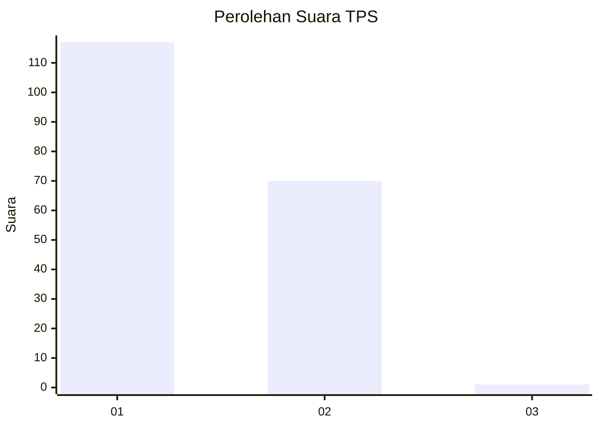
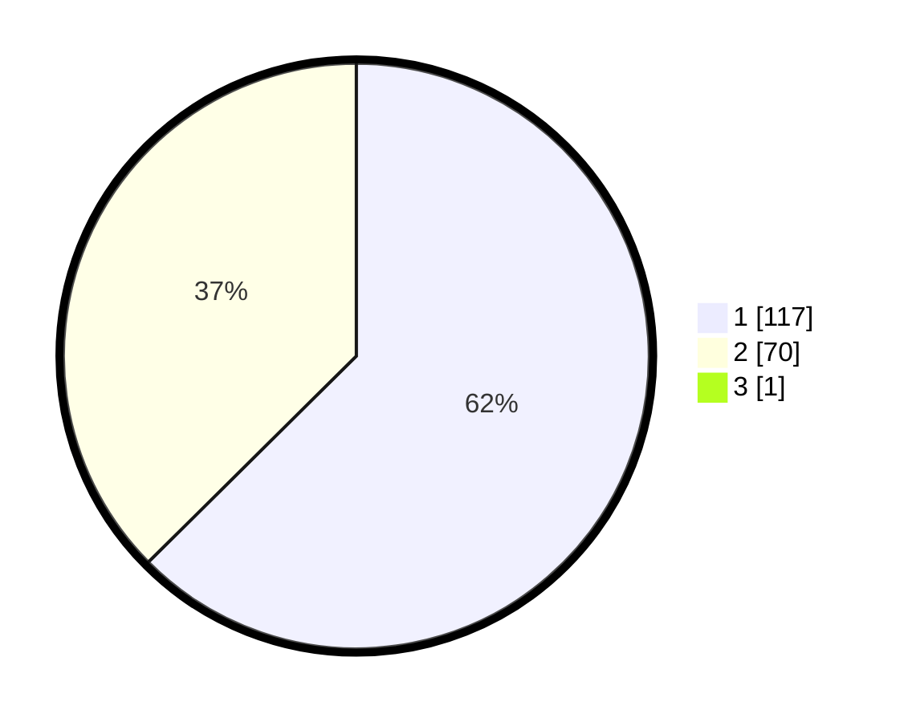

# Hasil

## Grafik

## Tabel

| No. | Nama Paslon    | Suara | Suara (raw) | Persentase |
|:--- |:-------------- | -----:| -----------:| ----------:|
| 1   | ANIES MUHAIMIN | 117   | [117][p-1]  | 62,23      |
| 2   | PRABOWO GIBRAN | 70    | [70][p-2]   | 37,23      |
| 3   | GANJAR MAHFUD  | 1     | [1][p-3]    | 0,53       |

[p-1]: https://github.com/gigit-pemilu/pemilu-2024-13-sumatera-barat/blob/main/pilpres/hitung-suara/sub/13-sumatera-barat/sub/08-pasaman/sub/12-duo-koto/sub/2001-simpang-tonang/sub/004-tps/sub/paslon-1.txt
[p-2]: https://github.com/gigit-pemilu/pemilu-2024-13-sumatera-barat/blob/main/pilpres/hitung-suara/sub/13-sumatera-barat/sub/08-pasaman/sub/12-duo-koto/sub/2001-simpang-tonang/sub/004-tps/sub/paslon-2.txt
[p-3]: https://github.com/gigit-pemilu/pemilu-2024-13-sumatera-barat/blob/main/pilpres/hitung-suara/sub/13-sumatera-barat/sub/08-pasaman/sub/12-duo-koto/sub/2001-simpang-tonang/sub/004-tps/sub/paslon-3.txt

## Foto C Plano

https://sirekap-obj-formc.kpu.go.id/8035/pemilu/ppwp/13/08/12/20/01/1308122001004-20240214-210523--2d5b0658-cc95-4b82-a66c-85f684a7084b.jpg

https://sirekap-obj-formc.kpu.go.id/8035/pemilu/ppwp/13/08/12/20/01/1308122001004-20240214-210941--a91baece-dfd5-43d6-8703-5b427204a98d.jpg

https://sirekap-obj-formc.kpu.go.id/8035/pemilu/ppwp/13/08/12/20/01/1308122001004-20240214-211136--b1d8a31b-6894-4b4e-8219-c9303e70d2cb.jpg

## Metadata

| Key        | Value               |
| ---------- | ------------------- |
| Time Stamp | 2024-02-25 21:00:00 |

