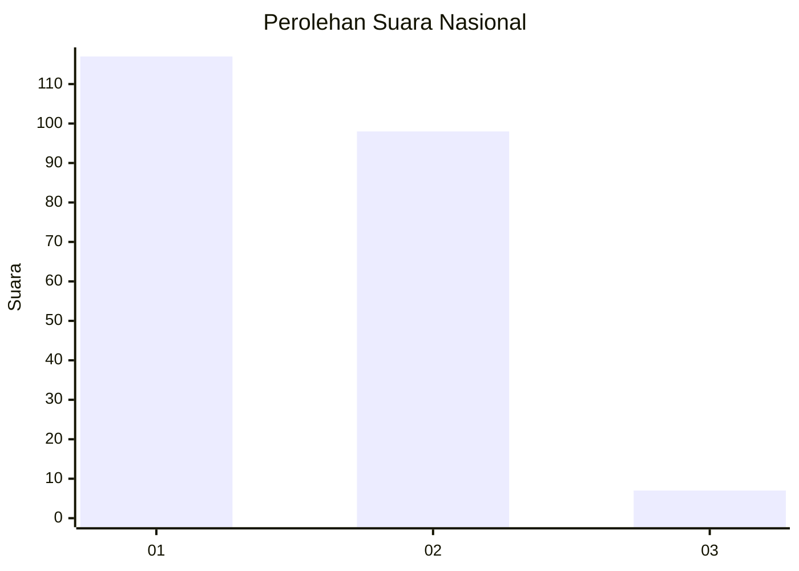
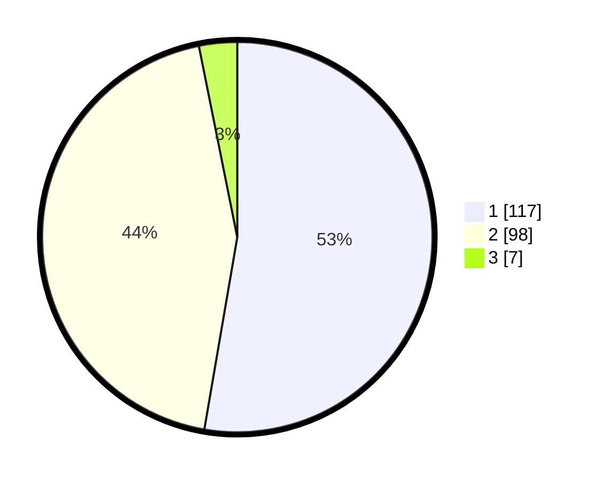

# Hasil

## Grafik

## Tabel

| No. | Nama Paslon    | Suara | Suara (raw) | Persentase |
|:--- |:-------------- | -----:| -----------:| ----------:|
| 1   | ANIES MUHAIMIN | 117   | [117][p-1]  | 52,70      |
| 2   | PRABOWO GIBRAN | 98    | [98][p-2]   | 44,14      |
| 3   | GANJAR MAHFUD  | 7     | [7][p-3]    | 3,15       |

[p-1]: https://github.com/gigit-pemilu/pemilu-2024/blob/main/pilpres/hitung-suara/sub/13-sumatera-barat/sub/08-pasaman/sub/12-duo-koto/sub/2001-simpang-tonang/sub/005-tps/sub/paslon-1.txt
[p-2]: https://github.com/gigit-pemilu/pemilu-2024/blob/main/pilpres/hitung-suara/sub/13-sumatera-barat/sub/08-pasaman/sub/12-duo-koto/sub/2001-simpang-tonang/sub/005-tps/sub/paslon-2.txt
[p-3]: https://github.com/gigit-pemilu/pemilu-2024/blob/main/pilpres/hitung-suara/sub/13-sumatera-barat/sub/08-pasaman/sub/12-duo-koto/sub/2001-simpang-tonang/sub/005-tps/sub/paslon-3.txt

## Foto C Plano

https://sirekap-obj-formc.kpu.go.id/36d6/pemilu/ppwp/13/08/12/20/01/1308122001005-20240214-224106--23c7cdcd-0921-4142-9c50-900f09734161.jpg

https://sirekap-obj-formc.kpu.go.id/36d6/pemilu/ppwp/13/08/12/20/01/1308122001005-20240214-224545--b991e90b-e892-4bf3-ae21-a47a171d867a.jpg

https://sirekap-obj-formc.kpu.go.id/36d6/pemilu/ppwp/13/08/12/20/01/1308122001005-20240214-224828--1f2e9e9f-d42f-4d42-8e7a-85a02c9e2b1a.jpg

## Metadata

| Key        | Value               |
| ---------- | ------------------- |
| Time Stamp | 2024-02-25 13:00:00 |

