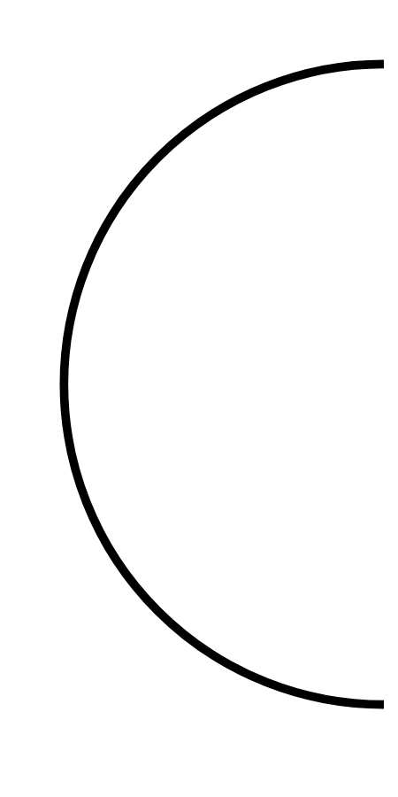

# Hasil

## Grafik

```mermaid
xychart-beta
    title "Perolehan Suara Nasional"
    x-axis []
    y-axis "Suara" 0 --> 0
    bar []
```



## Tabel

| No. | Nama Paslon | Suara | Suara (raw) | Persentase |
|:--- |:----------- | -----:| -----------:| ----------:|


[p-1]: https://github.com/gigit-pemilu/pemilu-2024/blob/main/pilpres/hitung-suara/sub/13-sumatera-barat/sub/08-pasaman/sub/12-duo-koto/sub/2007-cubadak-barat/sub/010-tps/sub/paslon-1.txt
[p-2]: https://github.com/gigit-pemilu/pemilu-2024/blob/main/pilpres/hitung-suara/sub/13-sumatera-barat/sub/08-pasaman/sub/12-duo-koto/sub/2007-cubadak-barat/sub/010-tps/sub/paslon-2.txt
[p-3]: https://github.com/gigit-pemilu/pemilu-2024/blob/main/pilpres/hitung-suara/sub/13-sumatera-barat/sub/08-pasaman/sub/12-duo-koto/sub/2007-cubadak-barat/sub/010-tps/sub/paslon-3.txt

## Foto C Plano

https://sirekap-obj-formc.kpu.go.id/626a/pemilu/ppwp/13/08/12/20/07/1308122007010-20240228-112458--75050aed-5d29-4ff5-a7b4-c25e9b3ea656.jpg

https://sirekap-obj-formc.kpu.go.id/626a/pemilu/ppwp/13/08/12/20/07/1308122007010-20240217-132808--f9508ab6-0908-4f34-b753-339589fdb514.jpg

https://sirekap-obj-formc.kpu.go.id/626a/pemilu/ppwp/13/08/12/20/07/1308122007010-20240228-112507--33c6de2a-1eb7-4ce1-9451-9f00a518eaf8.jpg


## Metadata

| Key        | Value               |
| ---------- | ------------------- |
| Time Stamp | 2024-02-28 12:00:00 |


