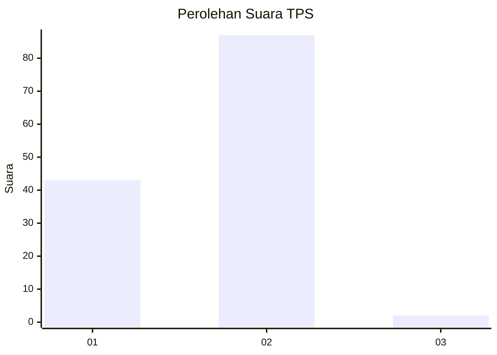
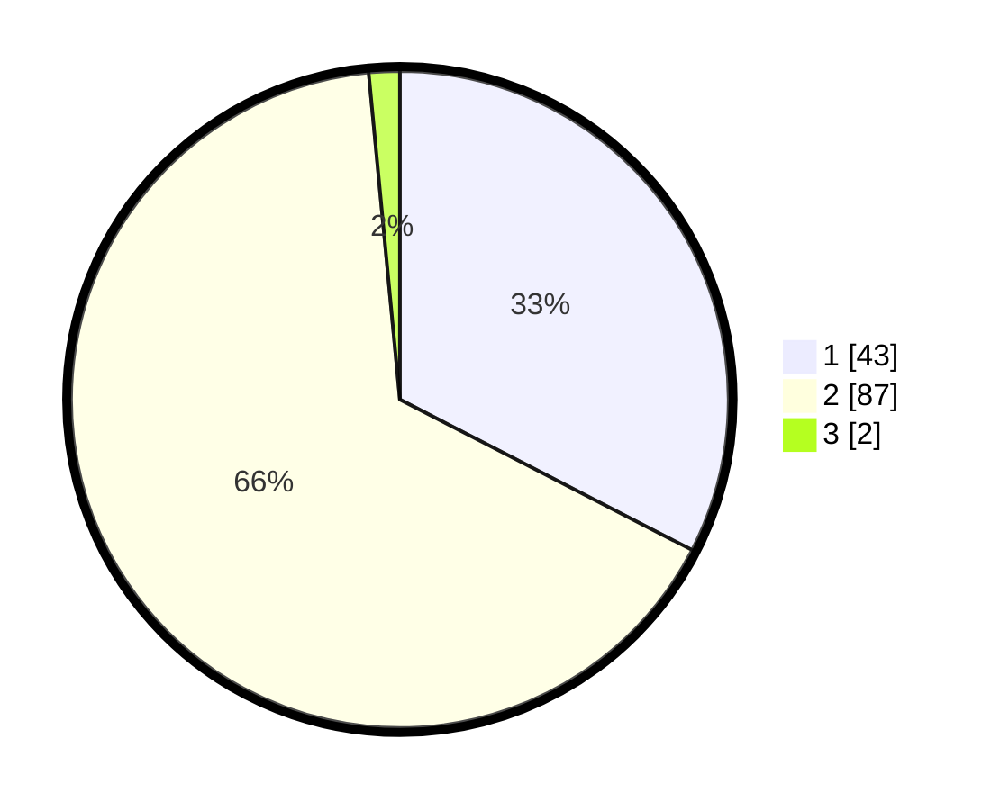

# Hasil

## Grafik

## Tabel

| No. | Nama Paslon    | Suara | Suara (raw) | Persentase |
|:--- |:-------------- | -----:| -----------:| ----------:|
| 1   | ANIES MUHAIMIN | 43    | [43][p-1]   | 32,58      |
| 2   | PRABOWO GIBRAN | 87    | [87][p-2]   | 65,91      |
| 3   | GANJAR MAHFUD  | 2     | [2][p-3]    | 1,52       |

[p-1]: https://github.com/gigit-pemilu/pemilu-2024-13-sumatera-barat/blob/main/pilpres/hitung-suara/sub/13-sumatera-barat/sub/08-pasaman/sub/15-mapat-tunggul-selatan/sub/2001-silayang/sub/001-tps/sub/paslon-1.txt
[p-2]: https://github.com/gigit-pemilu/pemilu-2024-13-sumatera-barat/blob/main/pilpres/hitung-suara/sub/13-sumatera-barat/sub/08-pasaman/sub/15-mapat-tunggul-selatan/sub/2001-silayang/sub/001-tps/sub/paslon-2.txt
[p-3]: https://github.com/gigit-pemilu/pemilu-2024-13-sumatera-barat/blob/main/pilpres/hitung-suara/sub/13-sumatera-barat/sub/08-pasaman/sub/15-mapat-tunggul-selatan/sub/2001-silayang/sub/001-tps/sub/paslon-3.txt

## Foto C Plano

https://sirekap-obj-formc.kpu.go.id/940c/pemilu/ppwp/13/08/15/20/01/1308152001001-20240226-113244--ad04867e-57e9-4567-b295-480d4a303552.jpg

https://sirekap-obj-formc.kpu.go.id/940c/pemilu/ppwp/13/08/15/20/01/1308152001001-20240226-113408--b60c88e7-1699-43a6-9613-9a2383c6865f.jpg

https://sirekap-obj-formc.kpu.go.id/940c/pemilu/ppwp/13/08/15/20/01/1308152001001-20240226-113440--7fe0d0f2-39fc-4e54-85da-42de97005584.jpg

## Metadata

| Key        | Value               |
| ---------- | ------------------- |
| Time Stamp | 2024-02-26 23:00:00 |

