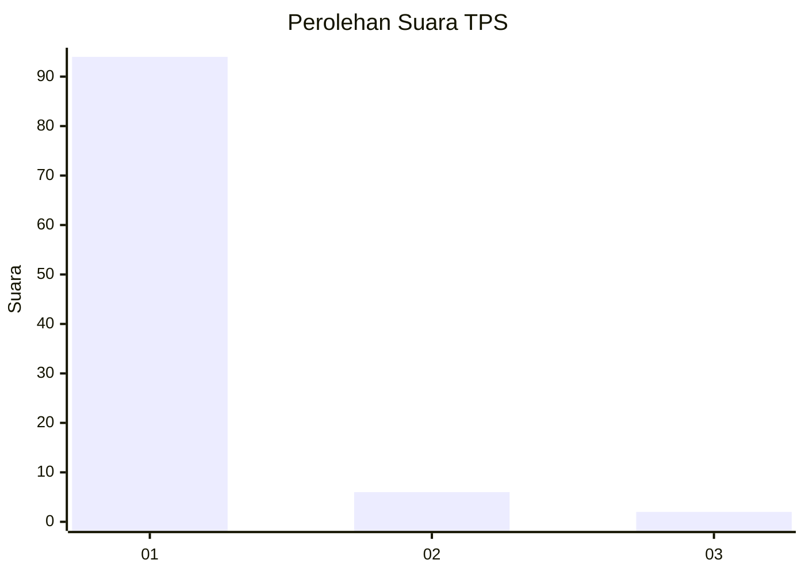
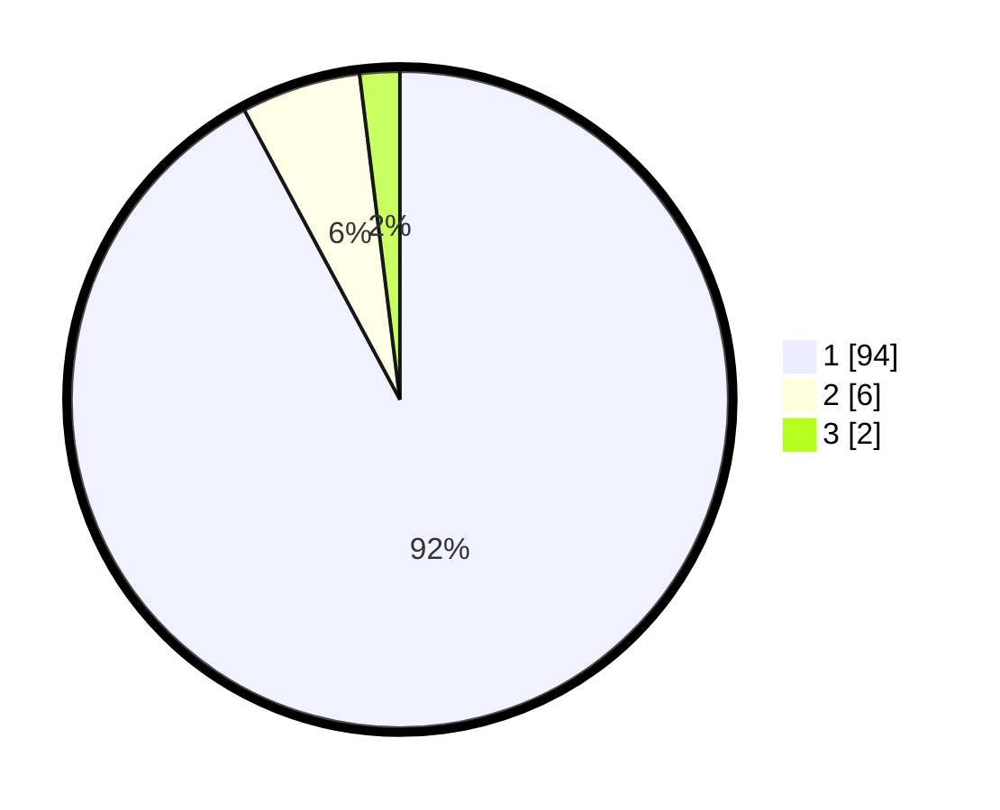

# Hasil

## Grafik

## Tabel

| No. | Nama Paslon    | Suara | Suara (raw) | Persentase |
|:--- |:-------------- | -----:| -----------:| ----------:|
| 1   | ANIES MUHAIMIN | 94    | [94][p-1]   | 92,16      |
| 2   | PRABOWO GIBRAN | 6     | [6][p-2]    | 5,88       |
| 3   | GANJAR MAHFUD  | 2     | [2][p-3]    | 1,96       |

[p-1]: https://github.com/gigit-pemilu/pemilu-2024-13-sumatera-barat/blob/main/pilpres/hitung-suara/sub/13-sumatera-barat/sub/08-pasaman/sub/15-mapat-tunggul-selatan/sub/2001-silayang/sub/004-tps/sub/paslon-1.txt
[p-2]: https://github.com/gigit-pemilu/pemilu-2024-13-sumatera-barat/blob/main/pilpres/hitung-suara/sub/13-sumatera-barat/sub/08-pasaman/sub/15-mapat-tunggul-selatan/sub/2001-silayang/sub/004-tps/sub/paslon-2.txt
[p-3]: https://github.com/gigit-pemilu/pemilu-2024-13-sumatera-barat/blob/main/pilpres/hitung-suara/sub/13-sumatera-barat/sub/08-pasaman/sub/15-mapat-tunggul-selatan/sub/2001-silayang/sub/004-tps/sub/paslon-3.txt

## Foto C Plano

https://sirekap-obj-formc.kpu.go.id/5b2b/pemilu/ppwp/13/08/15/20/01/1308152001004-20240217-161230--1ec472fb-e92c-4b92-b650-4ec20660a49e.jpg

https://sirekap-obj-formc.kpu.go.id/5b2b/pemilu/ppwp/13/08/15/20/01/1308152001004-20240217-161336--836ccb69-eb9b-41de-8750-6f5dfbdeebe9.jpg

https://sirekap-obj-formc.kpu.go.id/5b2b/pemilu/ppwp/13/08/15/20/01/1308152001004-20240217-161534--8128f0fd-80ed-4bdd-b50b-c0e348ffcc19.jpg

## Metadata

| Key        | Value               |
| ---------- | ------------------- |
| Time Stamp | 2024-02-17 16:36:25 |

## DATA PEMILIH TETAP

Jumlah pemilih dalam DPT: **140**.
 * L: **854**.
 * P: **871**.

## DATA PENGGUNA HAK PILIH

Jumlah pengguna hak pilih dalam DPT: **47**.
 * L: **847**.
 * P: **875**.

Jumlah pengguna hak pilih dalam DPTb: **882**.
 * L: **1**.
 * P: **801**.

Jumlah pengguna hak pilih dalam DPK: **7**.
 * L: **82**.
 * P: **801**.

Jumlah pengguna hak pilih: **100**.
 * L: **40**.
 * P: **441**.

## JUMLAH SUARA SAH DAN TIDAK SAH

JUMLAH SELURUH SUARA SAH: **502**.

JUMLAH SUARA TIDAK SAH: **800**.

JUMLAH SELURUH SUARA SAH DAN SUARA TIDAK SAH: **602**.

