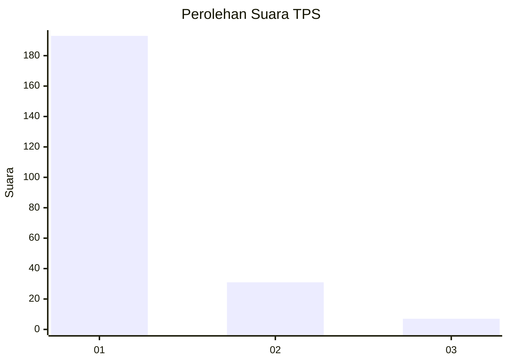
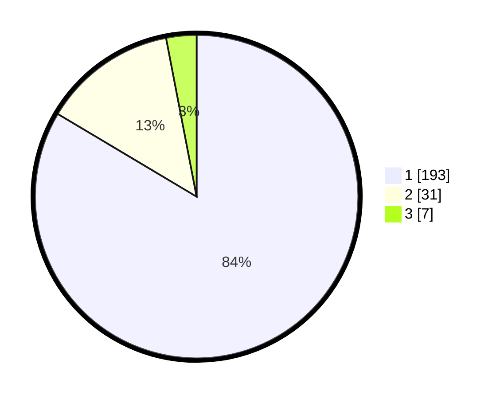

# Hasil

## Grafik

## Tabel

| No. | Nama Paslon    | Suara | Suara (raw) | Persentase |
|:--- |:-------------- | -----:| -----------:| ----------:|
| 1   | ANIES MUHAIMIN | 193   | [193][p-1]  | 83,55      |
| 2   | PRABOWO GIBRAN | 31    | [31][p-2]   | 13,42      |
| 3   | GANJAR MAHFUD  | 7     | [7][p-3]    | 3,03       |

[p-1]: https://github.com/gigit-pemilu/pemilu-2024-13-sumatera-barat/blob/main/pilpres/hitung-suara/sub/13-sumatera-barat/sub/08-pasaman/sub/15-mapat-tunggul-selatan/sub/2001-silayang/sub/008-tps/sub/paslon-1.txt
[p-2]: https://github.com/gigit-pemilu/pemilu-2024-13-sumatera-barat/blob/main/pilpres/hitung-suara/sub/13-sumatera-barat/sub/08-pasaman/sub/15-mapat-tunggul-selatan/sub/2001-silayang/sub/008-tps/sub/paslon-2.txt
[p-3]: https://github.com/gigit-pemilu/pemilu-2024-13-sumatera-barat/blob/main/pilpres/hitung-suara/sub/13-sumatera-barat/sub/08-pasaman/sub/15-mapat-tunggul-selatan/sub/2001-silayang/sub/008-tps/sub/paslon-3.txt

## Foto C Plano

https://sirekap-obj-formc.kpu.go.id/ddde/pemilu/ppwp/13/08/15/20/01/1308152001008-20240215-050633--68e7dc82-4eca-4a8d-afe0-d567ea5ae0a6.jpg

https://sirekap-obj-formc.kpu.go.id/ddde/pemilu/ppwp/13/08/15/20/01/1308152001008-20240215-050919--f0e3f268-1cc0-479d-95f0-9226d3d62e21.jpg

https://sirekap-obj-formc.kpu.go.id/ddde/pemilu/ppwp/13/08/15/20/01/1308152001008-20240215-030301--9d2e9ecc-473c-457f-9e95-14a066140741.jpg

## Metadata

| Key        | Value               |
| ---------- | ------------------- |
| Time Stamp | 2024-02-15 22:30:27 |

