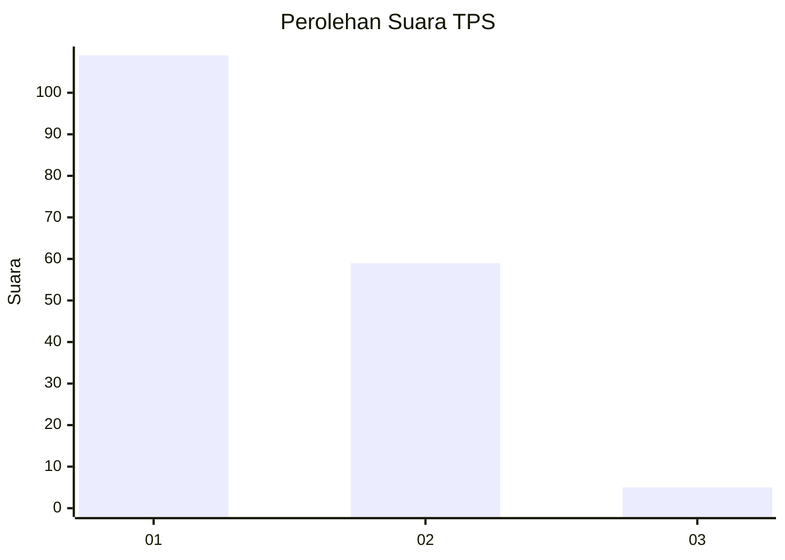
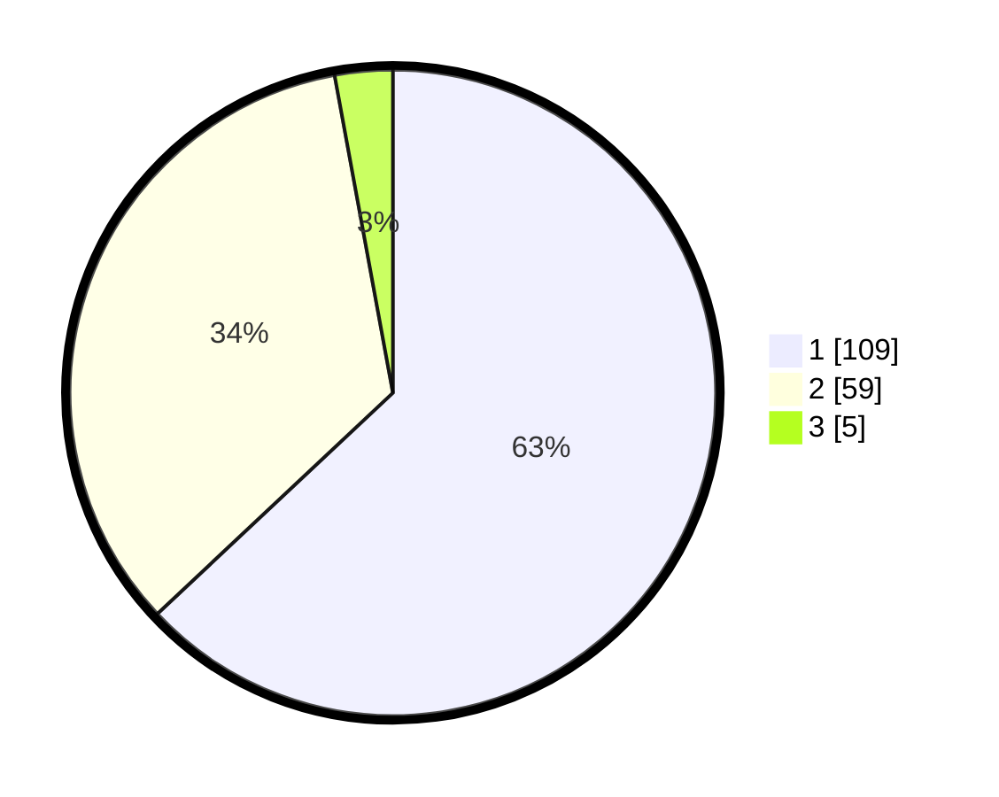

# Hasil

## Grafik

## Tabel

| No. | Nama Paslon    | Suara | Suara (raw) | Persentase |
|:--- |:-------------- | -----:| -----------:| ----------:|
| 1   | ANIES MUHAIMIN | 109   | [109][p-1]  | 63,01      |
| 2   | PRABOWO GIBRAN | 59    | [59][p-2]   | 34,10      |
| 3   | GANJAR MAHFUD  | 5     | [5][p-3]    | 2,89       |

[p-1]: https://github.com/gigit-pemilu/pemilu-2024-13-sumatera-barat/blob/main/pilpres/hitung-suara/sub/13-sumatera-barat/sub/08-pasaman/sub/17-padang-gelugur/sub/2001-padang-gelugur/sub/003-tps/sub/paslon-1.txt
[p-2]: https://github.com/gigit-pemilu/pemilu-2024-13-sumatera-barat/blob/main/pilpres/hitung-suara/sub/13-sumatera-barat/sub/08-pasaman/sub/17-padang-gelugur/sub/2001-padang-gelugur/sub/003-tps/sub/paslon-2.txt
[p-3]: https://github.com/gigit-pemilu/pemilu-2024-13-sumatera-barat/blob/main/pilpres/hitung-suara/sub/13-sumatera-barat/sub/08-pasaman/sub/17-padang-gelugur/sub/2001-padang-gelugur/sub/003-tps/sub/paslon-3.txt

## Foto C Plano

https://sirekap-obj-formc.kpu.go.id/23bf/pemilu/ppwp/13/08/17/20/01/1308172001003-20240214-235234--4605e027-9c1e-427c-81ee-4a0280c54811.jpg

https://sirekap-obj-formc.kpu.go.id/23bf/pemilu/ppwp/13/08/17/20/01/1308172001003-20240214-235407--1cc74cab-d4ea-4ac1-936f-3f3984762305.jpg

https://sirekap-obj-formc.kpu.go.id/23bf/pemilu/ppwp/13/08/17/20/01/1308172001003-20240214-235804--dce483bd-a90a-4882-91ec-c0a083522ef3.jpg

## Metadata

| Key        | Value               |
| ---------- | ------------------- |
| Time Stamp | 2024-02-24 22:31:28 |

