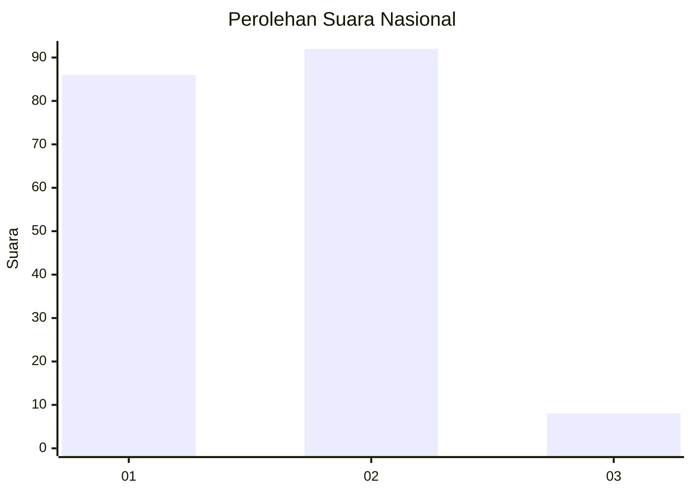
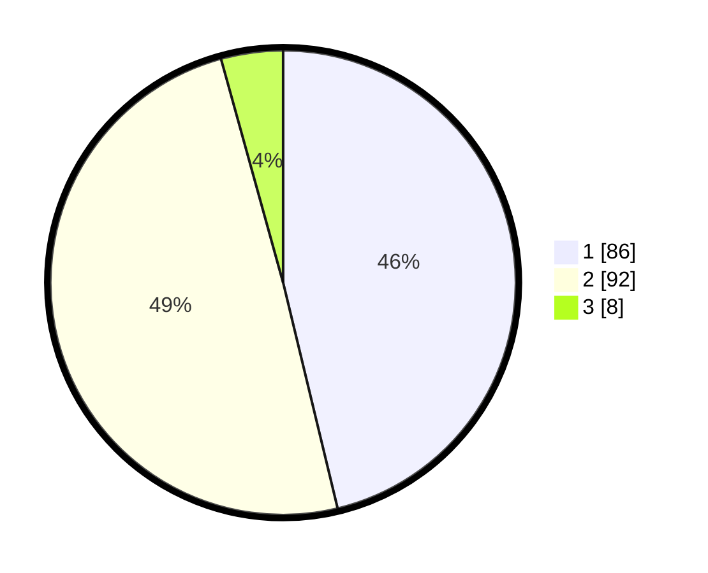

# Hasil

## Grafik

## Tabel

| No. | Nama Paslon    | Suara | Suara (raw) | Persentase |
|:--- |:-------------- | -----:| -----------:| ----------:|
| 1   | ANIES MUHAIMIN | 86    | [86][p-1]   | 46,24      |
| 2   | PRABOWO GIBRAN | 92    | [92][p-2]   | 49,46      |
| 3   | GANJAR MAHFUD  | 8     | [8][p-3]    | 4,30       |

[p-1]: https://github.com/gigit-pemilu/pemilu-2024/blob/main/pilpres/hitung-suara/sub/13-sumatera-barat/sub/08-pasaman/sub/17-padang-gelugur/sub/2001-padang-gelugur/sub/005-tps/sub/paslon-1.txt
[p-2]: https://github.com/gigit-pemilu/pemilu-2024/blob/main/pilpres/hitung-suara/sub/13-sumatera-barat/sub/08-pasaman/sub/17-padang-gelugur/sub/2001-padang-gelugur/sub/005-tps/sub/paslon-2.txt
[p-3]: https://github.com/gigit-pemilu/pemilu-2024/blob/main/pilpres/hitung-suara/sub/13-sumatera-barat/sub/08-pasaman/sub/17-padang-gelugur/sub/2001-padang-gelugur/sub/005-tps/sub/paslon-3.txt

## Foto C Plano

https://sirekap-obj-formc.kpu.go.id/ceb1/pemilu/ppwp/13/08/17/20/01/1308172001005-20240215-131231--5284c27f-652d-4eac-be4b-518ac376f4e8.jpg

https://sirekap-obj-formc.kpu.go.id/ceb1/pemilu/ppwp/13/08/17/20/01/1308172001005-20240214-194700--8d167d65-c63e-4805-9e3f-027088219e45.jpg

https://sirekap-obj-formc.kpu.go.id/ceb1/pemilu/ppwp/13/08/17/20/01/1308172001005-20240214-194807--99be16c5-971e-4727-b323-856fb20baced.jpg

## Metadata

| Key        | Value               |
| ---------- | ------------------- |
| Time Stamp | 2024-02-24 22:31:28 |

