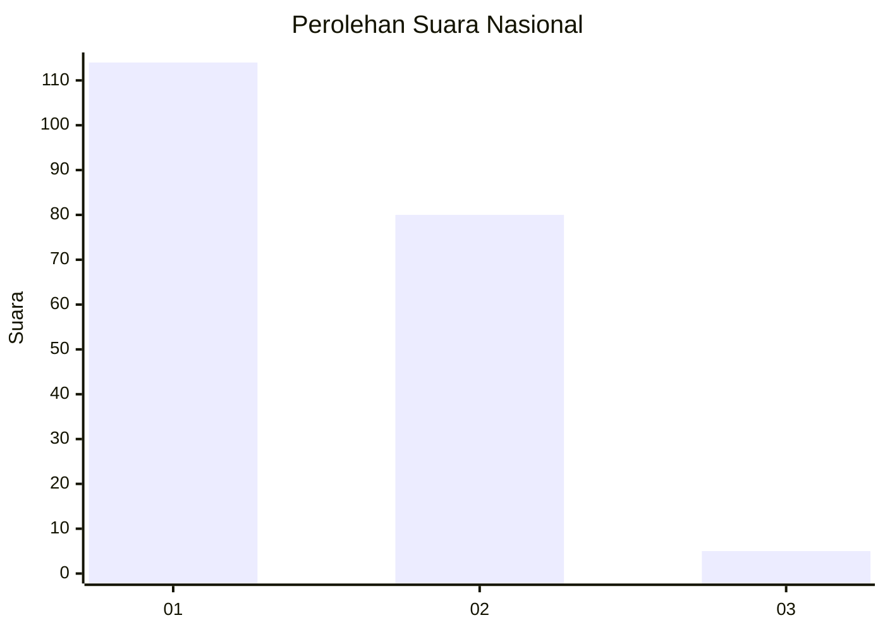
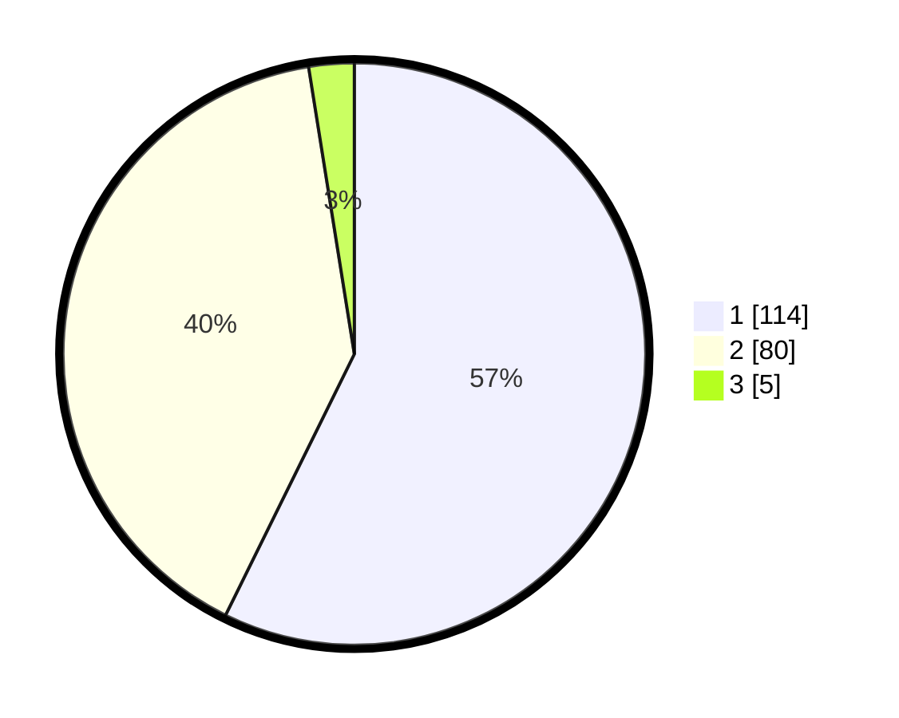

# Hasil

## Grafik

## Tabel

| No. | Nama Paslon    | Suara | Suara (raw) | Persentase |
|:--- |:-------------- | -----:| -----------:| ----------:|
| 1   | ANIES MUHAIMIN | 114   | [114][p-1]  | 57,29      |
| 2   | PRABOWO GIBRAN | 80    | [80][p-2]   | 40,20      |
| 3   | GANJAR MAHFUD  | 5     | [5][p-3]    | 2,51       |

[p-1]: https://github.com/gigit-pemilu/pemilu-2024/blob/main/pilpres/hitung-suara/sub/13-sumatera-barat/sub/08-pasaman/sub/17-padang-gelugur/sub/2004-bahagia-padang-gelugua/sub/001-tps/sub/paslon-1.txt
[p-2]: https://github.com/gigit-pemilu/pemilu-2024/blob/main/pilpres/hitung-suara/sub/13-sumatera-barat/sub/08-pasaman/sub/17-padang-gelugur/sub/2004-bahagia-padang-gelugua/sub/001-tps/sub/paslon-2.txt
[p-3]: https://github.com/gigit-pemilu/pemilu-2024/blob/main/pilpres/hitung-suara/sub/13-sumatera-barat/sub/08-pasaman/sub/17-padang-gelugur/sub/2004-bahagia-padang-gelugua/sub/001-tps/sub/paslon-3.txt

## Foto C Plano

https://sirekap-obj-formc.kpu.go.id/2045/pemilu/ppwp/13/08/17/20/04/1308172004001-20240227-174413--36d46bf8-000b-4c2f-bae6-ad5dc9ed3c9d.jpg

https://sirekap-obj-formc.kpu.go.id/2045/pemilu/ppwp/13/08/17/20/04/1308172004001-20240215-032026--62cc8e32-b517-4989-917c-7d2a469cdc69.jpg

https://sirekap-obj-formc.kpu.go.id/2045/pemilu/ppwp/13/08/17/20/04/1308172004001-20240215-050814--f00798fc-e3bf-4aff-913e-1ccea5f81238.jpg

## Metadata

| Key        | Value               |
| ---------- | ------------------- |
| Time Stamp | 2024-02-27 18:00:00 |

