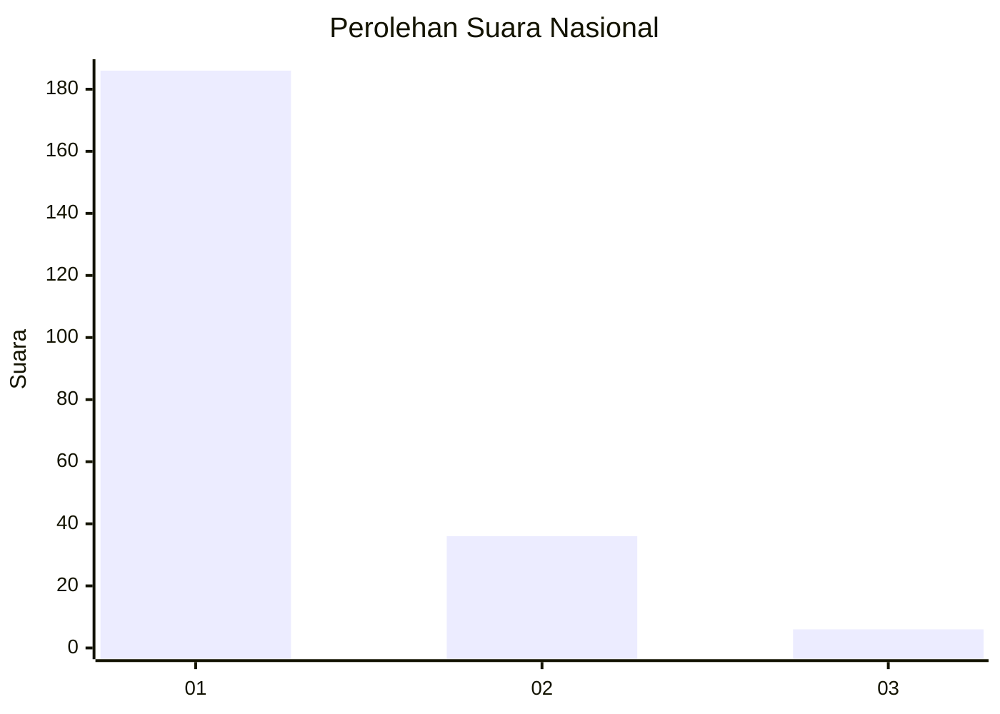
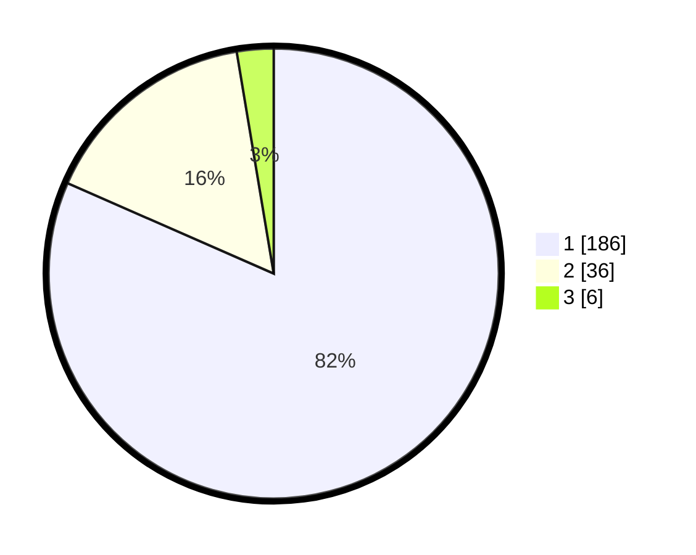

# Hasil

## Grafik

## Tabel

| No. | Nama Paslon    | Suara | Suara (raw) | Persentase |
|:--- |:-------------- | -----:| -----------:| ----------:|
| 1   | ANIES MUHAIMIN | 186   | [186][p-1]  | 81,58      |
| 2   | PRABOWO GIBRAN | 36    | [36][p-2]   | 15,79      |
| 3   | GANJAR MAHFUD  | 6     | [6][p-3]    | 2,63       |

[p-1]: https://github.com/gigit-pemilu/pemilu-2024/blob/main/pilpres/hitung-suara/sub/13-sumatera-barat/sub/08-pasaman/sub/18-rao-utara/sub/2001-koto-nopan/sub/003-tps/sub/paslon-1.txt
[p-2]: https://github.com/gigit-pemilu/pemilu-2024/blob/main/pilpres/hitung-suara/sub/13-sumatera-barat/sub/08-pasaman/sub/18-rao-utara/sub/2001-koto-nopan/sub/003-tps/sub/paslon-2.txt
[p-3]: https://github.com/gigit-pemilu/pemilu-2024/blob/main/pilpres/hitung-suara/sub/13-sumatera-barat/sub/08-pasaman/sub/18-rao-utara/sub/2001-koto-nopan/sub/003-tps/sub/paslon-3.txt

## Foto C Plano

https://sirekap-obj-formc.kpu.go.id/de2a/pemilu/ppwp/13/08/18/20/01/1308182001003-20240226-210814--dac9a5a8-6e6d-438b-92c7-8c8c6224a232.jpg

https://sirekap-obj-formc.kpu.go.id/de2a/pemilu/ppwp/13/08/18/20/01/1308182001003-20240226-210849--deb84c0c-9351-4c55-9a38-d4f685df6b98.jpg

https://sirekap-obj-formc.kpu.go.id/de2a/pemilu/ppwp/13/08/18/20/01/1308182001003-20240227-000658--ab98fcab-7fa9-4647-8f4d-f86574c9c259.jpg

## Metadata

| Key        | Value               |
| ---------- | ------------------- |
| Time Stamp | 2024-02-28 20:00:00 |

