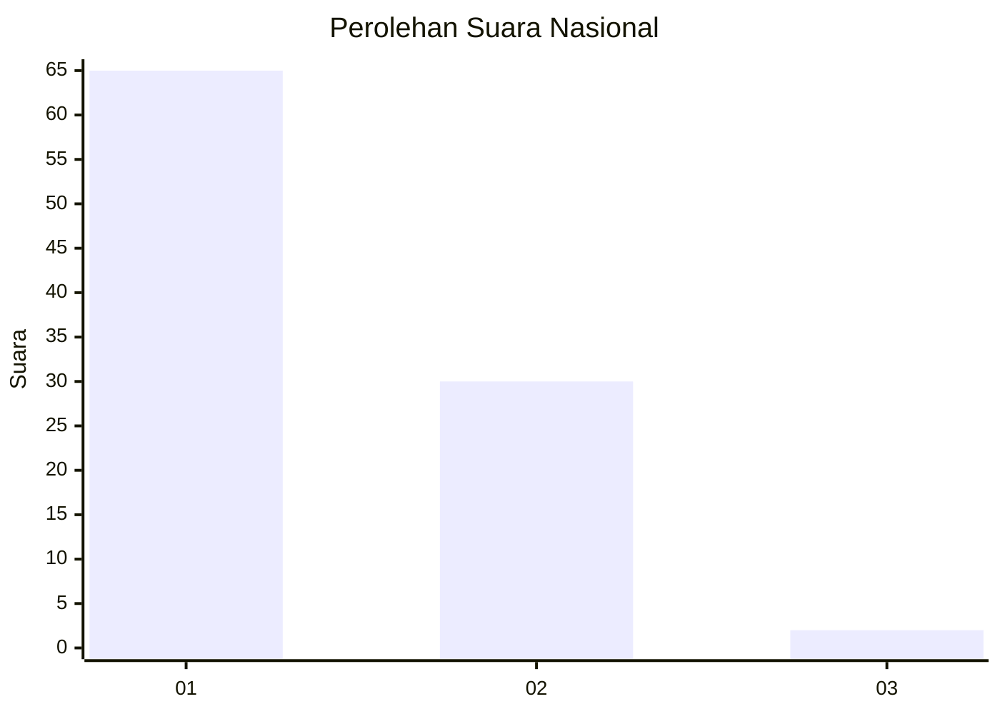
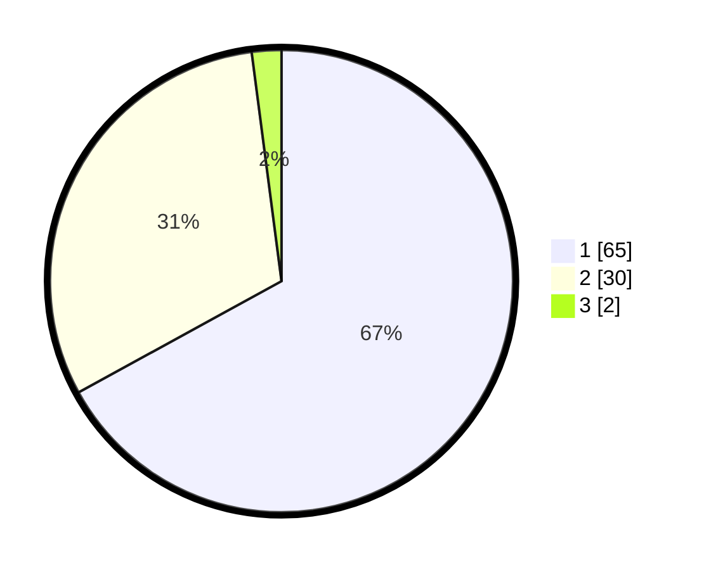

# Hasil

## Grafik

## Tabel

| No. | Nama Paslon    | Suara | Suara (raw) | Persentase |
|:--- |:-------------- | -----:| -----------:| ----------:|
| 1   | ANIES MUHAIMIN | 65    | [65][p-1]   | 67,01      |
| 2   | PRABOWO GIBRAN | 30    | [30][p-2]   | 30,93      |
| 3   | GANJAR MAHFUD  | 2     | [2][p-3]    | 2,06       |

[p-1]: https://github.com/gigit-pemilu/pemilu-2024/blob/main/pilpres/hitung-suara/sub/13-sumatera-barat/sub/08-pasaman/sub/18-rao-utara/sub/2002-koto-rajo/sub/007-tps/sub/paslon-1.txt
[p-2]: https://github.com/gigit-pemilu/pemilu-2024/blob/main/pilpres/hitung-suara/sub/13-sumatera-barat/sub/08-pasaman/sub/18-rao-utara/sub/2002-koto-rajo/sub/007-tps/sub/paslon-2.txt
[p-3]: https://github.com/gigit-pemilu/pemilu-2024/blob/main/pilpres/hitung-suara/sub/13-sumatera-barat/sub/08-pasaman/sub/18-rao-utara/sub/2002-koto-rajo/sub/007-tps/sub/paslon-3.txt

## Foto C Plano

https://sirekap-obj-formc.kpu.go.id/1f1b/pemilu/ppwp/13/08/18/20/02/1308182002007-20240226-220404--5b8bee79-cbea-44bb-8a5a-dc422b0c6d79.jpg

https://sirekap-obj-formc.kpu.go.id/1f1b/pemilu/ppwp/13/08/18/20/02/1308182002007-20240215-014830--f11101e1-53fe-4efe-af60-4471befaf831.jpg

https://sirekap-obj-formc.kpu.go.id/1f1b/pemilu/ppwp/13/08/18/20/02/1308182002007-20240215-015406--dde2d89c-ed92-4e66-8f89-ff51a55a3179.jpg

## Metadata

| Key        | Value               |
| ---------- | ------------------- |
| Time Stamp | 2024-02-26 23:00:00 |

