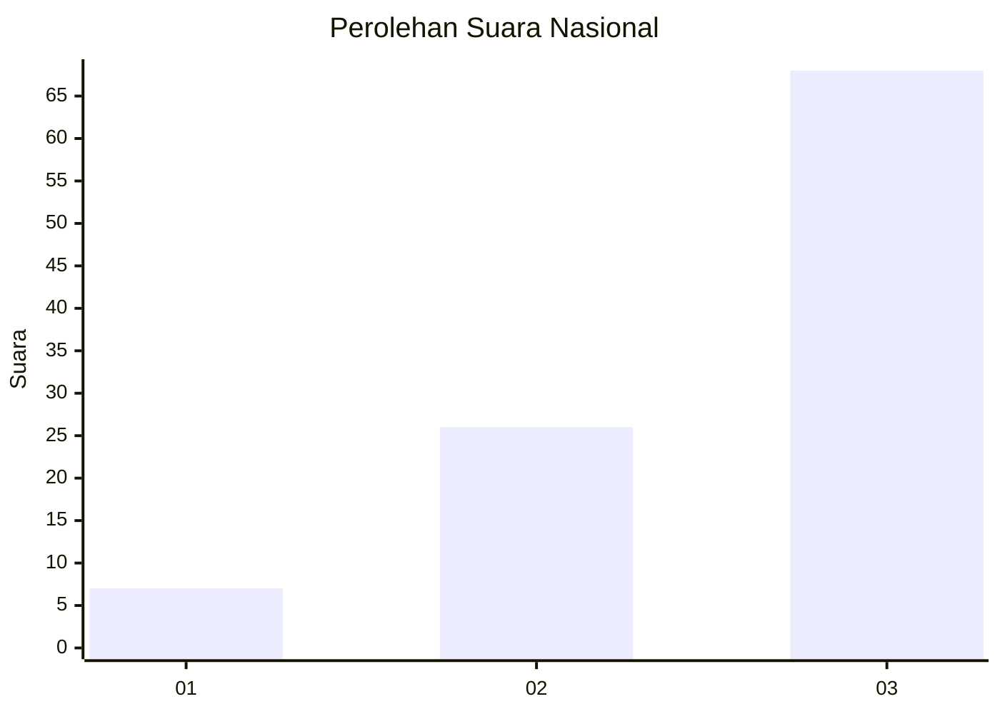
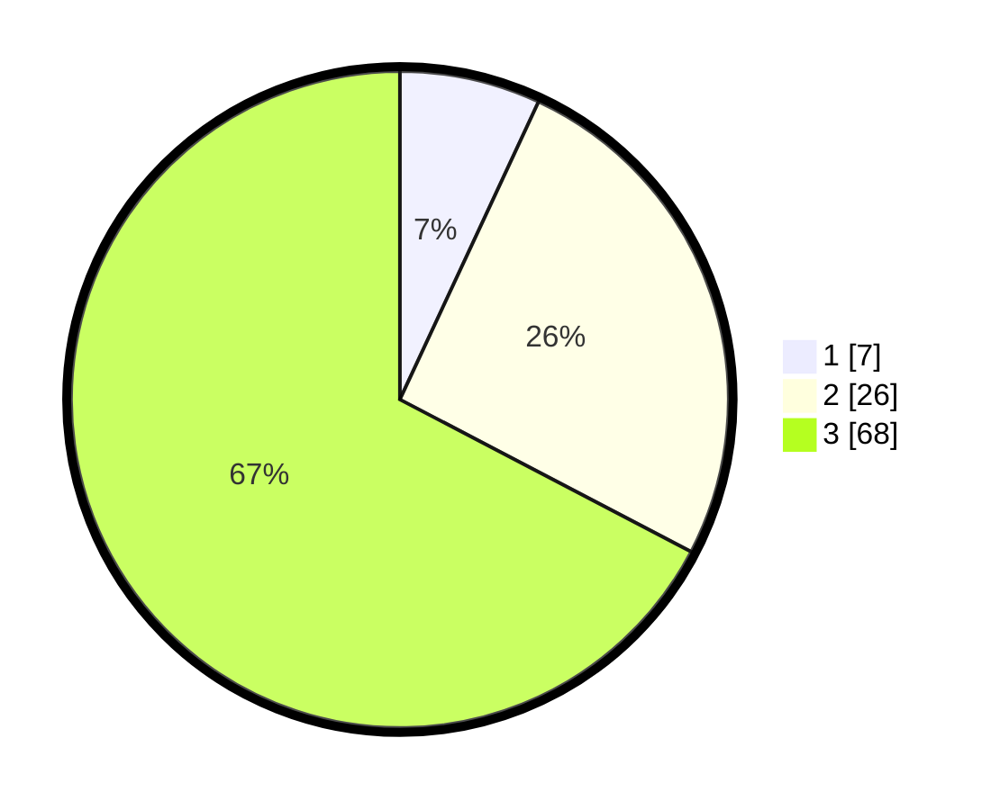

# Hasil

## Grafik

## Tabel

| No. | Nama Paslon    | Suara | Suara (raw) | Persentase |
|:--- |:-------------- | -----:| -----------:| ----------:|
| 1   | ANIES MUHAIMIN | 7     | [7][p-1]    | 6,93       |
| 2   | PRABOWO GIBRAN | 26    | [26][p-2]   | 25,74      |
| 3   | GANJAR MAHFUD  | 68    | [68][p-3]   | 67,33      |

[p-1]: https://github.com/gigit-pemilu/pemilu-2024/blob/main/pilpres/hitung-suara/sub/13-sumatera-barat/sub/09-kepulauan-mentawai/sub/01-pagai-utara/sub/2008-silabu/sub/004-tps/sub/paslon-1.txt
[p-2]: https://github.com/gigit-pemilu/pemilu-2024/blob/main/pilpres/hitung-suara/sub/13-sumatera-barat/sub/09-kepulauan-mentawai/sub/01-pagai-utara/sub/2008-silabu/sub/004-tps/sub/paslon-2.txt
[p-3]: https://github.com/gigit-pemilu/pemilu-2024/blob/main/pilpres/hitung-suara/sub/13-sumatera-barat/sub/09-kepulauan-mentawai/sub/01-pagai-utara/sub/2008-silabu/sub/004-tps/sub/paslon-3.txt

## Foto C Plano

https://sirekap-obj-formc.kpu.go.id/2461/pemilu/ppwp/13/09/01/20/08/1309012008004-20240215-210658--9d976720-c771-4686-8803-ec78010832cc.jpg

https://sirekap-obj-formc.kpu.go.id/2461/pemilu/ppwp/13/09/01/20/08/1309012008004-20240215-210843--4fa1ae63-17e7-4b29-ae18-bf19ca3a6e4d.jpg

https://sirekap-obj-formc.kpu.go.id/2461/pemilu/ppwp/13/09/01/20/08/1309012008004-20240215-131921--e00066ee-b9ba-4ad9-8ebf-c57ed00cd361.jpg

## Metadata

| Key        | Value               |
| ---------- | ------------------- |
| Time Stamp | 2024-02-16 00:00:26 |

## DATA PEMILIH TETAP

Jumlah pemilih dalam DPT: **114**.
 * L: **65**.
 * P: **49**.

## DATA PENGGUNA HAK PILIH

Jumlah pengguna hak pilih dalam DPT: **91**.
 * L: **47**.
 * P: **44**.

Jumlah pengguna hak pilih dalam DPTb: **0**.
 * L: **0**.
 * P: **0**.

Jumlah pengguna hak pilih dalam DPK: **4**.
 * L: **2**.
 * P: **2**.

Jumlah pengguna hak pilih: **95**.
 * L: **49**.
 * P: **46**.

## JUMLAH SUARA SAH DAN TIDAK SAH

JUMLAH SELURUH SUARA SAH: **95**.

JUMLAH SUARA TIDAK SAH: **0**.

JUMLAH SELURUH SUARA SAH DAN SUARA TIDAK SAH: **95**.

