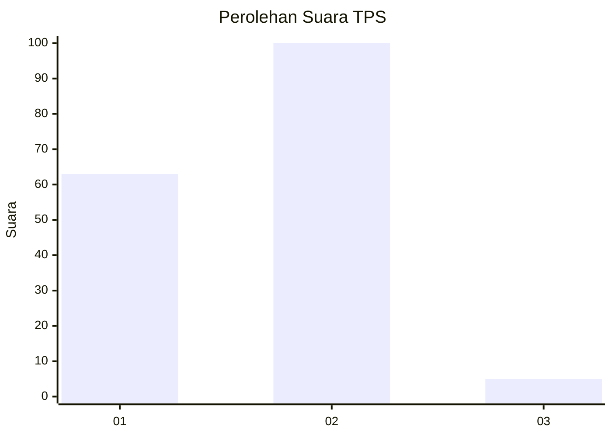
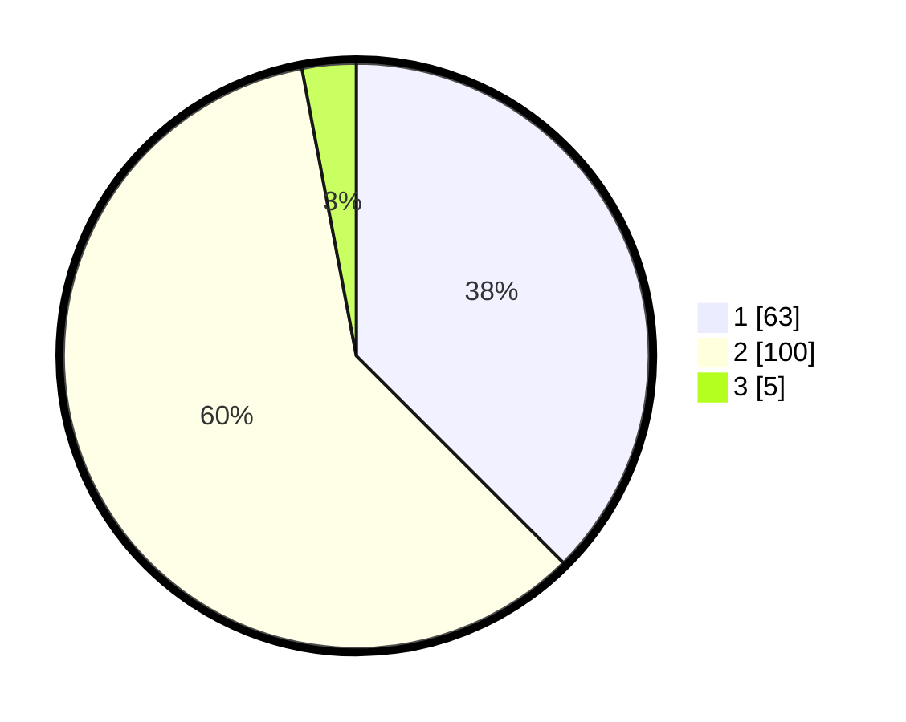

# Hasil

## Grafik

## Tabel

| No. | Nama Paslon    | Suara | Suara (raw) | Persentase |
|:--- |:-------------- | -----:| -----------:| ----------:|
| 1   | ANIES MUHAIMIN | 63    | [63][p-1]   | 37,50      |
| 2   | PRABOWO GIBRAN | 100   | [100][p-2]  | 59,52      |
| 3   | GANJAR MAHFUD  | 5     | [5][p-3]    | 2,98       |

[p-1]: https://github.com/gigit-pemilu/pemilu-2024-13-sumatera-barat/blob/main/pilpres/hitung-suara/sub/13-sumatera-barat/sub/09-kepulauan-mentawai/sub/04-siberut-utara/sub/2006-muara-sikabaluan/sub/003-tps/sub/paslon-1.txt
[p-2]: https://github.com/gigit-pemilu/pemilu-2024-13-sumatera-barat/blob/main/pilpres/hitung-suara/sub/13-sumatera-barat/sub/09-kepulauan-mentawai/sub/04-siberut-utara/sub/2006-muara-sikabaluan/sub/003-tps/sub/paslon-2.txt
[p-3]: https://github.com/gigit-pemilu/pemilu-2024-13-sumatera-barat/blob/main/pilpres/hitung-suara/sub/13-sumatera-barat/sub/09-kepulauan-mentawai/sub/04-siberut-utara/sub/2006-muara-sikabaluan/sub/003-tps/sub/paslon-3.txt

## Foto C Plano

https://sirekap-obj-formc.kpu.go.id/4623/pemilu/ppwp/13/09/04/20/06/1309042006003-20240219-134118--06295a36-4993-4a96-bfd1-cc4d69f383b4.jpg

https://sirekap-obj-formc.kpu.go.id/4623/pemilu/ppwp/13/09/04/20/06/1309042006003-20240219-134255--2be5175a-063e-412f-9ff7-379980558b23.jpg

https://sirekap-obj-formc.kpu.go.id/4623/pemilu/ppwp/13/09/04/20/06/1309042006003-20240219-134600--3f529f63-8963-402c-abea-b7c96b640c35.jpg

## Metadata

| Key        | Value               |
| ---------- | ------------------- |
| Time Stamp | 2024-02-20 11:00:00 |

## DATA PEMILIH TETAP

Jumlah pemilih dalam DPT: **249**.
 * L: **307**.
 * P: **32**.

## DATA PENGGUNA HAK PILIH

Jumlah pengguna hak pilih dalam DPT: **727**.
 * L: **887**.
 * P: **36**.

Jumlah pengguna hak pilih dalam DPTb: **0**.
 * L: **808**.
 * P: **80**.

Jumlah pengguna hak pilih dalam DPK: **885**.
 * L: **2**.
 * P: **803**.

Jumlah pengguna hak pilih: **272**.
 * L: **83**.
 * P: **889**.

## JUMLAH SUARA SAH DAN TIDAK SAH

JUMLAH SELURUH SUARA SAH: **168**.

JUMLAH SUARA TIDAK SAH: **4**.

JUMLAH SELURUH SUARA SAH DAN SUARA TIDAK SAH: **172**.

