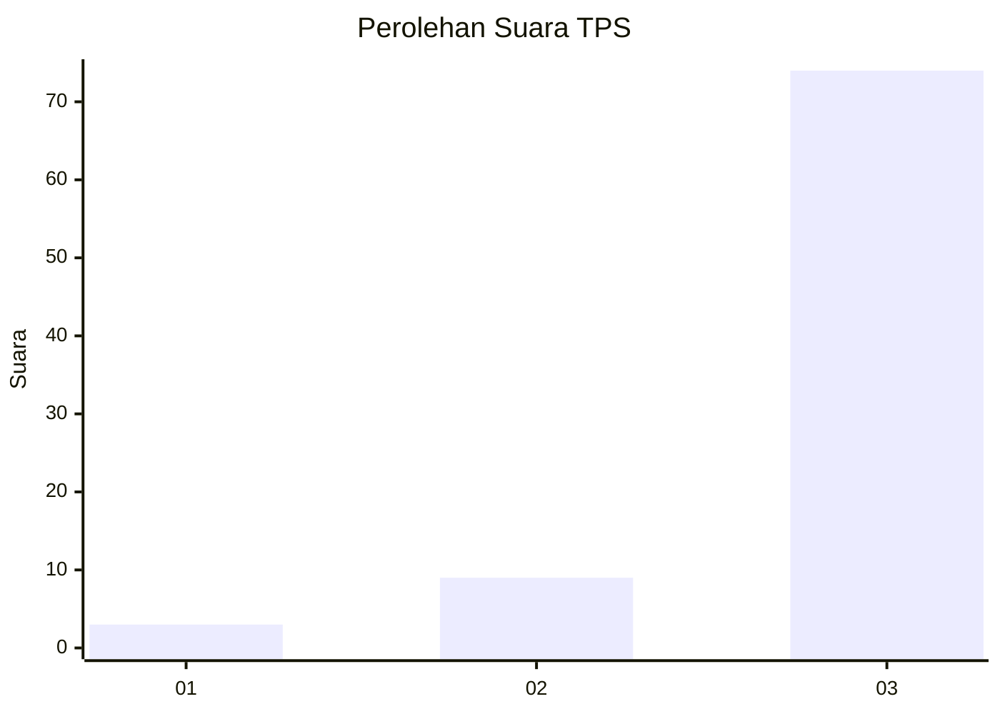
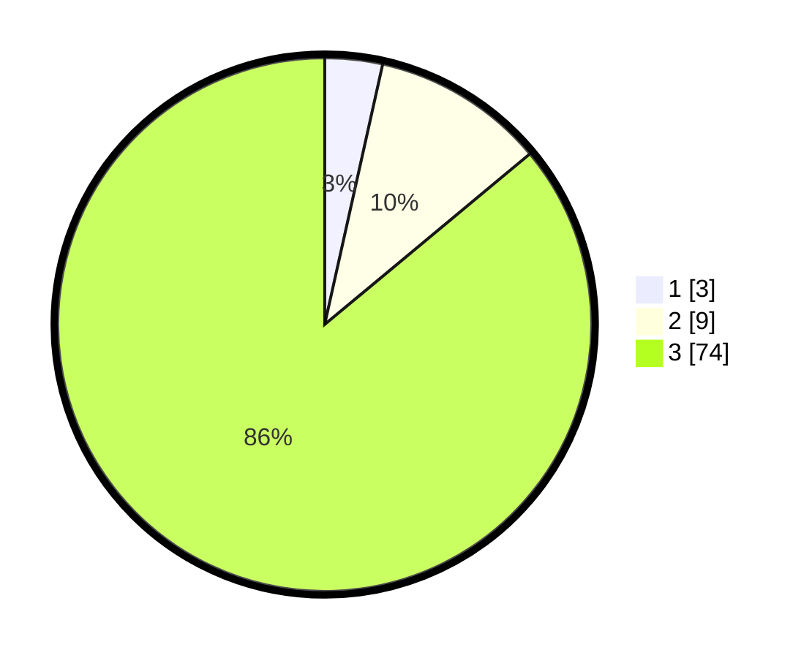

# Hasil

## Grafik

## Tabel

| No. | Nama Paslon    | Suara | Suara (raw) | Persentase |
|:--- |:-------------- | -----:| -----------:| ----------:|
| 1   | ANIES MUHAIMIN | 3     | [3][p-1]    | 3,49       |
| 2   | PRABOWO GIBRAN | 9     | [9][p-2]    | 10,47      |
| 3   | GANJAR MAHFUD  | 74    | [74][p-3]   | 86,05      |

[p-1]: https://github.com/gigit-pemilu/pemilu-2024-13-sumatera-barat/blob/main/pilpres/hitung-suara/sub/13-sumatera-barat/sub/09-kepulauan-mentawai/sub/10-pagai-selatan/sub/2002-bulasat/sub/010-tps/sub/paslon-1.txt
[p-2]: https://github.com/gigit-pemilu/pemilu-2024-13-sumatera-barat/blob/main/pilpres/hitung-suara/sub/13-sumatera-barat/sub/09-kepulauan-mentawai/sub/10-pagai-selatan/sub/2002-bulasat/sub/010-tps/sub/paslon-2.txt
[p-3]: https://github.com/gigit-pemilu/pemilu-2024-13-sumatera-barat/blob/main/pilpres/hitung-suara/sub/13-sumatera-barat/sub/09-kepulauan-mentawai/sub/10-pagai-selatan/sub/2002-bulasat/sub/010-tps/sub/paslon-3.txt

## Foto C Plano

https://sirekap-obj-formc.kpu.go.id/8d6a/pemilu/ppwp/13/09/10/20/02/1309102002010-20240216-152446--3442014e-35b4-4d47-be15-be42e3bda1d9.jpg

https://sirekap-obj-formc.kpu.go.id/8d6a/pemilu/ppwp/13/09/10/20/02/1309102002010-20240216-152448--171784e1-4613-4488-afef-8f7ae3c924d1.jpg

https://sirekap-obj-formc.kpu.go.id/8d6a/pemilu/ppwp/13/09/10/20/02/1309102002010-20240216-152447--3f08444e-6d0c-4e15-807e-aa322da8cf7b.jpg

## Metadata

| Key        | Value               |
| ---------- | ------------------- |
| Time Stamp | 2024-02-17 13:37:34 |

## DATA PEMILIH TETAP

Jumlah pemilih dalam DPT: **102**.
 * L: **61**.
 * P: **41**.

## DATA PENGGUNA HAK PILIH

Jumlah pengguna hak pilih dalam DPT: **84**.
 * L: **47**.
 * P: **37**.

Jumlah pengguna hak pilih dalam DPTb: **2**.
 * L: **1**.
 * P: **1**.

Jumlah pengguna hak pilih dalam DPK: **0**.
 * L: **0**.
 * P: **0**.

Jumlah pengguna hak pilih: **86**.
 * L: **48**.
 * P: **38**.

## JUMLAH SUARA SAH DAN TIDAK SAH

JUMLAH SELURUH SUARA SAH: **86**.

JUMLAH SUARA TIDAK SAH: **0**.

JUMLAH SELURUH SUARA SAH DAN SUARA TIDAK SAH: **86**.

