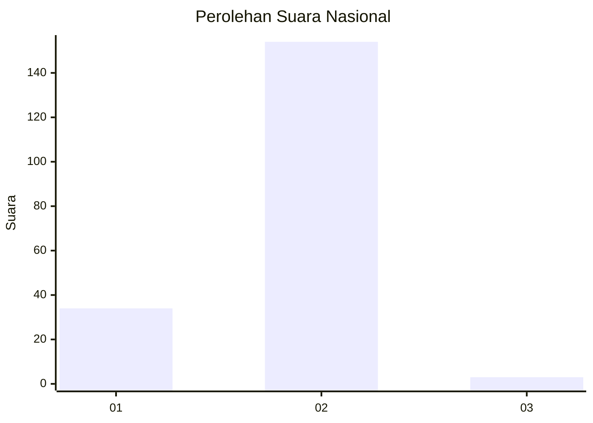
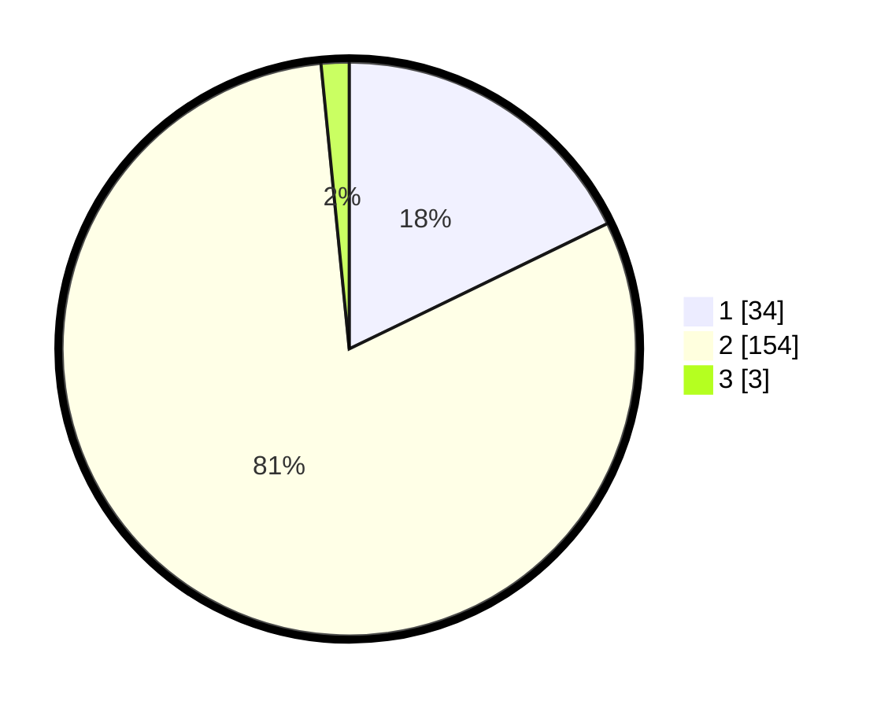

# Hasil

## Grafik

## Tabel

| No. | Nama Paslon    | Suara | Suara (raw) | Persentase |
|:--- |:-------------- | -----:| -----------:| ----------:|
| 1   | ANIES MUHAIMIN | 34    | [34][p-1]   | 17,80      |
| 2   | PRABOWO GIBRAN | 154   | [154][p-2]  | 80,63      |
| 3   | GANJAR MAHFUD  | 3     | [3][p-3]    | 1,57       |

[p-1]: https://github.com/gigit-pemilu/pemilu-2024/blob/main/pilpres/hitung-suara/sub/13-sumatera-barat/sub/11-solok-selatan/sub/05-sangir-batang-hari/sub/2001-abai/sub/001-tps/sub/paslon-1.txt
[p-2]: https://github.com/gigit-pemilu/pemilu-2024/blob/main/pilpres/hitung-suara/sub/13-sumatera-barat/sub/11-solok-selatan/sub/05-sangir-batang-hari/sub/2001-abai/sub/001-tps/sub/paslon-2.txt
[p-3]: https://github.com/gigit-pemilu/pemilu-2024/blob/main/pilpres/hitung-suara/sub/13-sumatera-barat/sub/11-solok-selatan/sub/05-sangir-batang-hari/sub/2001-abai/sub/001-tps/sub/paslon-3.txt

## Foto C Plano

https://sirekap-obj-formc.kpu.go.id/c74c/pemilu/ppwp/13/11/05/20/01/1311052001001-20240226-202113--1e073add-c551-45be-ad59-790bb416f340.jpg

https://sirekap-obj-formc.kpu.go.id/c74c/pemilu/ppwp/13/11/05/20/01/1311052001001-20240226-202319--ec1fd441-8253-413e-a8fd-a1828c3431e5.jpg

https://sirekap-obj-formc.kpu.go.id/c74c/pemilu/ppwp/13/11/05/20/01/1311052001001-20240226-202449--2adbf250-22b1-440c-bd1b-28c0f17c6751.jpg

## Metadata

| Key        | Value               |
| ---------- | ------------------- |
| Time Stamp | 2024-02-28 19:00:00 |

