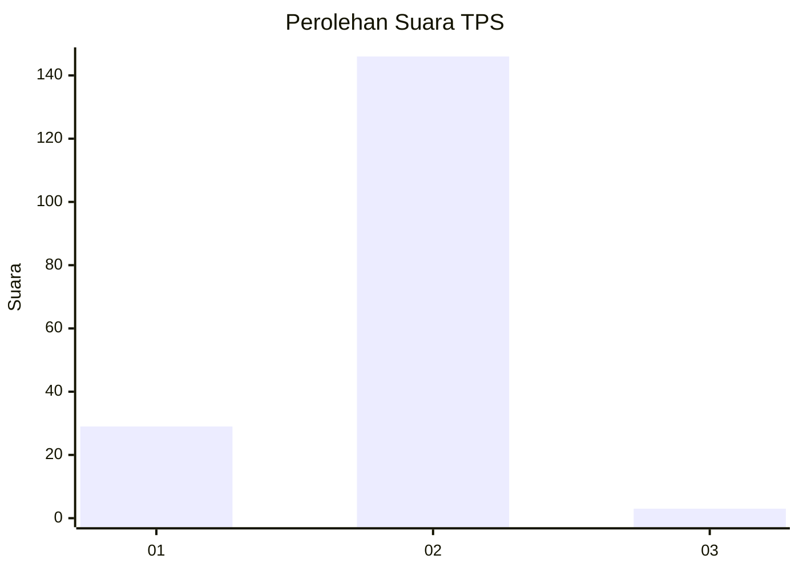
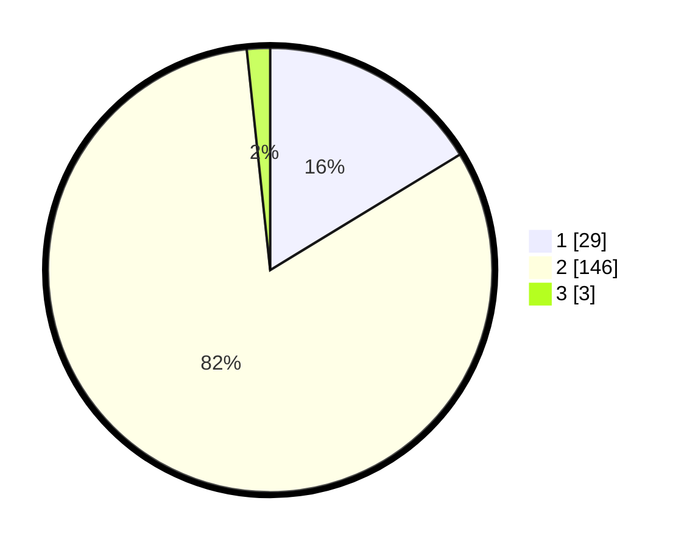

# Hasil

## Grafik

## Tabel

| No. | Nama Paslon    | Suara | Suara (raw) | Persentase |
|:--- |:-------------- | -----:| -----------:| ----------:|
| 1   | ANIES MUHAIMIN | 29    | [29][p-1]   | 16,29      |
| 2   | PRABOWO GIBRAN | 146   | [146][p-2]  | 82,02      |
| 3   | GANJAR MAHFUD  | 3     | [3][p-3]    | 1,69       |

[p-1]: https://github.com/gigit-pemilu/pemilu-2024-13-sumatera-barat/blob/main/pilpres/hitung-suara/sub/13-sumatera-barat/sub/11-solok-selatan/sub/05-sangir-batang-hari/sub/2001-abai/sub/004-tps/sub/paslon-1.txt
[p-2]: https://github.com/gigit-pemilu/pemilu-2024-13-sumatera-barat/blob/main/pilpres/hitung-suara/sub/13-sumatera-barat/sub/11-solok-selatan/sub/05-sangir-batang-hari/sub/2001-abai/sub/004-tps/sub/paslon-2.txt
[p-3]: https://github.com/gigit-pemilu/pemilu-2024-13-sumatera-barat/blob/main/pilpres/hitung-suara/sub/13-sumatera-barat/sub/11-solok-selatan/sub/05-sangir-batang-hari/sub/2001-abai/sub/004-tps/sub/paslon-3.txt

## Foto C Plano

https://sirekap-obj-formc.kpu.go.id/6672/pemilu/ppwp/13/11/05/20/01/1311052001004-20240226-202933--925ab9fa-2229-4a13-846a-677739df98ee.jpg

https://sirekap-obj-formc.kpu.go.id/6672/pemilu/ppwp/13/11/05/20/01/1311052001004-20240226-203032--a4b36910-f358-4c8b-b117-c72bbb9bffc9.jpg

https://sirekap-obj-formc.kpu.go.id/6672/pemilu/ppwp/13/11/05/20/01/1311052001004-20240226-203131--a476e1cc-dcb5-4af3-afc0-f13a0214edd8.jpg

## Metadata

| Key        | Value               |
| ---------- | ------------------- |
| Time Stamp | 2024-02-28 20:00:00 |

