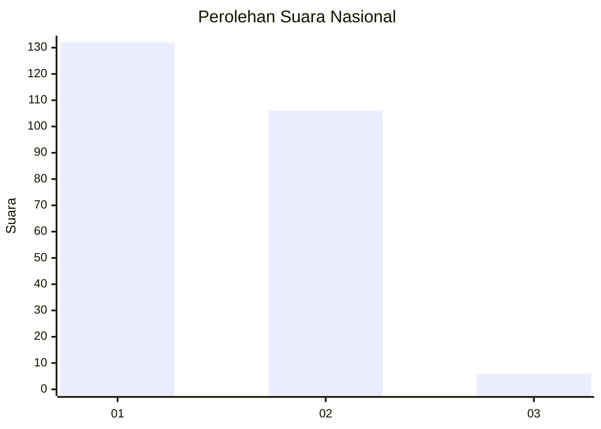
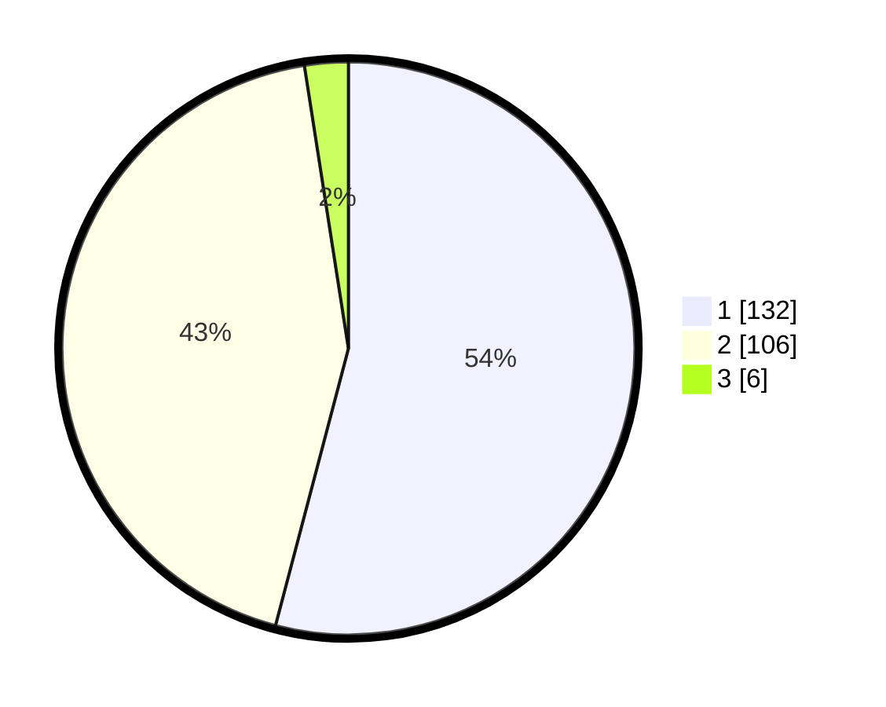

# Hasil

## Grafik

## Tabel

| No. | Nama Paslon    | Suara | Suara (raw) | Persentase |
|:--- |:-------------- | -----:| -----------:| ----------:|
| 1   | ANIES MUHAIMIN | 132   | [132][p-1]  | 54,10      |
| 2   | PRABOWO GIBRAN | 106   | [106][p-2]  | 43,44      |
| 3   | GANJAR MAHFUD  | 6     | [6][p-3]    | 2,46       |

[p-1]: https://github.com/gigit-pemilu/pemilu-2024/blob/main/pilpres/hitung-suara/sub/13-sumatera-barat/sub/11-solok-selatan/sub/06-pauh-duo/sub/2001-alam-pauh-duo/sub/003-tps/sub/paslon-1.txt
[p-2]: https://github.com/gigit-pemilu/pemilu-2024/blob/main/pilpres/hitung-suara/sub/13-sumatera-barat/sub/11-solok-selatan/sub/06-pauh-duo/sub/2001-alam-pauh-duo/sub/003-tps/sub/paslon-2.txt
[p-3]: https://github.com/gigit-pemilu/pemilu-2024/blob/main/pilpres/hitung-suara/sub/13-sumatera-barat/sub/11-solok-selatan/sub/06-pauh-duo/sub/2001-alam-pauh-duo/sub/003-tps/sub/paslon-3.txt

## Foto C Plano

https://sirekap-obj-formc.kpu.go.id/008b/pemilu/ppwp/13/11/06/20/01/1311062001003-20240226-172339--4e78bc48-76ac-490c-8038-801406812596.jpg

https://sirekap-obj-formc.kpu.go.id/008b/pemilu/ppwp/13/11/06/20/01/1311062001003-20240226-172447--c65a3aca-aeaf-438b-bf62-f9b475301403.jpg

https://sirekap-obj-formc.kpu.go.id/008b/pemilu/ppwp/13/11/06/20/01/1311062001003-20240226-172634--b86a9b6b-f293-454c-a7ee-614757cc1006.jpg

## Metadata

| Key        | Value               |
| ---------- | ------------------- |
| Time Stamp | 2024-02-28 19:00:00 |

