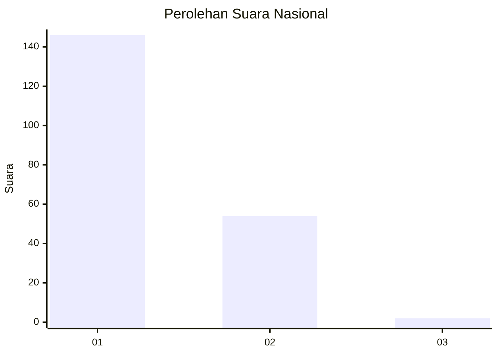
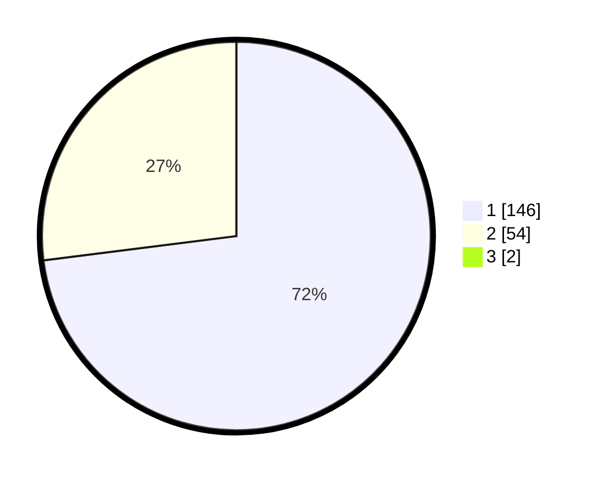

# Hasil

## Grafik

## Tabel

| No. | Nama Paslon    | Suara | Suara (raw) | Persentase |
|:--- |:-------------- | -----:| -----------:| ----------:|
| 1   | ANIES MUHAIMIN | 146   | [146][p-1]  | 72,28      |
| 2   | PRABOWO GIBRAN | 54    | [54][p-2]   | 26,73      |
| 3   | GANJAR MAHFUD  | 2     | [2][p-3]    | 0,99       |

[p-1]: https://github.com/gigit-pemilu/pemilu-2024/blob/main/pilpres/hitung-suara/sub/13-sumatera-barat/sub/11-solok-selatan/sub/06-pauh-duo/sub/2003-luak-kapau-alam-pauh-duo/sub/001-tps/sub/paslon-1.txt
[p-2]: https://github.com/gigit-pemilu/pemilu-2024/blob/main/pilpres/hitung-suara/sub/13-sumatera-barat/sub/11-solok-selatan/sub/06-pauh-duo/sub/2003-luak-kapau-alam-pauh-duo/sub/001-tps/sub/paslon-2.txt
[p-3]: https://github.com/gigit-pemilu/pemilu-2024/blob/main/pilpres/hitung-suara/sub/13-sumatera-barat/sub/11-solok-selatan/sub/06-pauh-duo/sub/2003-luak-kapau-alam-pauh-duo/sub/001-tps/sub/paslon-3.txt

## Foto C Plano

https://sirekap-obj-formc.kpu.go.id/8f9b/pemilu/ppwp/13/11/06/20/03/1311062003001-20240227-224954--a1cc44de-a97f-4ea4-bccb-2e0c1000412d.jpg

https://sirekap-obj-formc.kpu.go.id/8f9b/pemilu/ppwp/13/11/06/20/03/1311062003001-20240227-225014--c8533993-5ae3-4c13-a149-016da2397d92.jpg

https://sirekap-obj-formc.kpu.go.id/8f9b/pemilu/ppwp/13/11/06/20/03/1311062003001-20240227-225044--24a4b6cf-6094-409a-af77-adab307de2f9.jpg

## Metadata

| Key        | Value               |
| ---------- | ------------------- |
| Time Stamp | 2024-02-28 19:00:00 |

