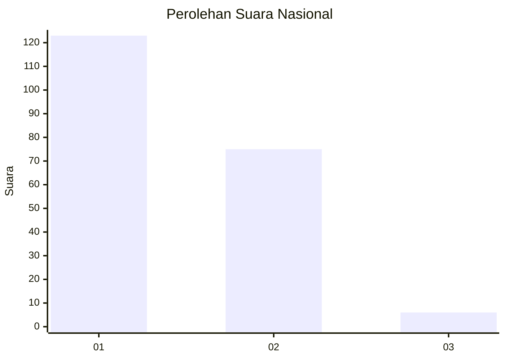
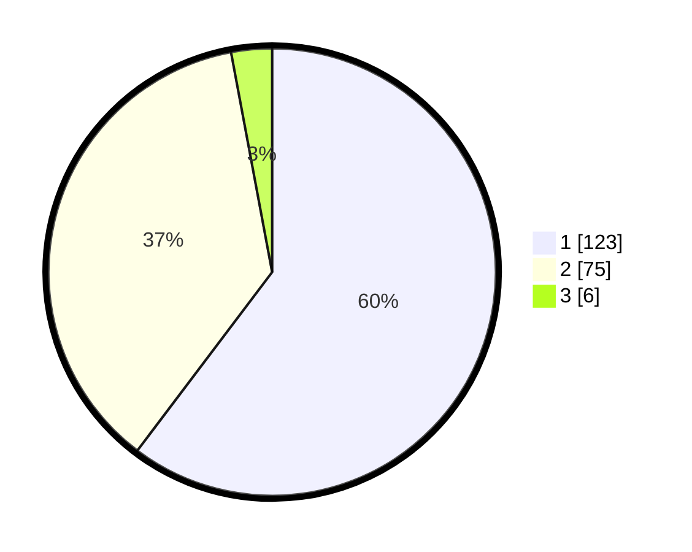

# Hasil

## Grafik

## Tabel

| No. | Nama Paslon    | Suara | Suara (raw) | Persentase |
|:--- |:-------------- | -----:| -----------:| ----------:|
| 1   | ANIES MUHAIMIN | 123   | [123][p-1]  | 60,29      |
| 2   | PRABOWO GIBRAN | 75    | [75][p-2]   | 36,76      |
| 3   | GANJAR MAHFUD  | 6     | [6][p-3]    | 2,94       |

[p-1]: https://github.com/gigit-pemilu/pemilu-2024/blob/main/pilpres/hitung-suara/sub/13-sumatera-barat/sub/11-solok-selatan/sub/06-pauh-duo/sub/2003-luak-kapau-alam-pauh-duo/sub/003-tps/sub/paslon-1.txt
[p-2]: https://github.com/gigit-pemilu/pemilu-2024/blob/main/pilpres/hitung-suara/sub/13-sumatera-barat/sub/11-solok-selatan/sub/06-pauh-duo/sub/2003-luak-kapau-alam-pauh-duo/sub/003-tps/sub/paslon-2.txt
[p-3]: https://github.com/gigit-pemilu/pemilu-2024/blob/main/pilpres/hitung-suara/sub/13-sumatera-barat/sub/11-solok-selatan/sub/06-pauh-duo/sub/2003-luak-kapau-alam-pauh-duo/sub/003-tps/sub/paslon-3.txt

## Foto C Plano

https://sirekap-obj-formc.kpu.go.id/fc9d/pemilu/ppwp/13/11/06/20/03/1311062003003-20240226-162345--7dfbcdec-025e-471b-9907-c575b2e58f56.jpg

https://sirekap-obj-formc.kpu.go.id/fc9d/pemilu/ppwp/13/11/06/20/03/1311062003003-20240226-162429--bdbb31f7-0e98-4119-9c2d-5b9f57b7bcd1.jpg

https://sirekap-obj-formc.kpu.go.id/fc9d/pemilu/ppwp/13/11/06/20/03/1311062003003-20240226-162509--377bff26-8d74-4770-bf57-5fdfc2ed991a.jpg

## Metadata

| Key        | Value               |
| ---------- | ------------------- |
| Time Stamp | 2024-02-28 19:00:00 |

