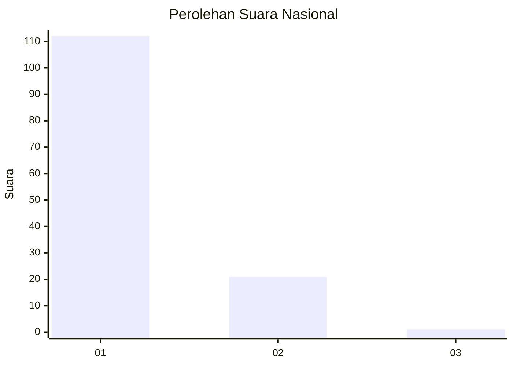
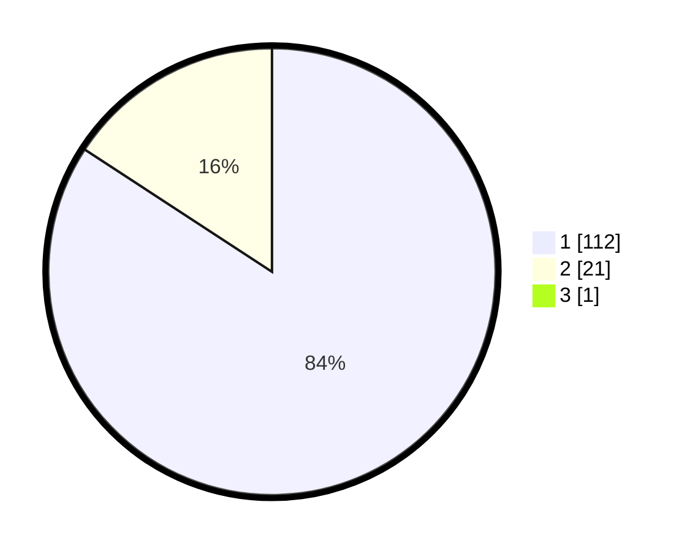

# Hasil

## Grafik

## Tabel

| No. | Nama Paslon    | Suara | Suara (raw) | Persentase |
|:--- |:-------------- | -----:| -----------:| ----------:|
| 1   | ANIES MUHAIMIN | 112   | [112][p-1]  | 83,58      |
| 2   | PRABOWO GIBRAN | 21    | [21][p-2]   | 15,67      |
| 3   | GANJAR MAHFUD  | 1     | [1][p-3]    | 0,75       |

[p-1]: https://github.com/gigit-pemilu/pemilu-2024/blob/main/pilpres/hitung-suara/sub/13-sumatera-barat/sub/11-solok-selatan/sub/06-pauh-duo/sub/2003-luak-kapau-alam-pauh-duo/sub/006-tps/sub/paslon-1.txt
[p-2]: https://github.com/gigit-pemilu/pemilu-2024/blob/main/pilpres/hitung-suara/sub/13-sumatera-barat/sub/11-solok-selatan/sub/06-pauh-duo/sub/2003-luak-kapau-alam-pauh-duo/sub/006-tps/sub/paslon-2.txt
[p-3]: https://github.com/gigit-pemilu/pemilu-2024/blob/main/pilpres/hitung-suara/sub/13-sumatera-barat/sub/11-solok-selatan/sub/06-pauh-duo/sub/2003-luak-kapau-alam-pauh-duo/sub/006-tps/sub/paslon-3.txt

## Foto C Plano

https://sirekap-obj-formc.kpu.go.id/22fb/pemilu/ppwp/13/11/06/20/03/1311062003006-20240226-163740--e81526c5-dddc-47d3-841a-a51f700737d5.jpg

https://sirekap-obj-formc.kpu.go.id/22fb/pemilu/ppwp/13/11/06/20/03/1311062003006-20240226-164027--e36b6423-b68d-4970-810e-1814cdfea666.jpg

https://sirekap-obj-formc.kpu.go.id/22fb/pemilu/ppwp/13/11/06/20/03/1311062003006-20240226-164127--78125760-ea90-42b0-8f45-148a2f25c22e.jpg

## Metadata

| Key        | Value               |
| ---------- | ------------------- |
| Time Stamp | 2024-02-29 14:00:00 |

