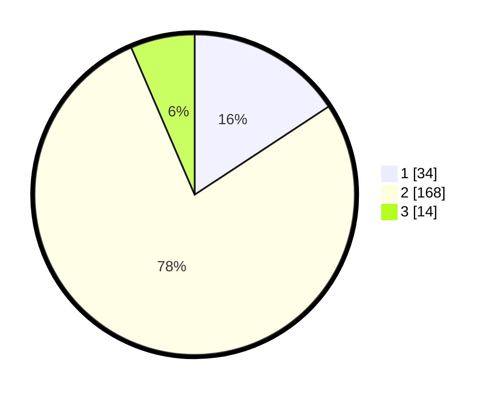

# Hasil

## Grafik

## Tabel

| No. | Nama Paslon    | Suara | Suara (raw) | Persentase |
|:--- |:-------------- | -----:| -----------:| ----------:|
| 1   | ANIES MUHAIMIN | 34    | [34][p-1]   | 15,74      |
| 2   | PRABOWO GIBRAN | 168   | [168][p-2]  | 77,78      |
| 3   | GANJAR MAHFUD  | 14    | [14][p-3]   | 6,48       |

[p-1]: https://github.com/gigit-pemilu/pemilu-2024/blob/main/pilpres/hitung-suara/sub/13-sumatera-barat/sub/11-solok-selatan/sub/06-pauh-duo/sub/2003-luak-kapau-alam-pauh-duo/sub/007-tps/sub/paslon-1.txt
[p-2]: https://github.com/gigit-pemilu/pemilu-2024/blob/main/pilpres/hitung-suara/sub/13-sumatera-barat/sub/11-solok-selatan/sub/06-pauh-duo/sub/2003-luak-kapau-alam-pauh-duo/sub/007-tps/sub/paslon-2.txt
[p-3]: https://github.com/gigit-pemilu/pemilu-2024/blob/main/pilpres/hitung-suara/sub/13-sumatera-barat/sub/11-solok-selatan/sub/06-pauh-duo/sub/2003-luak-kapau-alam-pauh-duo/sub/007-tps/sub/paslon-3.txt

## Foto C Plano

https://sirekap-obj-formc.kpu.go.id/496f/pemilu/ppwp/13/11/06/20/03/1311062003007-20240226-164422--4b42e291-7f88-4493-bab5-d25f780d1924.jpg

https://sirekap-obj-formc.kpu.go.id/496f/pemilu/ppwp/13/11/06/20/03/1311062003007-20240226-164910--d4a7f9de-708a-4a94-a6c9-0f5878642c55.jpg

https://sirekap-obj-formc.kpu.go.id/496f/pemilu/ppwp/13/11/06/20/03/1311062003007-20240226-165226--b31dc86a-9300-4afc-970d-d0780b2bf2fd.jpg

## Metadata

| Key        | Value               |
| ---------- | ------------------- |
| Time Stamp | 2024-02-28 20:00:00 |

