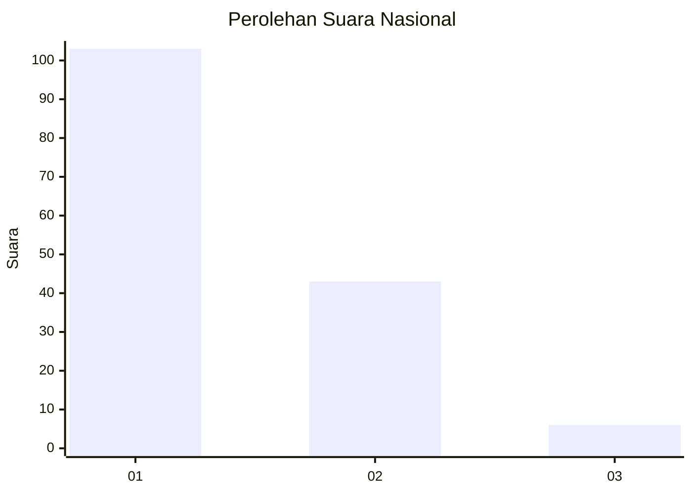
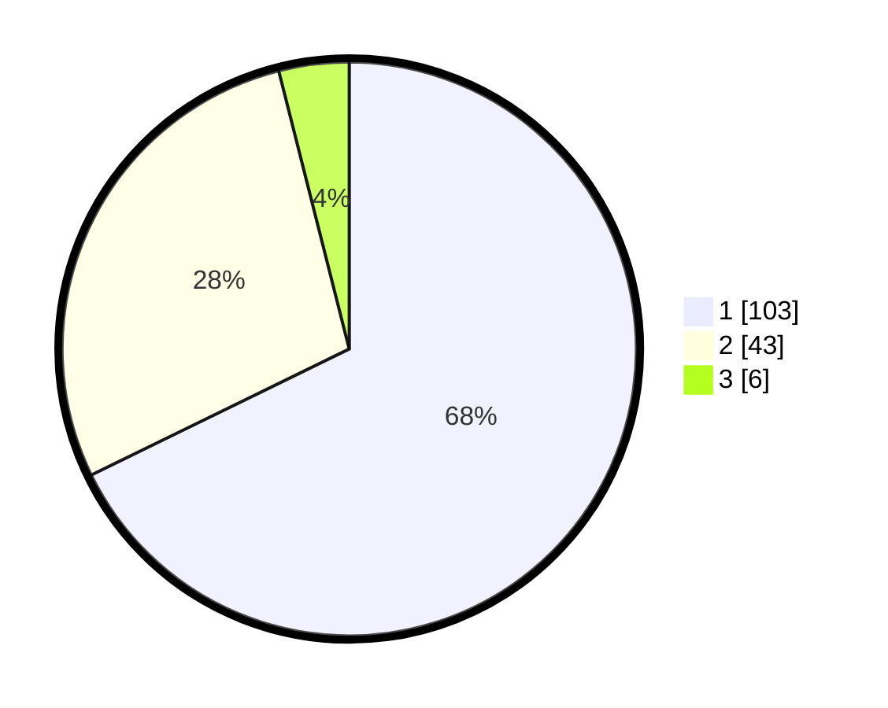

# Hasil

## Grafik

## Tabel

| No. | Nama Paslon    | Suara | Suara (raw) | Persentase |
|:--- |:-------------- | -----:| -----------:| ----------:|
| 1   | ANIES MUHAIMIN | 103   | [103][p-1]  | 67,76      |
| 2   | PRABOWO GIBRAN | 43    | [43][p-2]   | 28,29      |
| 3   | GANJAR MAHFUD  | 6     | [6][p-3]    | 3,95       |

[p-1]: https://github.com/gigit-pemilu/pemilu-2024/blob/main/pilpres/hitung-suara/sub/13-sumatera-barat/sub/11-solok-selatan/sub/06-pauh-duo/sub/2004-pauh-duo-nan-batigo/sub/001-tps/sub/paslon-1.txt
[p-2]: https://github.com/gigit-pemilu/pemilu-2024/blob/main/pilpres/hitung-suara/sub/13-sumatera-barat/sub/11-solok-selatan/sub/06-pauh-duo/sub/2004-pauh-duo-nan-batigo/sub/001-tps/sub/paslon-2.txt
[p-3]: https://github.com/gigit-pemilu/pemilu-2024/blob/main/pilpres/hitung-suara/sub/13-sumatera-barat/sub/11-solok-selatan/sub/06-pauh-duo/sub/2004-pauh-duo-nan-batigo/sub/001-tps/sub/paslon-3.txt

## Foto C Plano

https://sirekap-obj-formc.kpu.go.id/5d90/pemilu/ppwp/13/11/06/20/04/1311062004001-20240226-174352--9041fb47-04d3-49fa-aa2e-f721e6cc3dc1.jpg

https://sirekap-obj-formc.kpu.go.id/5d90/pemilu/ppwp/13/11/06/20/04/1311062004001-20240226-174559--fdda12a1-ff5e-4c55-89f7-dfa837e14735.jpg

https://sirekap-obj-formc.kpu.go.id/5d90/pemilu/ppwp/13/11/06/20/04/1311062004001-20240226-174655--e2c8867f-bbe7-447d-98fc-a1196f11efc2.jpg

## Metadata

| Key        | Value               |
| ---------- | ------------------- |
| Time Stamp | 2024-02-28 21:00:00 |

