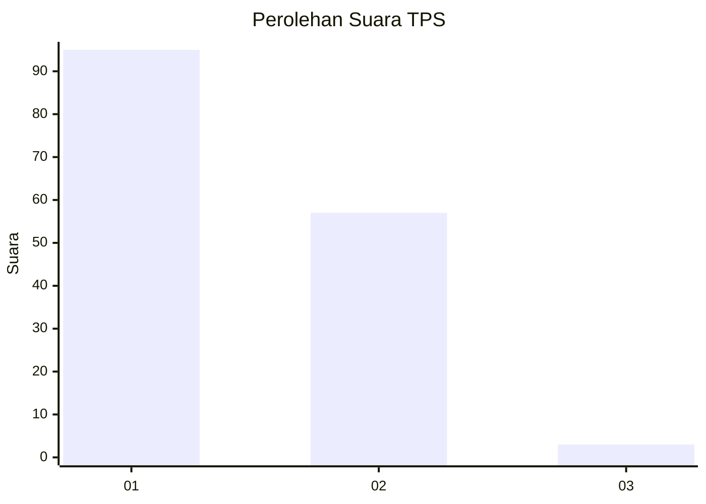
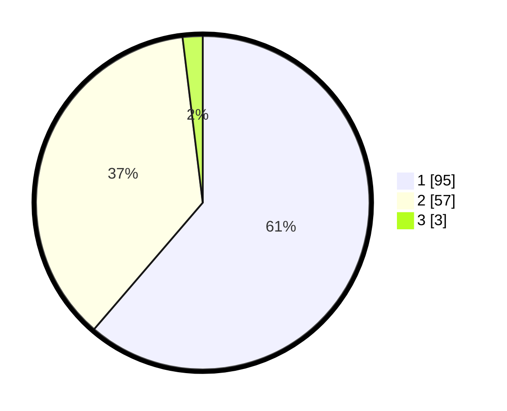

# Hasil

## Grafik

## Tabel

| No. | Nama Paslon    | Suara | Suara (raw) | Persentase |
|:--- |:-------------- | -----:| -----------:| ----------:|
| 1   | ANIES MUHAIMIN | 95    | [95][p-1]   | 61,29      |
| 2   | PRABOWO GIBRAN | 57    | [57][p-2]   | 36,77      |
| 3   | GANJAR MAHFUD  | 3     | [3][p-3]    | 1,94       |

[p-1]: https://github.com/gigit-pemilu/pemilu-2024-13-sumatera-barat/blob/main/pilpres/hitung-suara/sub/13-sumatera-barat/sub/11-solok-selatan/sub/06-pauh-duo/sub/2004-pauh-duo-nan-batigo/sub/002-tps/sub/paslon-1.txt
[p-2]: https://github.com/gigit-pemilu/pemilu-2024-13-sumatera-barat/blob/main/pilpres/hitung-suara/sub/13-sumatera-barat/sub/11-solok-selatan/sub/06-pauh-duo/sub/2004-pauh-duo-nan-batigo/sub/002-tps/sub/paslon-2.txt
[p-3]: https://github.com/gigit-pemilu/pemilu-2024-13-sumatera-barat/blob/main/pilpres/hitung-suara/sub/13-sumatera-barat/sub/11-solok-selatan/sub/06-pauh-duo/sub/2004-pauh-duo-nan-batigo/sub/002-tps/sub/paslon-3.txt

## Foto C Plano

https://sirekap-obj-formc.kpu.go.id/e433/pemilu/ppwp/13/11/06/20/04/1311062004002-20240227-203357--f4500b21-5b44-47bd-a9c9-ba5b2e22cd0e.jpg

https://sirekap-obj-formc.kpu.go.id/e433/pemilu/ppwp/13/11/06/20/04/1311062004002-20240227-204506--524e8bc6-64e3-43ab-bf42-fd8197b79a5c.jpg

https://sirekap-obj-formc.kpu.go.id/e433/pemilu/ppwp/13/11/06/20/04/1311062004002-20240227-204621--1918a77e-a038-42ed-88c8-759d26876ebc.jpg

## Metadata

| Key        | Value               |
| ---------- | ------------------- |
| Time Stamp | 2024-02-28 19:00:00 |

