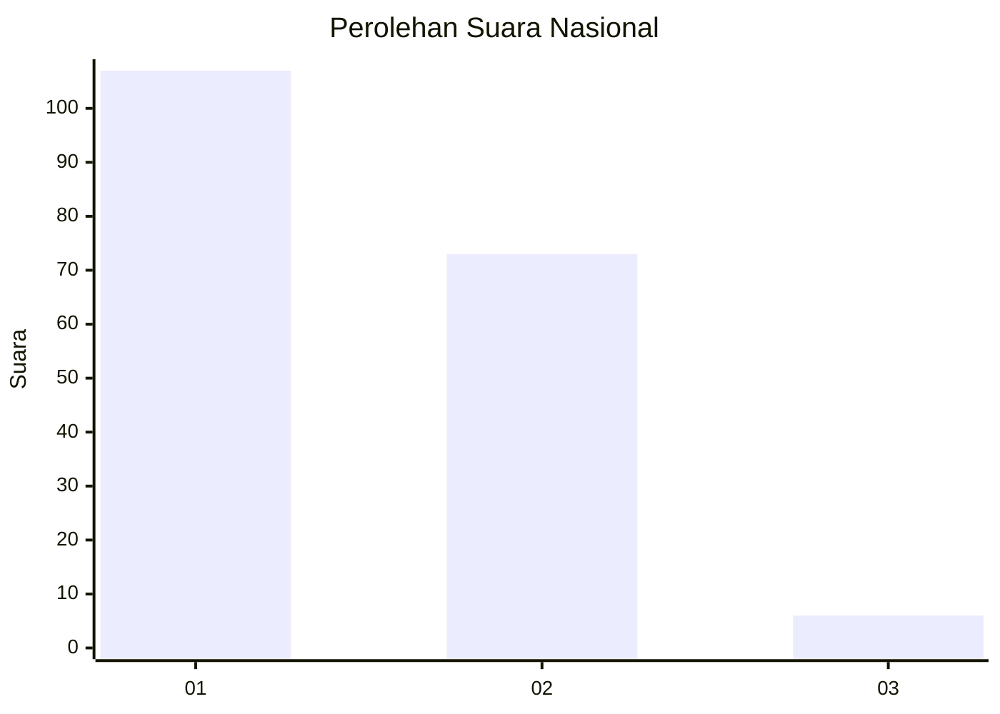
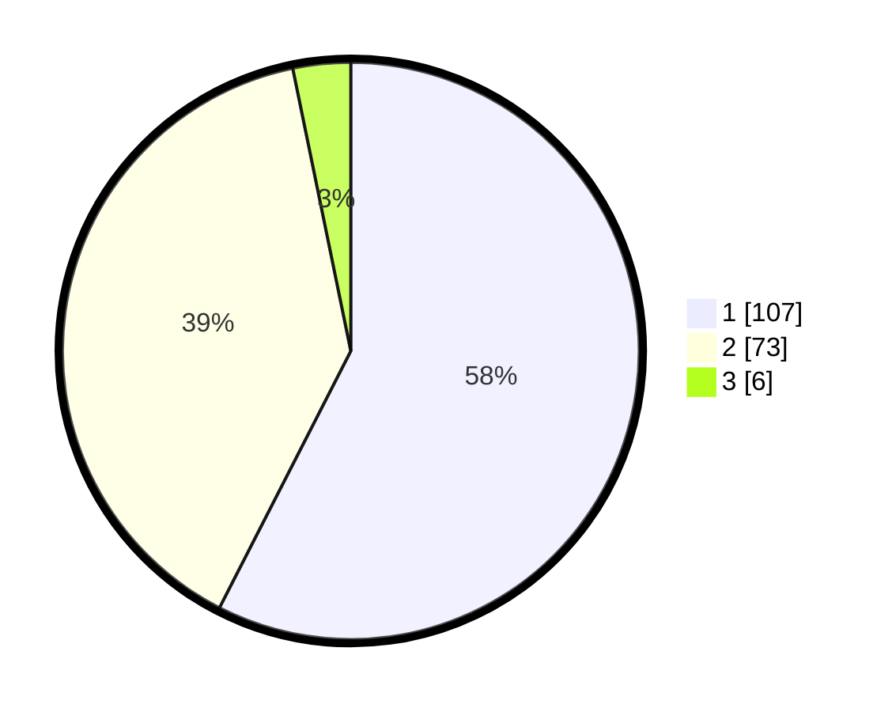

# Hasil

## Grafik

## Tabel

| No. | Nama Paslon    | Suara | Suara (raw) | Persentase |
|:--- |:-------------- | -----:| -----------:| ----------:|
| 1   | ANIES MUHAIMIN | 107   | [107][p-1]  | 57,53      |
| 2   | PRABOWO GIBRAN | 73    | [73][p-2]   | 39,25      |
| 3   | GANJAR MAHFUD  | 6     | [6][p-3]    | 3,23       |

[p-1]: https://github.com/gigit-pemilu/pemilu-2024/blob/main/pilpres/hitung-suara/sub/13-sumatera-barat/sub/11-solok-selatan/sub/06-pauh-duo/sub/2004-pauh-duo-nan-batigo/sub/003-tps/sub/paslon-1.txt
[p-2]: https://github.com/gigit-pemilu/pemilu-2024/blob/main/pilpres/hitung-suara/sub/13-sumatera-barat/sub/11-solok-selatan/sub/06-pauh-duo/sub/2004-pauh-duo-nan-batigo/sub/003-tps/sub/paslon-2.txt
[p-3]: https://github.com/gigit-pemilu/pemilu-2024/blob/main/pilpres/hitung-suara/sub/13-sumatera-barat/sub/11-solok-selatan/sub/06-pauh-duo/sub/2004-pauh-duo-nan-batigo/sub/003-tps/sub/paslon-3.txt

## Foto C Plano

https://sirekap-obj-formc.kpu.go.id/8358/pemilu/ppwp/13/11/06/20/04/1311062004003-20240227-201400--f2004b79-1f6c-4eb3-93fd-4609eb68880d.jpg

https://sirekap-obj-formc.kpu.go.id/8358/pemilu/ppwp/13/11/06/20/04/1311062004003-20240227-201721--e7a5865e-a994-4d91-a12b-078b40a8f150.jpg

https://sirekap-obj-formc.kpu.go.id/8358/pemilu/ppwp/13/11/06/20/04/1311062004003-20240227-202539--ec5a42b3-c0ff-41dc-b356-7358f42ae81f.jpg

## Metadata

| Key        | Value               |
| ---------- | ------------------- |
| Time Stamp | 2024-02-28 19:00:00 |

