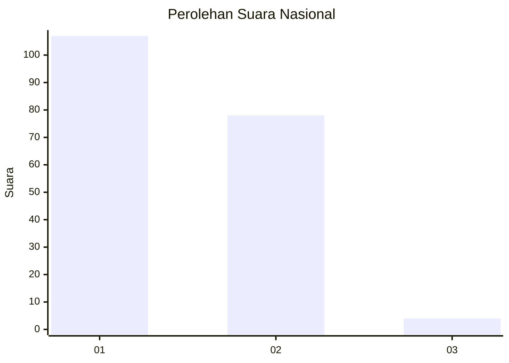
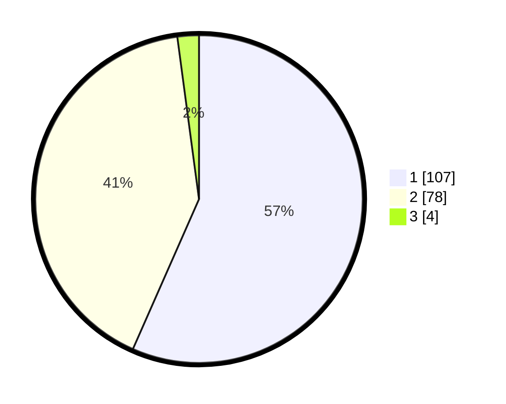

# Hasil

## Grafik

## Tabel

| No. | Nama Paslon    | Suara | Suara (raw) | Persentase |
|:--- |:-------------- | -----:| -----------:| ----------:|
| 1   | ANIES MUHAIMIN | 107   | [107][p-1]  | 56,61      |
| 2   | PRABOWO GIBRAN | 78    | [78][p-2]   | 41,27      |
| 3   | GANJAR MAHFUD  | 4     | [4][p-3]    | 2,12       |

[p-1]: https://github.com/gigit-pemilu/pemilu-2024/blob/main/pilpres/hitung-suara/sub/13-sumatera-barat/sub/11-solok-selatan/sub/06-pauh-duo/sub/2004-pauh-duo-nan-batigo/sub/004-tps/sub/paslon-1.txt
[p-2]: https://github.com/gigit-pemilu/pemilu-2024/blob/main/pilpres/hitung-suara/sub/13-sumatera-barat/sub/11-solok-selatan/sub/06-pauh-duo/sub/2004-pauh-duo-nan-batigo/sub/004-tps/sub/paslon-2.txt
[p-3]: https://github.com/gigit-pemilu/pemilu-2024/blob/main/pilpres/hitung-suara/sub/13-sumatera-barat/sub/11-solok-selatan/sub/06-pauh-duo/sub/2004-pauh-duo-nan-batigo/sub/004-tps/sub/paslon-3.txt

## Foto C Plano

https://sirekap-obj-formc.kpu.go.id/a5ab/pemilu/ppwp/13/11/06/20/04/1311062004004-20240226-224031--ddf2b5bc-755a-4cc4-9c76-d135e30c8e46.jpg

https://sirekap-obj-formc.kpu.go.id/a5ab/pemilu/ppwp/13/11/06/20/04/1311062004004-20240226-224443--55dda1ab-9f8f-4ea3-adbe-28c60537df91.jpg

https://sirekap-obj-formc.kpu.go.id/a5ab/pemilu/ppwp/13/11/06/20/04/1311062004004-20240226-224240--e98b4134-3bdf-4b3b-acb1-1d307b8224be.jpg

## Metadata

| Key        | Value               |
| ---------- | ------------------- |
| Time Stamp | 2024-03-01 15:00:00 |

