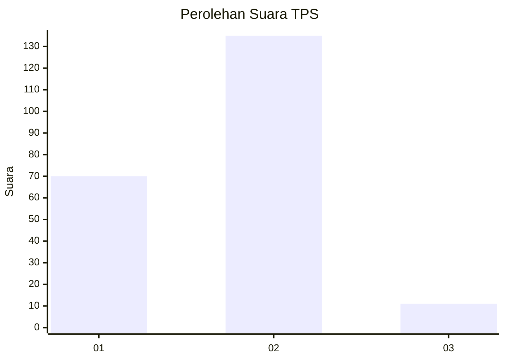
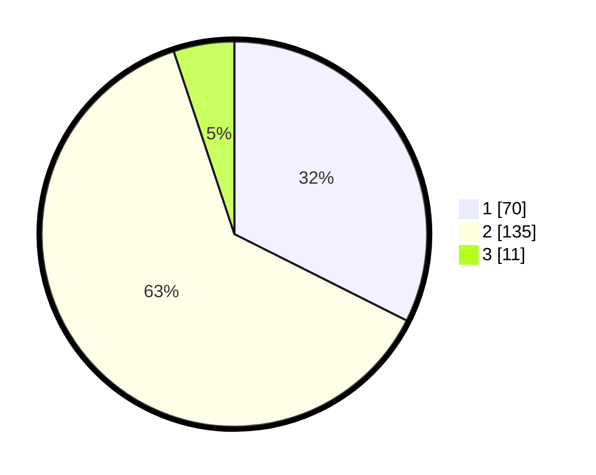

# Hasil

## Grafik

## Tabel

| No. | Nama Paslon    | Suara | Suara (raw) | Persentase |
|:--- |:-------------- | -----:| -----------:| ----------:|
| 1   | ANIES MUHAIMIN | 70    | [70][p-1]   | 32,41      |
| 2   | PRABOWO GIBRAN | 135   | [135][p-2]  | 62,50      |
| 3   | GANJAR MAHFUD  | 11    | [11][p-3]   | 5,09       |

[p-1]: https://github.com/gigit-pemilu/pemilu-2024-13-sumatera-barat/blob/main/pilpres/hitung-suara/sub/13-sumatera-barat/sub/11-solok-selatan/sub/07-sangir-balai-janggo/sub/2001-sungai-kunyit/sub/001-tps/sub/paslon-1.txt
[p-2]: https://github.com/gigit-pemilu/pemilu-2024-13-sumatera-barat/blob/main/pilpres/hitung-suara/sub/13-sumatera-barat/sub/11-solok-selatan/sub/07-sangir-balai-janggo/sub/2001-sungai-kunyit/sub/001-tps/sub/paslon-2.txt
[p-3]: https://github.com/gigit-pemilu/pemilu-2024-13-sumatera-barat/blob/main/pilpres/hitung-suara/sub/13-sumatera-barat/sub/11-solok-selatan/sub/07-sangir-balai-janggo/sub/2001-sungai-kunyit/sub/001-tps/sub/paslon-3.txt

## Foto C Plano

https://sirekap-obj-formc.kpu.go.id/049e/pemilu/ppwp/13/11/07/20/01/1311072001001-20240220-103211--aa7e6671-44d1-4fc8-85f0-c854d972ad52.jpg

https://sirekap-obj-formc.kpu.go.id/049e/pemilu/ppwp/13/11/07/20/01/1311072001001-20240220-103422--ff89b13a-d8d8-48d4-9fed-285b59afab7e.jpg

https://sirekap-obj-formc.kpu.go.id/049e/pemilu/ppwp/13/11/07/20/01/1311072001001-20240220-103614--8be911ad-ff04-45eb-8d2c-068caddb92f0.jpg

## Metadata

| Key        | Value               |
| ---------- | ------------------- |
| Time Stamp | 2024-02-22 15:00:00 |

## DATA PEMILIH TETAP

Jumlah pemilih dalam DPT: **1**.
 * L: **50**.
 * P: **0**.

## DATA PENGGUNA HAK PILIH

Jumlah pengguna hak pilih dalam DPT: **31**.
 * L: **5**.
 * P: **1**.

Jumlah pengguna hak pilih dalam DPTb: **702**.
 * L: **503**.
 * P: **777**.

Jumlah pengguna hak pilih dalam DPK: **200**.
 * L: **700**.
 * P: **300**.

Jumlah pengguna hak pilih: **218**.
 * L: **109**.
 * P: **109**.

## JUMLAH SUARA SAH DAN TIDAK SAH

JUMLAH SELURUH SUARA SAH: **216**.

JUMLAH SUARA TIDAK SAH: **2**.

JUMLAH SELURUH SUARA SAH DAN SUARA TIDAK SAH: **218**.

