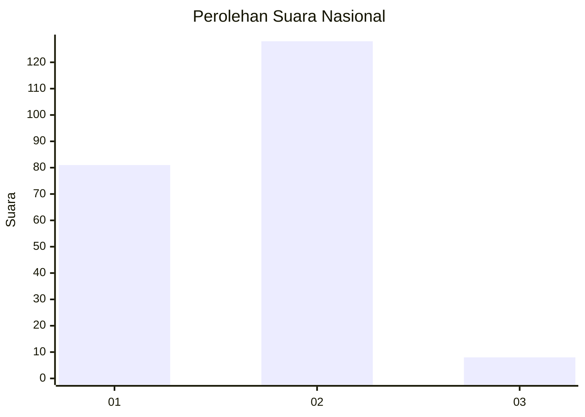
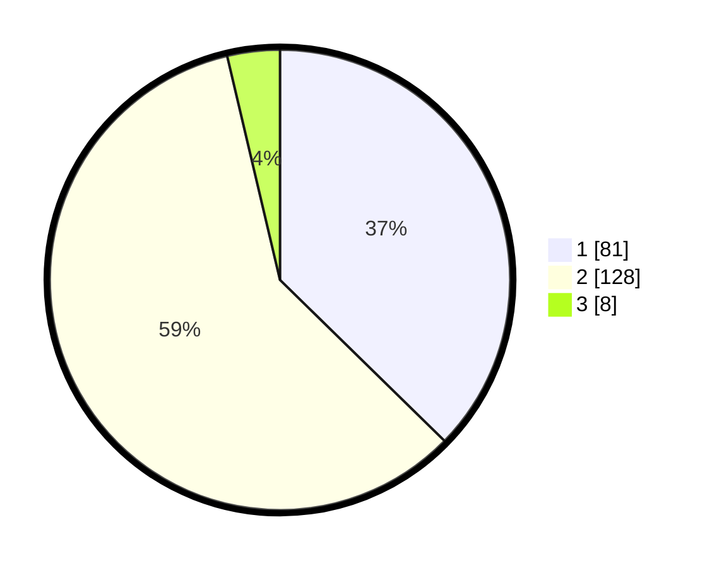

# Hasil

## Grafik

## Tabel

| No. | Nama Paslon    | Suara | Suara (raw) | Persentase |
|:--- |:-------------- | -----:| -----------:| ----------:|
| 1   | ANIES MUHAIMIN | 81    | [81][p-1]   | 37,33      |
| 2   | PRABOWO GIBRAN | 128   | [128][p-2]  | 58,99      |
| 3   | GANJAR MAHFUD  | 8     | [8][p-3]    | 3,69       |

[p-1]: https://github.com/gigit-pemilu/pemilu-2024/blob/main/pilpres/hitung-suara/sub/13-sumatera-barat/sub/11-solok-selatan/sub/07-sangir-balai-janggo/sub/2001-sungai-kunyit/sub/003-tps/sub/paslon-1.txt
[p-2]: https://github.com/gigit-pemilu/pemilu-2024/blob/main/pilpres/hitung-suara/sub/13-sumatera-barat/sub/11-solok-selatan/sub/07-sangir-balai-janggo/sub/2001-sungai-kunyit/sub/003-tps/sub/paslon-2.txt
[p-3]: https://github.com/gigit-pemilu/pemilu-2024/blob/main/pilpres/hitung-suara/sub/13-sumatera-barat/sub/11-solok-selatan/sub/07-sangir-balai-janggo/sub/2001-sungai-kunyit/sub/003-tps/sub/paslon-3.txt

## Foto C Plano

https://sirekap-obj-formc.kpu.go.id/2d85/pemilu/ppwp/13/11/07/20/01/1311072001003-20240226-225957--358dad3d-ccfb-475c-a0b0-0d294fe72762.jpg

https://sirekap-obj-formc.kpu.go.id/2d85/pemilu/ppwp/13/11/07/20/01/1311072001003-20240226-230152--eafe7a78-f823-4bee-8d64-992e4a78a480.jpg

https://sirekap-obj-formc.kpu.go.id/2d85/pemilu/ppwp/13/11/07/20/01/1311072001003-20240220-131955--1cbd5da9-1ab1-462a-b59a-ecd2bb1897f2.jpg

## Metadata

| Key        | Value               |
| ---------- | ------------------- |
| Time Stamp | 2024-02-28 19:00:00 |

