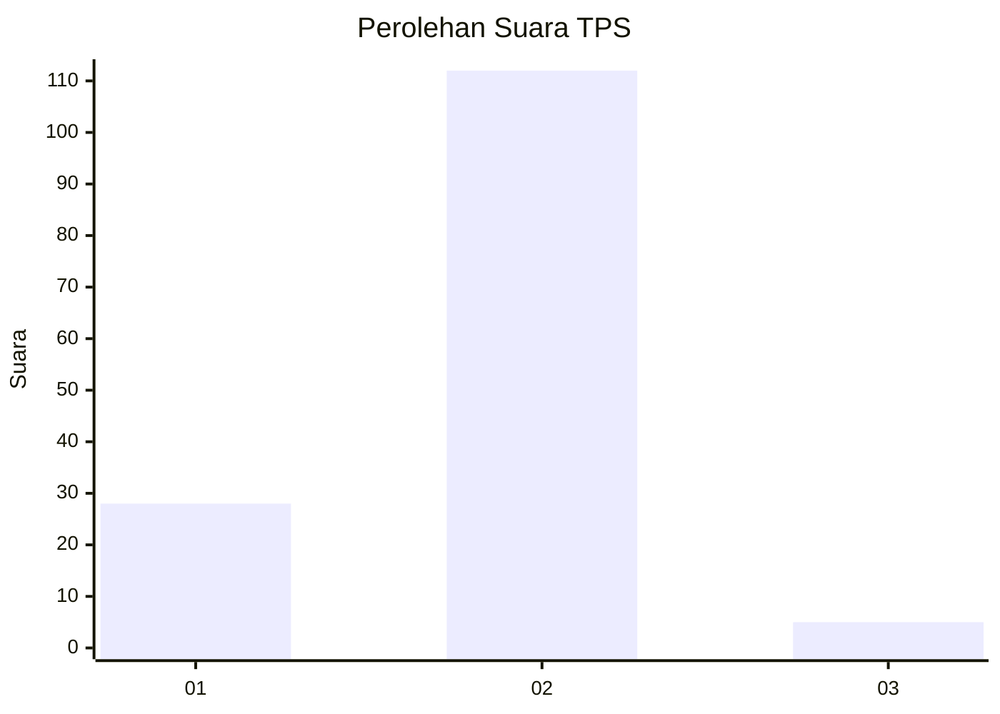
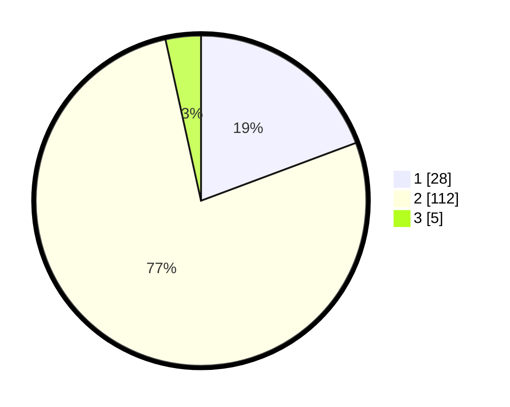

# Hasil

## Grafik

## Tabel

| No. | Nama Paslon    | Suara | Suara (raw) | Persentase |
|:--- |:-------------- | -----:| -----------:| ----------:|
| 1   | ANIES MUHAIMIN | 28    | [28][p-1]   | 19,31      |
| 2   | PRABOWO GIBRAN | 112   | [112][p-2]  | 77,24      |
| 3   | GANJAR MAHFUD  | 5     | [5][p-3]    | 3,45       |

[p-1]: https://github.com/gigit-pemilu/pemilu-2024-13-sumatera-barat/blob/main/pilpres/hitung-suara/sub/13-sumatera-barat/sub/11-solok-selatan/sub/07-sangir-balai-janggo/sub/2001-sungai-kunyit/sub/005-tps/sub/paslon-1.txt
[p-2]: https://github.com/gigit-pemilu/pemilu-2024-13-sumatera-barat/blob/main/pilpres/hitung-suara/sub/13-sumatera-barat/sub/11-solok-selatan/sub/07-sangir-balai-janggo/sub/2001-sungai-kunyit/sub/005-tps/sub/paslon-2.txt
[p-3]: https://github.com/gigit-pemilu/pemilu-2024-13-sumatera-barat/blob/main/pilpres/hitung-suara/sub/13-sumatera-barat/sub/11-solok-selatan/sub/07-sangir-balai-janggo/sub/2001-sungai-kunyit/sub/005-tps/sub/paslon-3.txt

## Foto C Plano

https://sirekap-obj-formc.kpu.go.id/7749/pemilu/ppwp/13/11/07/20/01/1311072001005-20240226-231156--03a86064-f0cf-439d-88c6-d7f078d1f53a.jpg

https://sirekap-obj-formc.kpu.go.id/7749/pemilu/ppwp/13/11/07/20/01/1311072001005-20240226-231830--42c20eda-0000-460b-a612-da8a4420b1d3.jpg

https://sirekap-obj-formc.kpu.go.id/7749/pemilu/ppwp/13/11/07/20/01/1311072001005-20240220-172110--6668e1f0-cce6-4f79-be24-d11bb245a307.jpg

## Metadata

| Key        | Value               |
| ---------- | ------------------- |
| Time Stamp | 2024-02-28 19:00:00 |

